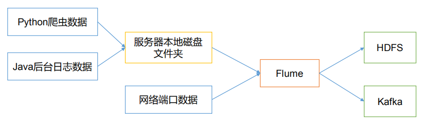
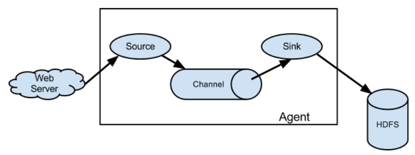

# Flume概述

## Flume定义

  - Flume是Cloudera提供的一个高可用的，高可靠的，分布式的海量日志采集、聚合和传输的系统。
  - Flume基于流式架构，灵活简单。
  - Flume最主要的作用就是，实时读取服务器本地磁盘的数据，将数据写入到HDFS。
  - Flume图示：
  
  
  
## Flume基础架构

  - Flume基础架构：
  
  
  
  - 组件介绍：
    - Agent:
      - Agent是一个JVM进程，它以事件的形式将数据从源头送至目的地。
      - Agent主要由3个部分组成，Source、Channel、Sink。
    - Source:
      - Source是负责接收数据到Flume Agent的组件。
      - Source 组件可以处理各种类型、各种格式的日志数据, 包括avro, jms, http等。
    - Sink:
      - Sink不断地轮询Channel中的事件且批量地移除它们，并将这些事件批量写入到存储或索引系统、或者被发送到另一个Flume Agent。
      - Sink组件目的地包括hdfs、logger、avro、HBase等。
    - Channel:
      - Channel是位于Source和Sink之间的缓冲区。
      - Channel允许Source和Sink运作在不同的速率上。
      - Channel是线程安全的，可以同时处理几个Source的写入操作和几个Sink的读取操作。
      - Flume自带两种Channel：Memory Channel和File Channel。
      - Memory Channel是内存中的队列。它在不需要关心数据丢失的情景下适用。因为程序死亡、机器宕机或者重启都会导致数据丢失。
      - File Channel将所有事件写到磁盘。因此在程序关闭或机器宕机的情况下不会丢失数据。
    - Event:
      - Flume数据传输的基本单元，以Event形式将数据从源头送至目的地。
      - Event由Header和Body两部分组成，Header用来存放该event的一些属性，为K-V结构。Body用来存放该条数据，形式为字节数组。
    
  
