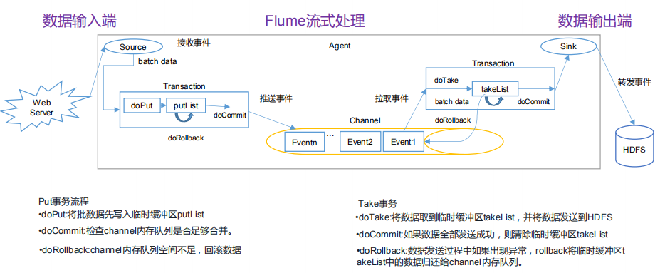
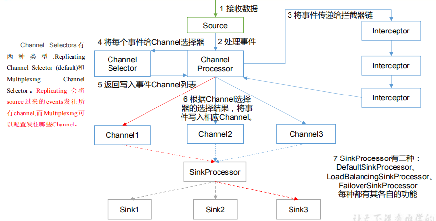
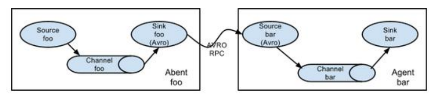
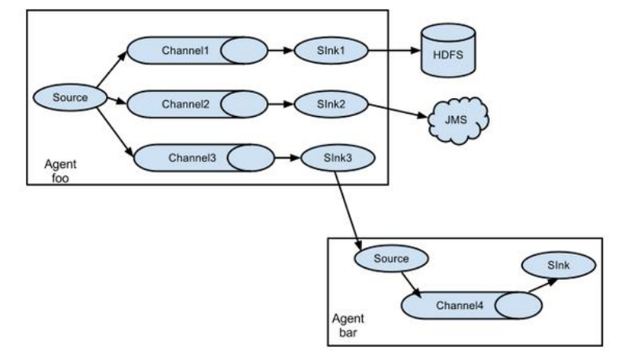
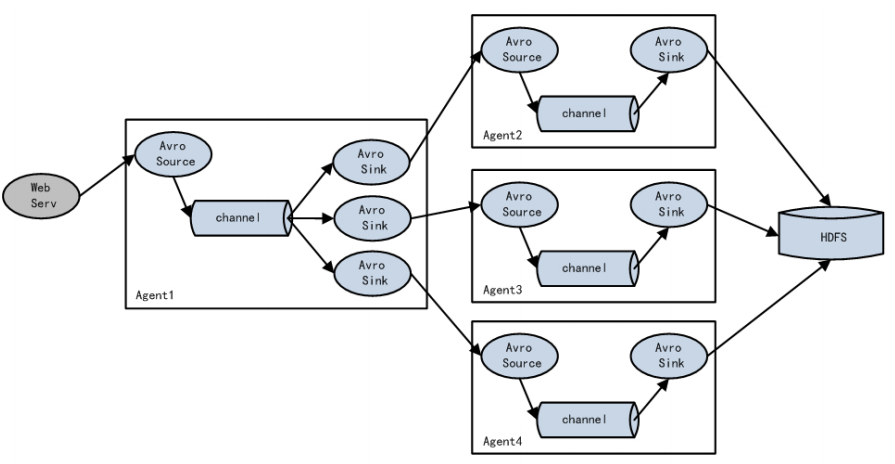
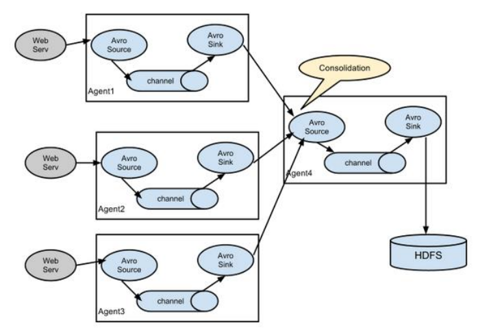

# Flume进阶

## Flume事务

  - Flume事务：
    - 事务中的一系列Event作为一个整体写入，写入失败时将会回滚，保证原子性。Flume保证Event至少一次写入的语义。
    - 事务分为Source端事务和Sink端事务：
      - 当Source端事务成功提交后，会把Event写入Channel，否则事务回滚。
      - 当Sink端事务成功提交后，将数据已经写入外部存储，会清除Channel中的Event。
  
  
  
## Flume Agent内部原理

  - Flume Agent内部原理：
  
  
  
  - 组件细节：
    - ChannelSelector：
      - ChannelSelector的作用就是选出Event将要被发往哪个Channel。
      - 共有两种类型，分别是Replicating（复制）和Multiplexing（多路复用）。
      - ReplicatingSelector会将同一个Event发往所有的Channel，Multiplexing会根据相应的原则，将不同的Event发往不同的Channel。
    - SinkProcessor:
      - SinkProcessor共有三种类型，分别是DefaultSinkProcessor 、LoadBalancingSinkProcessor 和 FailoverSinkProcessor。
      - DefaultSinkProcessor：对应的是单个的Sink，使用source-channel-sink模式
      - LoadBalancingSinkProcessor：在多个Sink之间实现均衡负载，可以通过round_robin或者random选择机制来分配负载。如果启用backoff，sink处理器会将失败的sinks加入黑名单。
      - FailoverSinkProcessor：维护一个优先列表的Sinks，保证只要有可用的Sink，Events就会被处理。失败的Sinks会被降级到回收池，等待一段时间会重试。在该Sink成功发送Event之后会恢复到存活池。Sink有对应的数字表示优先级，数字越大优先级越高。
    
## 拦截器

  - Flume可以通过拦截器对正在传输的Event进行修改或过滤。拦截器是实现org.apache.flume.interceptor.Interceptor接口的类。拦截器在Source配置中由空格分隔的列表指定，指定的顺序就是执行的顺序。
  - 拦截器类型：
    - Timestamp Interceptor：这种拦截器将处理Event的时间戳插入到Event Header。
    - Host Interceptor：这种拦截器将Agent运行的主机名或IP地址插入以host作为键的Header。
    - Static Interceptor：用户可以向所有Events追加一个有固定值的Header。
    - UUID Interceptor：这种拦截器为所有Events设置一个唯一的标识符。
    - Search and Replace Interceptor：这种拦截器提供基于Java正则表达式搜索替换字符串的功能。
    - Regex Filtering Interceptor：这种拦截器将Event Bdy解析为文本，将匹配预置的正则表达式Event过滤掉。
    
## Flume拓扑结构

### 简单串联

  - Flume简单串联结构：
  
  
  
  - 注意细节：
    - 这种模式是将多个flume顺序连接 ，从最初的source开始到最终sink的存储系统。
    - 此模式不建议桥接过多的flume，flume数量过多不仅会影响传输速率，而且一旦传输过程中某个节点flume宕机，会影响整个传输系统。
    
### 复制和多路复用

  - Flume复制和多路复用结构：
  
  
  
  - 注意细节：
    - Flume 支持将事件流向一个或者多个目的地。
    - 这种模式可以将相同数据复制到多个channel中，或者将不同数据分发到不同的channel中，sink可以选择传送到不同的目的地。
    
### 负载均衡和故障转移

  - Flume负载均衡和故障转移结构：
  
  
  
  - 注意细节：
    - Flume支持使用将多个sink逻辑上分到一个sink组，sink组配合不同的SinkProcessor可以实现负载均衡和错误恢复的功能。
  
### 聚合

  - Flume聚合结构：
  
  
  
  - 注意细节：
    - 日常web应用通常分布在上百个服务器，大者甚至上千个、上万个服务器。产生的日志，处理起来也非常麻烦。
    - 用flume的这种组合方式能很好的解决这一问题，每台服务器部署一个flume采集日志，传送到一个集中收集日志的flume，再由此flume上传到hdfs、hive、hbase等，进行日志分析。
    
## 补充要点

  - 为什么需要Flume, 而不是直接将数据写到HDFS/HBase?
    - 每次新建文件或分配新Block会导致Name Node上一系列操作，如果同时有大量请求会导致服务器负载过大。
    - Flume的作用是作为缓冲区对流量整形，数据预处理，路由功能。Flume对写入的保证是At Least Once，因此可能导致重复写入，可以通过头部的UUID解决。
  - 批量写入的重要性：
    - 使用File Channel时，每次成功的事务提交将会导致一次fsync操作 (强制将磁盘缓冲区内数据写入磁盘, 防止意外情况下的断电数据丢失)。批次数量少会导致写入磁盘次数过多，性能下降。
  
  
