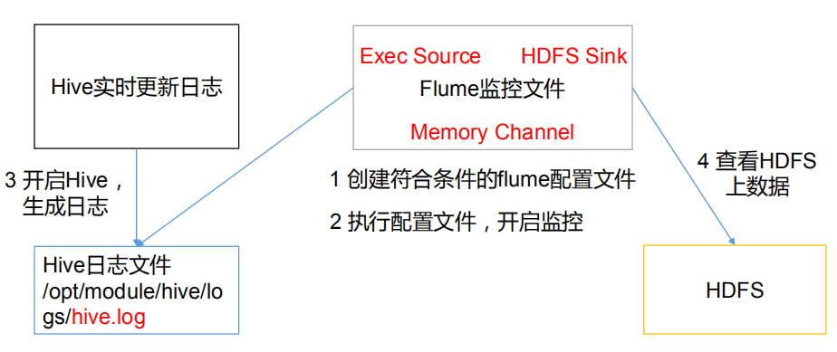

# Flume入门案例

## 监控端口数据案例

  - 需求：使用Flume监听一个端口，收集该端口数据，并打印到控制台。
  - 监控端口数据案例：
  
  
  
  - 监控端口数据配置文件：
  
  
  
  - 命令示例：
    - bin/flume-ng agent --conf conf/ --name a1 --conf-file job/netcat-flume-logger.conf -Dflume.root.logger=INFO,console
    - bin/flume-ng agent -c conf/ -n a1 -f job/netcat-flume-logger.conf -Dflume.root.logger=INFO,console
    - 参数说明：
      - --conf/-c：表示配置文件存储在conf/目录。
      - --name/-n：表示给agent起名为a1。
      - --conf-file/-f：flume本次启动读取的配置文件是在job文件夹下的netcat-flume-logger.conf文件。
      - -Dflume.root.logger=INFO,console：-D表示flume运行时动态修改flume.root.logger参数属性值，并将控制台日志打印级别设置为INFO级别。日志级别包括:log、info、warn、
error。
     
## 实时监控单个追加文件案例

  - 需求：实时监控Hive日志，并上传到HDFS中。
  - 实时监控单个追加文件案例：
  
  
  
  - 实时监控单个追加文件配置文件：
  
  
  
## 实时监控目录下多个新文件案例

  - 需求：使用Flume监听整个目录的文件，并上传至HDFS。
  - 实时监控目录下多个新文件案例：
  
  
  
  - 实时监控目录下多个新文件配置文件：
  
  
  
  - 注意细节：
    - 在使用Spooling Directory Source时，不要在监控目录中创建并持续修改文件。
    - 上传完成的文件会以.COMPLETED结尾。
    - 被监控文件夹每500毫秒扫描一次文件变动。
    
## 实时监控目录下的多个追加文件案例

  - 需求：使用Flume监听整个目录的实时追加文件，并上传至HDFS。
  - 实时监控目录下的多个追加文件案例：
  
  
  
  - 实时监控目录下的多个追加文件配置文件：
  
  
  
  - 注意细节：
    - Exec source适用于监控一个实时追加的文件，但不能保证数据不丢失。
    - Spooldir Source能够保证数据不丢失，且能够实现断点续传，但延迟较高，不能实时监控。
    - Taildir Source既能够实现断点续传，又可以保证数据不丢失，还能够进行实时监控。
    - Taildir Source维护了一个json格式的position file，它定期的往position File中更新每个文件读取到的最新的位置，因此能够实现断点续传。
    - Position File的格式：
  
    

    
    
    
  
  
  
  
  
  
  
  
  
  
  
  
