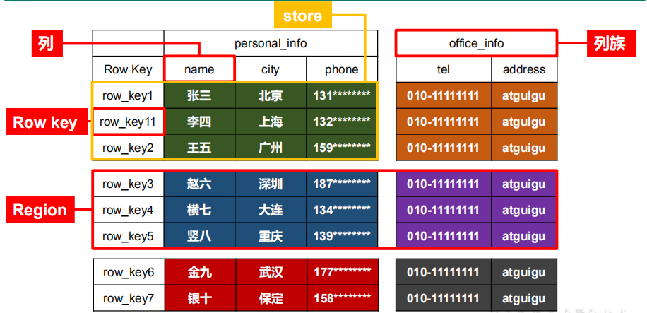
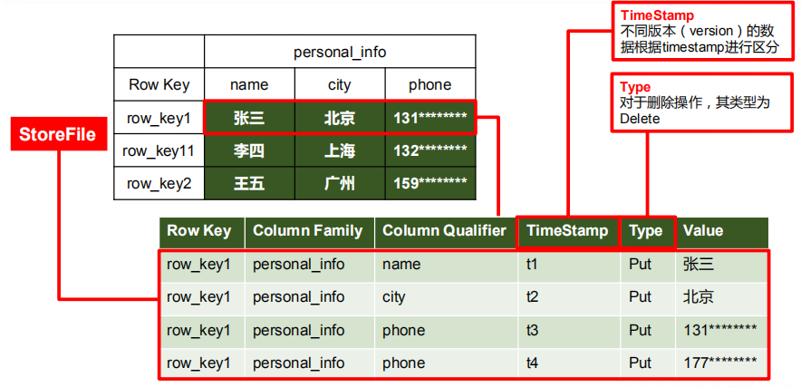
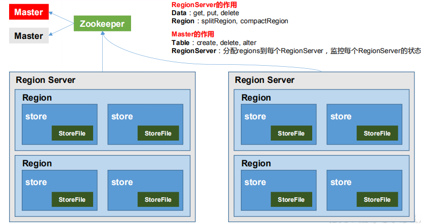

# HBase概述

  - HBase定义: HBase是一种分布式、可扩展、支持海量数据存储的NoSQL数据库，面向列族的数据库。
  - HBase数据模型: 
    - 逻辑上，HBase的数据模型同关系型数据库很类似，数据存储在一张表中，有行有列。
    - 但从HBase的底层物理存储结构（K-V）来看，HBase更像是一个multi-dimensional map。
  - HBase逻辑结构: 
  
  
  
  - HBase物理存储结构: 
  
   
  
  - 数据模型:
    - Name Space: 
      - 命名空间，类似于关系型数据库的DatabBase, 每个命名空间下有多个表。
      - HBase有两个自带的命名空间，分别是hbase和default。
      - hbase中存放的是HBase内置的表，default表是用户默认使用的命名空间。
    - Table:
      - HBase定义表时只需要声明列族即可，不需要声明具体的列。
      - 往HBase写入数据时，字段可以动态、按需指定。
      - 因此，和关系型数据库相比，HBase能够轻松应对字段变更的场景。
    - Row:
      - 数据以行的形式存储在表中。
      - 每行数据都由一个唯一标识RowKey和多个Column（列）组成。RowKey没有数据类型，在HBase中RowKey被看作一个字节数组。
      - 数据是按照RowKey的字典顺序存储的，并且查询数据时只能根据RowKey进行检索。
    - Column Family:
      - 行中的数据根据列族分组，列族会影响HBase中数据的物理分布，将具有相同列族的列及其值存储在一起。
    - Column:
      - HBase中的每个列都由Column Family(列族)和Column Qualifier（列限定符）进行限定。
      - 例如 info:name，info:age。
    - Cell:
      - 由{rowkey, column family:column qualifier, value, timeStamp} 唯一确定的单元。
      - cell中的数据是没有类型的，全部是字节码形式存贮。
    - Timestamp:
      - 用于标识数据的不同版本（Version），每条数据写入时，如果不指定时间戳，系统会自动为其加上该字段，其值为写入HBase的时间。
      
## HBase基本架构

  - HBase基本架构:
  
  
      
  - 架构角色：
    - Region Server：
      - Region Server为Region的管理者，其实现类为HRegionServer。
      - 对于数据的操作：get, put, delete。
      - 对于Region的操作：splitRegion、compactRegion。
    - Master:
      - Master是所有Region Server的管理者，其实现类为HMaster。
      - 对于表的操作：create, delete, alter。
      - 对于RegionServer的操作：分配regions到每个RegionServer，监控每个RegionServer的状态，负载均衡和故障转移。
    - ZooKeeper:
      - HBase通过Zookeeper来做Master的高可用、RegionServer的监控、元数据的入口以及集群配置的维护等工作。
    - HDFS:
      - HDFS为HBase提供最终的底层数据存储服务，同时为HBase提供高可用的支持。
      
      
