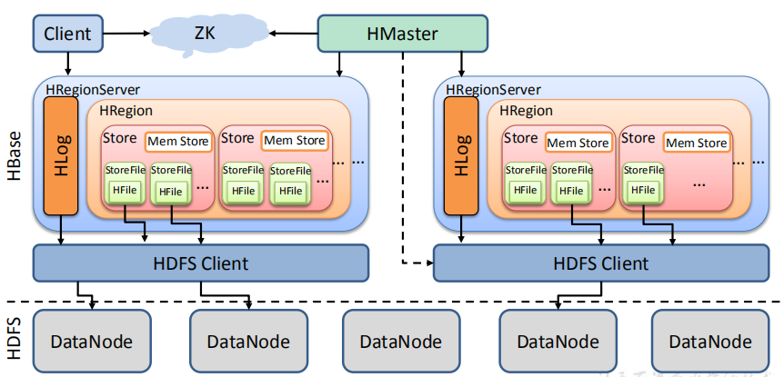
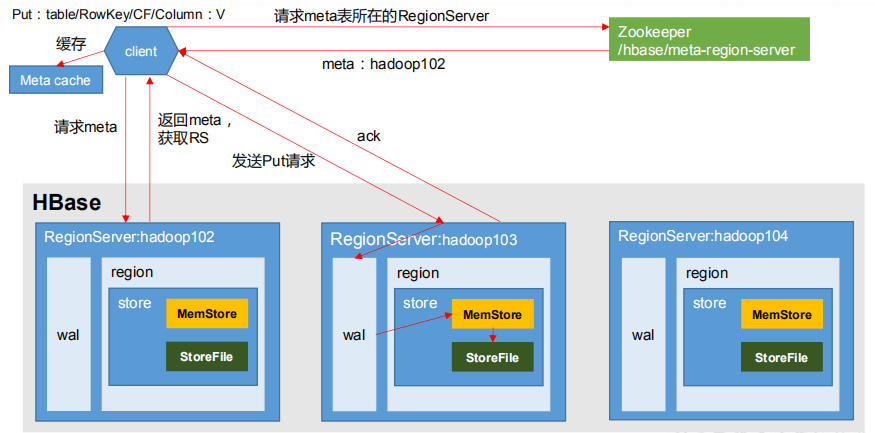
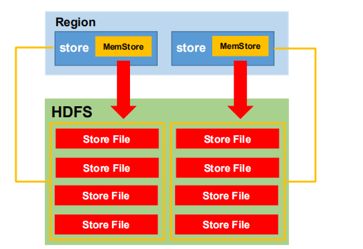
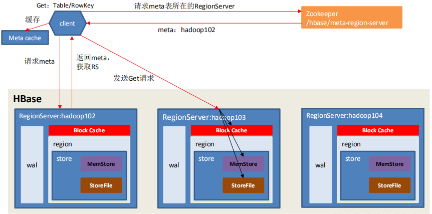

# HBase进阶

## HBase架构原理

  - HBase详细架构图:
  
  
  
  - 注意细节：
    - StoreFile：
      - 保存实际数据的物理文件，StoreFile以HFile的形式存储在HDFS上。
      - 每个Store会有一个或多个StoreFile（HFile），数据在每个StoreFile中都是有序的。
    - MemStore：
      - 写缓存，由于HFile中的数据要求是有序的，所以数据是先存储在MemStore中，排好序后，等到达刷写时机才会刷写到HFile，每次刷写都会形成一个新的HFile。
    - WAL(write ahead log)：
      - 把数据保存在内存中会有很高的概率导致数据丢失，为了解决这个问题，数据会先写入WAL文件中，它记录数据的所有变更，然后再写入MemStore中。
      - 在系统出现故障的时候，数据可以通过这个WAL日志文件重建。
  
## 写流程

  - HBase写流程：
  
  
  
  - 写流程步骤：
    - Client先访问zookeeper，zookeeper中存储了meta表的region信息，从meta表获取相应region信息
    - 访问对应的Region Server，根据读请求的namespace:table/rowkey，查询出目标数据位于哪个Region Server中的哪个Region中。
    - 并将该table的region信息以及meta表的位置信息缓存在客户端的meta cache，方便下次访问。
    - 与目标Region Server进行通讯。
    - 将数据顺序写入（追加）到 WAL和MemStore各一份。
    - MemStore中数据达到一个阈值后则把数据刷成一个StoreFile文件。若MemStore中的数据有丢失，则可以从WAL中恢复
    - 当多个StoreFile文件达到一定的大小后，会触发Compact合并操作，合并为一个StoreFile，这里同时进行版本的合并和数据删除。
    - 当发生Compact逐步形成越来越大的StoreFIle后，会触发Split操作，把当前的StoreFile分成两个，这里相当于把一个大的region分割成两个region。
    - 向客户端发送ack。
    
## MemStore Flush

  - MemStore Flush:
  
  
  
  - MemStore刷写时机：
    - 当某个MemStore的大小达到了hbase.hregion.memstore.flush.size（默认值 128M）， 其所在region的所有MemStore都会刷写。同时阻止继续往该写数据。
    - 当region server中MemStore的总大小达到以下条件时， region会按照其所有memstore的大小顺序（由大到小）依次进行刷写。直到region server中所有memstore的总大小减小到限定值以下。同时会阻止继续往所有的memstore写数据。
      - *hbase.regionserver.global.memstore.size（默认值 0.4）
      - *hbase.regionserver.global.memstore.size.lower.limit（默认值 0.95）
    - 到达自动刷写的时间，也会触发memstore flush：
      - 自动刷新的时间间隔由该属性进行配置hbase.regionserver.optionalcacheflushinterval（默认 1 小时）。
    
## 读流程

  - HBase读流程:
  
  
  
  - 读流程步骤：
    - Client先访问zookeeper，zookeeper中存储了meta表的region信息，从meta表获取相应region信息。
    - 访问对应的Region Server，获取hbase:meta表，根据读请求的namespace:table/rowkey，查询出目标数据位于哪个Region Server中的哪个Region中。
    - 并将该table的region信息以及meta表的位置信息缓存在客户端的meta cache，方便下次访问。
    - 与目标Region Server进行通讯。
    - 分别在Block Cache（读缓存），MemStore 和 StoreFile（HFile）中查询目标数据，并将查到的所有数据进行合并。此处所有数据是指同一条数据的不同版本（Timestamp）或者不
同的类型（Put/Delete）。
    - 将从文件中查询到的数据块（Block，HFile数据存储单元，默认大小为 64KB）缓存到Block Cache。
    - 将合并后的最终结果返回给客户端。
    
## StoreFile Compaction

  - StoreFile Compaction：
  
  

  - 注意细节：
    - 由于MemStore每次刷写都会生成一个新的HFile，且同一个字段的不同版本（timestamp）和不同类型（Put/Delete）有可能会分布在不同的HFile中，因此查询时需要遍历所有的HFile。
    - 为了减少HFile的个数，以及清理掉过期和删除的数据，会进行StoreFile Compaction。
    - Compaction分为两种，分别是Minor Compaction和Major Compaction。
    - Minor Compaction会将临近的若干个较小的HFile合并成一个较大的HFile，但不会清理过期和删除的数据。
    - Major Compaction会将一个Store下的所有的HFile合并成一个大HFile，并且会清理掉过期和删除的数据。
  
## Region Split

  - 默认情况下，每个Table起初只有一个Region，随着数据的不断写入，Region会自动进行拆分。
  - 刚拆分时，两个子Region都位于当前的Region Server，但出于负载均衡的考虑，HMaster有可能会将某个Region转移给其他的Region Server。
  - Region Split时机：
    - 当Memstore flush操作后，HRegion写入新的HFile，有可能产生较大的HFile，会判断是否需要执行Split。
    - HStore执行完成Compact操作后可能产生较大的HFile，会判断是否需要执行Split。
    - HBaseAdmin手动执行split 命令时，会触发 Split。
    - 当某个Store下所有StoreFile的总大小超过Min(R^2 * "hbase.hregion.memstore.flush.size",hbase.hregion.max.filesize")，该Region就会进行拆分，其中R为当前集群Region Server属于该Table 的个数（0.94 版本之后）。
  - Split流程：HBase 将整个分裂过程包装成了一个事务，为了保证切分事务的原子性。整个分裂事务过程分为三个阶段：prepare – execute – (rollback)
    - prepare阶段：
      - 在内存中初始化两个子Region，具体是生成两个HRegionInfo对象，包含TableName、RegionName、Startkey、Endkey等。同时会生成一个transaction journal，这个对象用来记录切分的进展
    - execute阶段：
      - 在ZK节点/hbase/region-in-transition/region-name下创建一个znode，并设置状态为SPLITTING
      - Master通过监听ZK节点，检测到Region状态的变化
      - RegionServer在父Region的HDFS数据目录下创建一个名称为.splits 的子目录
      - RegionServer关闭父Region，强制将数据flush到磁盘，并这个Region标记为offline的状态。
      - RegionServer在.splits 目录（HDFS）下创建daughterA和daughterB子目录，并在文件夹中创建对应的reference文件，分别指向父Region的数据文件中的一部分。
      - RegionServer创建子Region的目录（HDFS），并将 daughterA和daughterB目录下的文件拷贝到Region目录。
      - 在meta表中设置父Region为offline状态，不再提供服务。并将子Region的信息添加到meta表中父Region的信息中（splitA和splitB两列）。
      - RegionServer并行启用两个子Region，并正式提供对外服务
      - RegionSever将daughterA和daughterB添加到meta表中，并设置为online状态，这样就可以从meta表找到子Region，并可以对子Region进行访问了。
      - RegionServr修改ZK节点/hbase/region-in-transition/region-name的状态为SPLIT，Master就可以监听到Region状态的更新。Split事务结束。
    - rollback阶段：
      - 如果execute阶段出现异常，则执行rollback操作。为了实现回滚，整个切分过程被分为很多子阶段，回滚程序会根据当前进展到哪个子阶段清理对应的垃圾数据。

