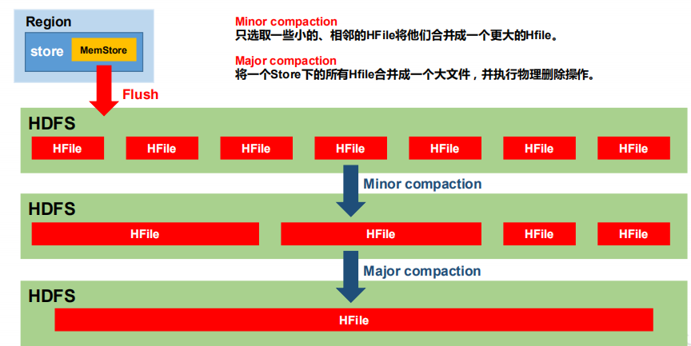

# HBase进阶

## HBase架构原理

  - HBase详细架构图:
  
  
  
  - 注意细节：
    - StoreFile：
      - 保存实际数据的物理文件，StoreFile以HFile的形式存储在HDFS上。
      - 每个Store会有一个或多个StoreFile（HFile），数据在每个StoreFile中都是有序的。
    - MemStore：
      - 写缓存，由于HFile中的数据要求是有序的，所以数据是先存储在MemStore中，排好序后，等到达刷写时机才会刷写到HFile，每次刷写都会形成一个新的HFile。
    - WAL：
      - 把数据保存在内存中会有很高的概率导致数据丢失，为了解决这个问题，数据会先写在一个叫做Write-Ahead logfile的文件中，然后再写入MemStore中。
      - 在系统出现故障的时候，数据可以通过这个日志文件重建。
  
## 写流程

  - HBase写流程：
  
  
  
  - 写流程步骤：
    - Client先访问zookeeper，获取hbase:meta表位于哪个Region Server。
    - 访问对应的Region Server，获取hbase:meta表，根据读请求的namespace:table/rowkey，查询出目标数据位于哪个Region Server中的哪个Region中。
    - 并将该table的region信息以及meta表的位置信息缓存在客户端的meta cache，方便下次访问。
    - 与目标 Region Server 进行通讯。
    - 将数据顺序写入（追加）到 WAL。
    - 将数据写入对应的 MemStore，数据会在 MemStore 进行排序。
    - 向客户端发送ack。
    - 等达到MemStore的刷写时机后，将数据刷写到HFile。
    
## MemStore Flush

  - MemStore Flush:
  
  
  
  - MemStore刷写时机：
    - 当某个MemStore的大小达到了hbase.hregion.memstore.flush.size（默认值 128M）， 其所在region的所有MemStore都会刷写。同时阻止继续往该写数据。
    - 当region server中MemStore的总大小达到以下条件时， region会按照其所有memstore的大小顺序（由大到小）依次进行刷写。直到region server中所有memstore的总大小减小到限定值以下。同时会阻止继续往所有的 memstore 写数据。
      - *hbase.regionserver.global.memstore.size（默认值 0.4）
      - *hbase.regionserver.global.memstore.size.lower.limit（默认值 0.95）
    - 到达自动刷写的时间，也会触发memstore flush：
      - 自动刷新的时间间隔由该属性进行配置hbase.regionserver.optionalcacheflushinterval（默认 1 小时）。
    
## 读流程

  - HBase读流程:
  
  
  
  - 读流程步骤：
    - Client先访问zookeeper，获取hbase:meta表位于哪个Region Server。
    - 访问对应的Region Server，获取hbase:meta表，根据读请求的namespace:table/rowkey，查询出目标数据位于哪个Region Server中的哪个Region中。
    - 并将该table的region信息以及meta表的位置信息缓存在客户端的meta cache，方便下次访问。
    - 与目标 Region Server 进行通讯。
    - 分别在Block Cache（读缓存），MemStore 和 Store File（HFile）中查询目标数据，并将查到的所有数据进行合并。此处所有数据是指同一条数据的不同版本（time stamp）或者不
同的类型（Put/Delete）。
    - 将从文件中查询到的数据块（Block，HFile 数据存储单元，默认大小为 64KB）缓存到Block Cache。
    - 将合并后的最终结果返回给客户端。
    
## StoreFile Compaction

  - StoreFile Compaction：
  
  

  - 注意细节：
    - 由于memstore每次刷写都会生成一个新的HFile，且同一个字段的不同版本（timestamp）和不同类型（Put/Delete）有可能会分布在不同的 HFile 中，因此查询时需要遍历所有的 HFile。
    - 为了减少 HFile 的个数，以及清理掉过期和删除的数据，会进行 StoreFile Compaction。
    - Compaction分为两种，分别是Minor Compaction和Major Compaction。
    - Minor Compaction会将临近的若干个较小的HFile合并成一个较大的HFile，但不会清理过期和删除的数据。
    - Major Compaction会将一个Store下的所有的HFile合并成一个大HFile，并且会清理掉过期和删除的数据。
  
## Region Split

  - 默认情况下，每个Table起初只有一个Region，随着数据的不断写入，Region会自动进行拆分。
  - 刚拆分时，两个子Region都位于当前的 Region Server，但处于负载均衡的考虑，HMaster有可能会将某个Region转移给其他的Region Server。
  - Region Split 时机：
    -  当 1 个 region 中 的 某 个 Store 下所有 StoreFile 的 总 大 小 超 过 Min(R^2 * "hbase.hregion.memstore.flush.size",hbase.hregion.max.filesize")，该 Region 就会进行拆分，其
中 R 为当前 Region Server 中属于该 Table 的个数（0.94 版本之后）。
  
  
  
