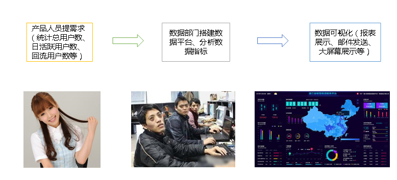
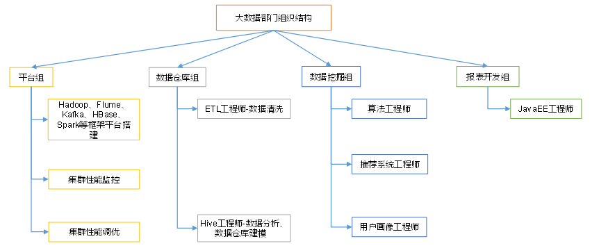

# 大数据概述

  - 大数据主要解决海量数据的存储和分析计算问题。
  - 按顺序给出数据存储单位：Bit -> Byte -> KB -> MB -> GB -> TB -> PB -> EB -> ZB -> YB -> BB -> NB -> DB。
  
## 大数据特点

  - Volume(大量)
  - Velocity(高速)
  - Variety(多样)：结构化数据，非结构化数据。
  - Value(低价值密度)：价值密度的高低与数据总量的大小成反比。
  
## 大数据应用场景

  - 物流仓储
  - 零售
  - 旅游
  - 商品广告推荐
  - 保险
  - 金融
  - 房产
  - 人工智能
  
## 大数据部门业务流程

  - 图示：
  
  
  
## 大数据部门组织结构

  - 图示：
  
  
  
## Lambda架构

  - 定义：Lambda架构包含三层：Batch Layer、Speed Layer和Serving Layer
    - Batch Layer(批处理层): 对历史数据进行离线预计算，使下游能够快速查询结果。批处理基于完整的历史数据集，因此准确性可以得到保证。批处理层可以用Hadoop、Spark和Flink等框架计算
      - 该层负责管理主数据集
      - 主数据集中的数据必须具有以下三个属性：
        - 数据是原始的
        - 数据是不可变的
        - 数据永远是真实的
      - 主数据集是正确性的保证（source of truth），即使丢失所有服务层数据集和加速层数据集，也可以从主数据集中重建应用程序
    - Speed Layer(加速处理层): 处理实时的增量数据，这一层重点在于低延迟。加速层的数据不如批处理层那样完整和准确，但是可以填补批处理高延迟导致的数据空白。加速层可以用Spark streaming和Flink 等框架计算
      - 加速层为批处理视图建立索引便于能快速的即席查询，它存储实时视图并处理传入的数据流，以便更新这些视图
      - 基础存储层必须满足以下场景：
        - 随机读：支持快速随机读取以快速响应查询
        - 随机写：为了支持增量算法，必须尽可能的以低延迟修改实时视图
        - 可伸缩性：实时视图应随它们存储的数据量和应用程序所需的读/写速率进行缩放
        - 容错性：当机器故障，实时视图应还能继续正常运行
    - Serving Layer(服务层): 将历史数据和实时数据合并，输出到数据库或者其他介质，供下游分析
      - 该层提供了主数据集上执行的计算结果的低延迟访问，读取速度可以通过数据附加的索引来加速
  - 架构图：
    
    
    
  - 参考：
    - https://cloud.tencent.com/developer/article/1893757#:~:text=Lambda%20架构分为三层%3A%20批处理层（batch%20layer），加速层（speed%20layer），和服务层（serving,layer）%E3%80%82%20它结合了对同一数据的实时（real-time）和批量（batches）处理%E3%80%82%20首先%20，传入的实时数据流在批处理层（batch%20layer）存储在主数据集中，并在加速层（speed%20layer）存储在内存缓存中%E3%80%82
    - https://zhuanlan.zhihu.com/p/69066464

  
  
  
  
