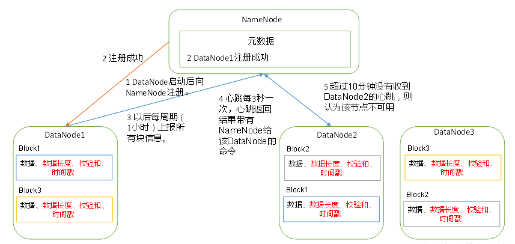

# DataNode

## DataNode工作机制

  - DataNode工作机制：
  
  
  
  - 注意细节：
    - 一个数据块在DataNode上以文件形式存储在磁盘上，包括两个文件，一个是数据本身，一个是元数据包括数据块的长度，块数据的校验和，以及时间戳。
    - DataNode启动后向NameNode注册，通过后，周期性（1小时）的向NameNode上报所有的块信息。
    - 心跳是每3秒一次，心跳返回结果带有NameNode给该DataNode的命令如复制块数据到另一台机器，或删除某个数据块。
    - 如果超过10分钟没有收到某个DataNode的心跳，则认为该节点不可用。
    - 集群运行中可以安全加入和退出一些机器。
    
## 数据完整性

  - 检测损坏数据的常用方式是计算数据的校验和。如果新产生的校验和与初始的不一致，则该数据被损坏了。这个技术只是错误检测，不能对数据进行修复。
  - HDFS的数据完整性：
    - Datanodes在接收到数据时校验数据以及它的校验和，可能发生在从客户端接收数据或者从其他节点复制数据。如果Datanode检测到错误，客户端会收到IOException。
    - 每个Datanode保存checksum校验的日志，因此它知道上一次数据块是什么时候校验的。
    - 除了在客户端读数据时校验，每个Datanode后台运行DataBlockScanner周期检验Datanode上所有的数据块。
   
 ## 压缩
 
  - 文件压缩有两个好处：
    - 减少存储文件需要的空间
    - 加速数据在网络中或磁盘间的传输
  - 文件压缩格式：
  
    
    
    - 所有的压缩算法面临空间/时间的折中：更快地压缩和解压速率通常占用的存储空间更大。
    - Splittable表示是否可以查询到数据流的任意位置，并开始读取数据。
  
