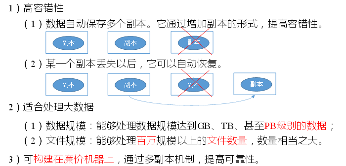
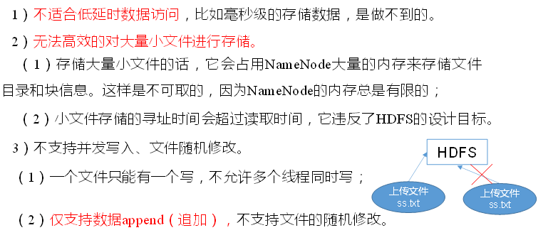
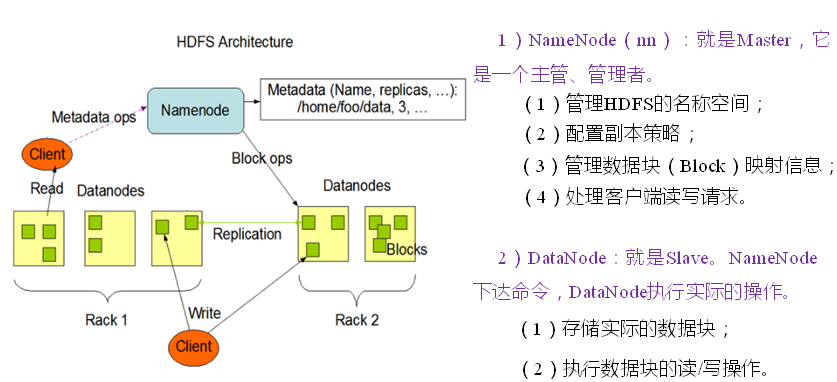
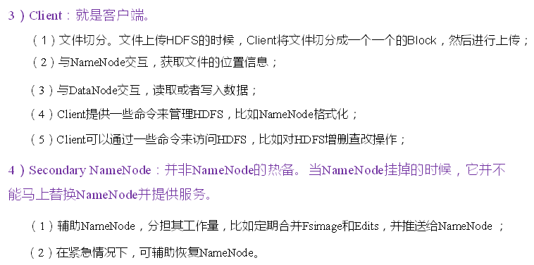
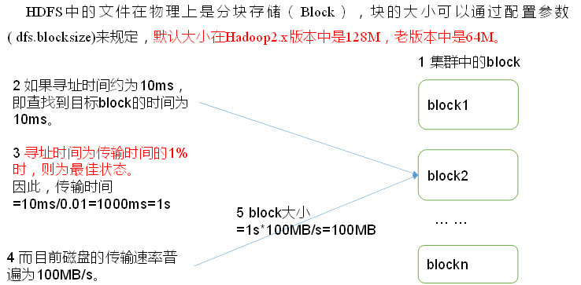

# HDFS概述

  - HDFS(Hadoop Distributed File System)是一个文件系统，用于存储文件，通过目录树来定位文件；其次它是分布式的，运行在商业软件的集群，集群中的服务器有各自的角色。
  - HDFS使用场景：适合一次写入，多次读出的场景。写入是以追加的方式在文件末端写入数据，不支持多个writers以及在文件任意位置修改。
  - HDFS提高数据的吞吐量，但是以牺牲时延为代价

## HDFS概念

  - Blocks：数据块
    - HDFS默认的数据块大小是128MB。但是小于默认数据块大小的文件只占用实际大小的存储，不是整个默认数据块的大小。例如数据块大小是128MB，文件大小是1MB，实际占用的磁盘空间就是1MB。
    - 数据块比较大的原因：数据块比较大，数据传输的时间远大于寻址时间，而传输数据是以磁盘传输率进行的。
  - Namenode and Datanode：
    - 一个HDFS集群有一个Namenode和很多Datanode。
    - Namenode：管理文件系统的命名空间，它包含文件系统树以及文件和目录的元数据。这些信息存储在本地磁盘，包含：namespace image和edit log。Namenode也知道数据块所在Datanode的位置。
    - Datanode：负责存储和读取数据块，并且周期向Namenode报告自身存储block的情况。
    - Namenode failure mechanisms: Secondary Namenode：它负责周期合并namespace image和edit log，防止edit log过大。然而secondary namenode状态落后于primary namenode，所以primary namenode失败的时候会发生数据丢失。
  - Block Caching：数据块缓存
    - 通常Datanode从磁盘读取数据块，但经常被访问的数据块可以显示缓存在Datanode内存中，即堆外块缓存。
  - HDFS Federation：联邦
    - Hadoop 2.x引入HDFS联邦，允许集群通过增加Namenode扩展，每个Namenode管理一部分文件系统的命名空间（namespace volume）。
  - HDFS High Availability：
    - 将一对Namenodes配置成active-standby。如果active namenode失效了，standby namenode接管任务处理用户请求。
    - Failover controller管理active namenode到standby namenode的切换。每个Namenode运行一个轻量级的failover controller，它通过心跳机制监控Namenode状态，并在Namenode失效时触发故障转移。
  
## HDFS优缺点

  - HDFS优点：
  
  
  
  - HDFS缺点：
  
  
  
## HDFS架构

  - HDFS架构：
  
  
  
  
  
## HDFS文件块大小

  - HDFS文件块大小：
  
  
  
  - 注意细节：
    - HDFS文件块设置太小，会增加寻址时间。
    - HDFS文件块设置太大，传输数据的时间会增加。
    - HDFS文件块设置主要取决于磁盘传输速率。
    
    
  
  
  
