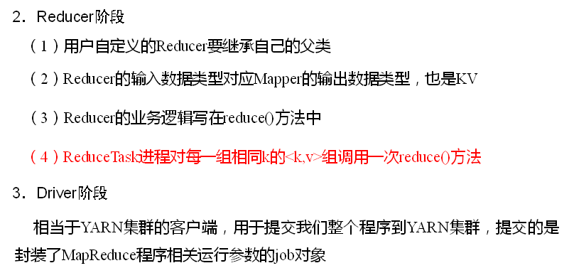

# MapReduce概述

## MapReduce定义

  - MapReduce是一个分布式运算程序的编程框架，是用户开发“基于Hadoop的数据分析应用”的核心框架。
  - MapReduce核心功能是将用户编写的业务逻辑代码和自带默认组件整合成一个完整的分布式运算程序，并发运行在一个Hadoop集群上。
  
## MapReduce优缺点

  - 优点：
    - 易于编程：简单实现一些接口就可以完成一个分布式程序，然后分布到大量廉价的机器上运行。
    - 良好的扩展性：通过增加机器来扩展计算能力。
    - 高容错性：一台机器挂了，它可以把计算任务转移到另一个节点上运行。
    - 适合PB级以上海量数据的离线处理。
  - 缺点：
    - 不擅长实时计算。
    - 不擅长流失计算。
    - 不擅长有向图计算。
    
## MapReduce核心思想

  - MapReduce图示：
  
  
  
  - MapReduce进程：
  
  
  
## 常用数据序列化类型

  - 常用的数据类型：
  
  
  
## MapReduce编程规范

  - 用户编写的程序分成三个部分：Mapper、Reducer和Driver。
  - MapReduce编程规范：
  
  
  
  
  
  
  
    
