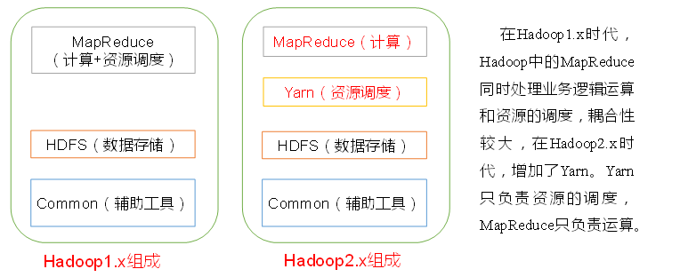
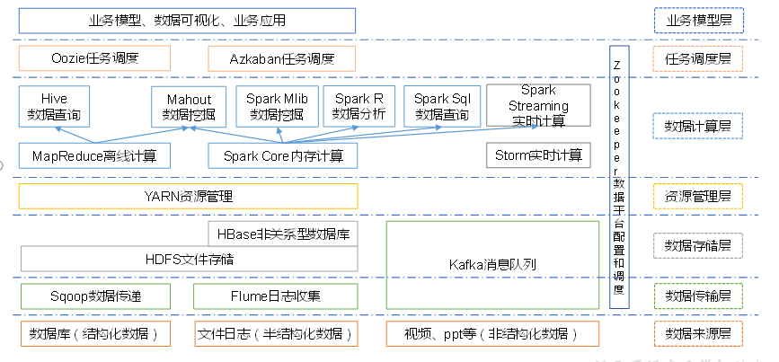

# Hadoop概述

  - 背景介绍：
    - 从磁盘读写TB级别以上大量数据都比较耗时，一个解决方法是同时并行地从多个磁盘读取数据。
    - 并行处理数据的一些问题：
      - Hardware failure: 同时运行多个硬件，其中某个硬件失败的概率很大。避免数据丢失的一个常用做法是复制：在多个节点上做数据的备份。
      - 需要从多个数据源聚合数据进行处理。MR提供了一个编程模型，将这个问题从磁盘的读写抽象成了两部分计算模型：map and reduce。
  - Hadoop概述：
    - Hadoop是由Apache开发的分布式系统基础架构，是一个可靠、可扩展的平台，运行在经济的商业软件上。
    - 主要解决海量数据的存储和分析计算问题。
    - Hadoop通常指一个更广泛的概念 - Hadoop生态圈。
  
## Hadoop发展历史

  - Doug Cutting
  - Google:
    - GFS         --> HDFS
    - MapReduce   --> MR
    - BigTable    --> HBase
    
## Hadoop三大发行版本

  - Apache：最原始（最基础）的版本，对于入门学习最好。
  - Cloudera：大型互联网企业中用的较多。
  - Hortonworks：文档较好。
  
## Hadoop优势

  - 高可靠性：Hadoop底层维护多个数据副本，即使某个计算元素或存储出现故障，也不会导致数据的丢失。
  - 高扩展性：在集群间分配任务数据，可方便的扩展数以千计的节点。
  - 高效性：Hadoop是并行工作的，加快任务处理速度。
  - 高容错性：能够自动将失败的任务重新分配。
  
## Hadoop1.x和Hadoop2.x区别

  - 图示：
  
   
  
## 大数据技术生态体系

  - 图示：
  
  
  
  - 组件介绍：
    - Sqoop：Sqoop是一款开源的工具，主要用于在Hadoop、Hive与传统的数据库(MySql)间进行数据的传递，可以将一个关系型数据库（例如 ：MySQL，Oracle 等）中的数据导进到Hadoop的HDFS中，也可以将HDFS的数据导进到关系型数据库中。
    - Flume：Flume是Cloudera提供的一个高可用的，高可靠的，分布式的海量日志采集，聚合和传输的系统。Flume支持在日志系统中定制各类数据发送方，用于收集数据；同时，Flume提供对数据进行简单处理，并写到各种数据接受方（可定制）的能力。
    - Kafka：Kafka是一种高吞吐量的分布式发布订阅消息系统。
      - 通过O(1)的磁盘数据结构提供消息的持久化，这种结构对于即使数以TB的消息存储也能够保持长时间的稳定性能。
      - 高吞吐量：即使是非常普通的硬件Kafka也可以支持每秒数百万的消息。
      - 支持通过Kafka服务器和消费机集群来分区消息。
      - 支持Hadoop并行数据加载。
    - Storm：Storm用于“连续计算”，对数据流做连续查询，在计算时就将结果以流的形式输出给用户。
    - Spark：Spark是当前最流行的开源大数据内存计算框架。可以基于Hadoop上存储的大数据进行计算。
    - Oozie：Oozie是一个管理Hdoop作业（job）的工作流程调度管理系统。
    - Hbase：HBase是一个分布式的、面向列的开源数据库。HBase不同于一般的关系数据库，它是一个适合于非结构化数据存储的数据库。
    - Hive：Hive是基于Hadoop的一个数据仓库工具，可以将结构化的数据文件映射为一张数据库表，并提供简单的SQL查询功能，可以将SQL语句转换为MapReduce任务进行运行。十分适合数据仓库的统计分析。
    - R语言：R是用于统计分析、绘图的语言和操作环境。R是属于GNU系统的一个自由、免费、源代码开放的软件，它是一个用于统计计算和统计制图的优秀工具。
    - Mahout：Apache Mahout是个可扩展的机器学习和数据挖掘库。
    - ZooKeeper：Zookeeper是Google的Chubby一个开源的实现。它是一个针对大型分布式系统的可靠协调系统，提供的功能包括：配置维护、名字服务、 分布式同步、组服务等。ZooKeeper的目标就是封装好复杂易出错的关键服务，将简单易用的接口和性能高效、功能稳定的系统提供给用户。
    
    
      
  
