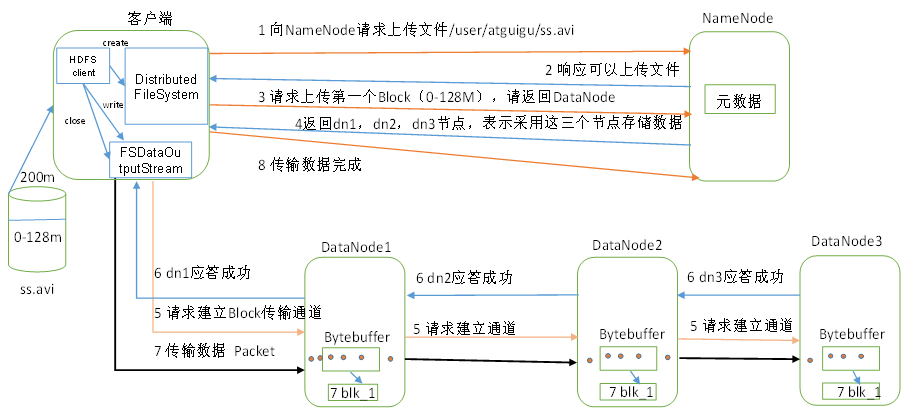
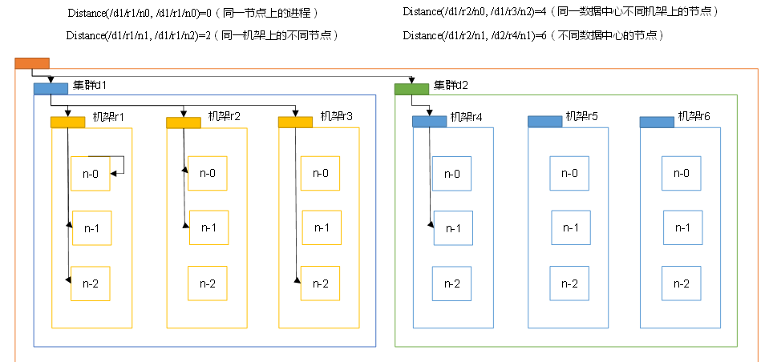
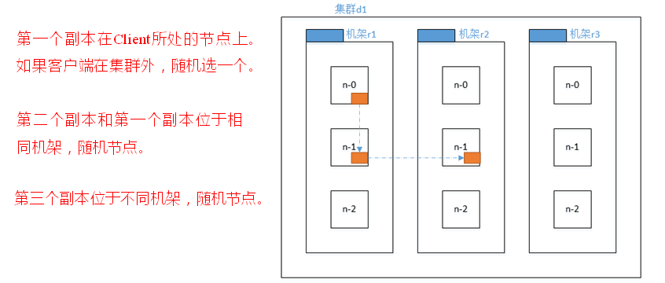
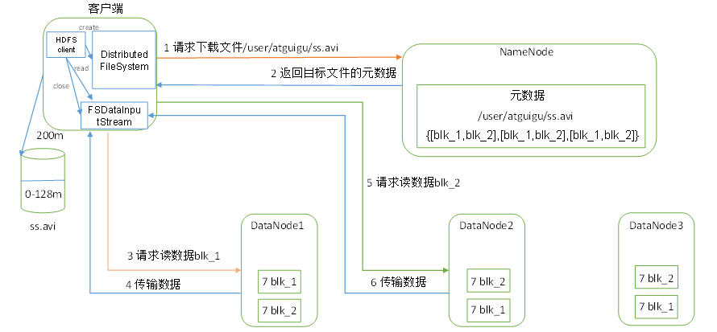

# HDFS的数据流

## HDFS写数据流程

  - HDFS写数据流程：
  
  
  
  - 写数据步骤：
    - 客户端通过Distributed FileSystem模块向NameNode请求上传文件，NameNode检查目标文件是否已存在，父目录是否存在。
    - NameNode返回是否可以上传。
    - 客户端请求第一个 Block上传到哪几个DataNode服务器上。
    - NameNode返回3个DataNode节点，分别为dn1、dn2、dn3。
    - 客户端通过FSDataOutputStream模块请求dn1上传数据，dn1收到请求会继续调用dn2，然后dn2调用dn3，将这个通信管道建立完成。
    - dn1、dn2、dn3逐级应答客户端。
    - 客户端开始往dn1上传第一个Block（先从磁盘读取数据放到一个本地内存缓存），以Packet为单位，dn1收到一个Packet就会传给dn2，dn2传给dn3；dn1每传一个packet会放入一个应答队列等待应答。
    - 当一个Block传输完成之后，客户端再次请求NameNode上传第二个Block的服务器。（重复执行3-7步）。
    
## 网络拓扑-节点距离计算

  - 在HDFS写数据的过程中，NameNode会选择距离待上传数据最近距离的DataNode接收数据。
  - 节点距离即两个节点到达最近的共同祖先的距离总和。
  - 节点距离图示：
  
  
  
## 副本节点选择

  - 副本节点选择:
  
  
  
## HDFS读数据流程

  - HDFS读数据流程：
  
  
  
  - 读数据步骤：
    - 客户端通过Distributed FileSystem向NameNode请求下载文件，NameNode通过查询元数据，找到文件块所在的DataNode地址。
    - 挑选一台DataNode（就近原则，然后随机）服务器，请求读取数据。
    - DataNode开始传输数据给客户端（从磁盘里面读取数据输入流，以Packet为单位来做校验）。
    - 客户端以Packet为单位接收，先在本地缓存，然后写入目标文件。
    
    
    
    
  

  
