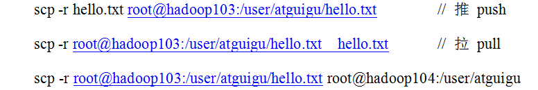
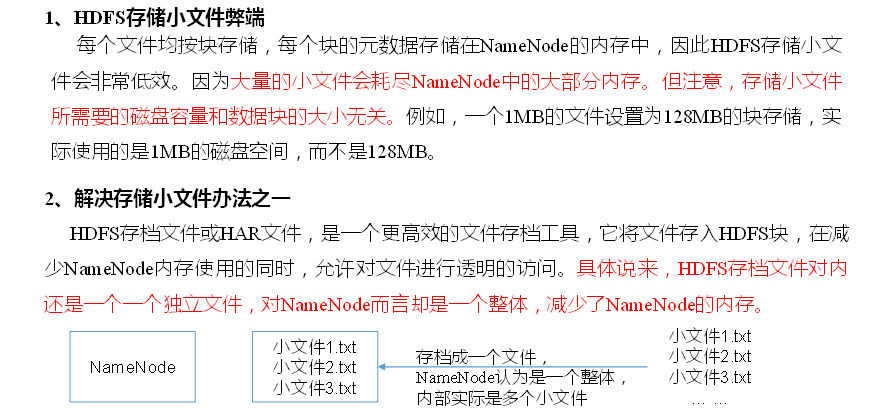
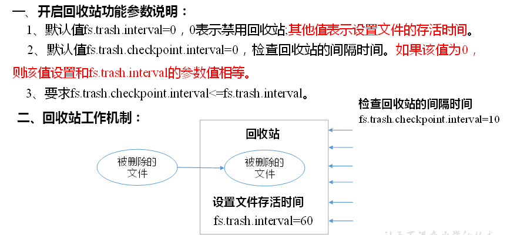
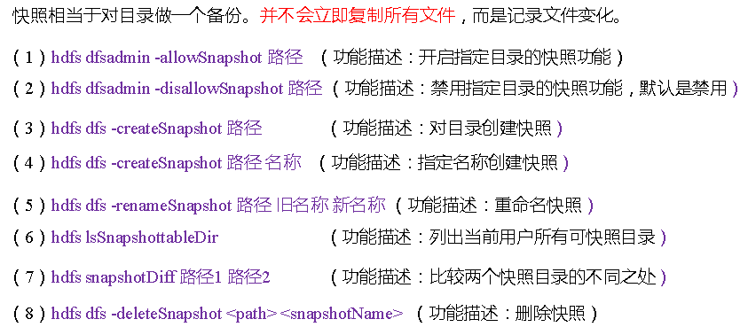

# HDFS 2.X新特性

## 集群间数据拷贝

  - scp实现两个远程主机之间的文件复制。
  
  - scp例子：
  
  
  
  - 采用distcp命令实现两个Hadoop集群之间的递归数据复制。
  
## 小文件存档

  - 小文件存档：
  
  
  
## 回收站

  - 开启回收站功能，可以将删除的文件在不超时的情况下，恢复原数据，起到防止误删除、备份等作用。
  - 回收站图示：
  
  
  
## 快照管理

  - 快照管理：
  
  
  
