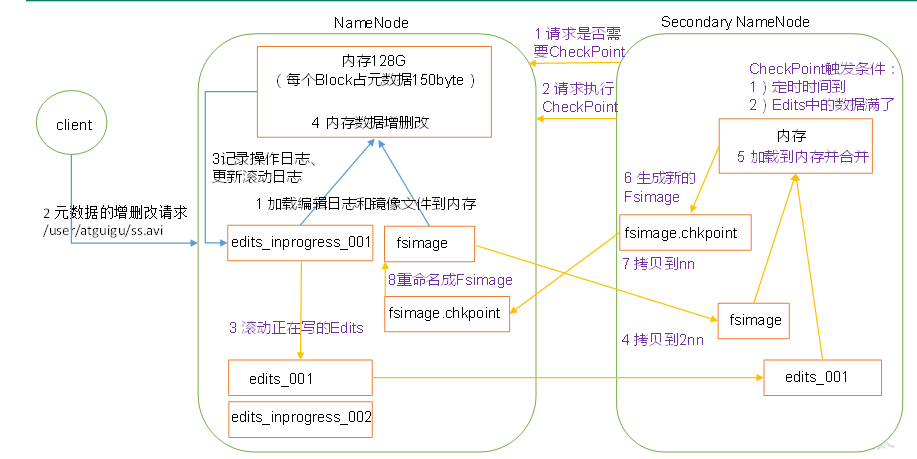
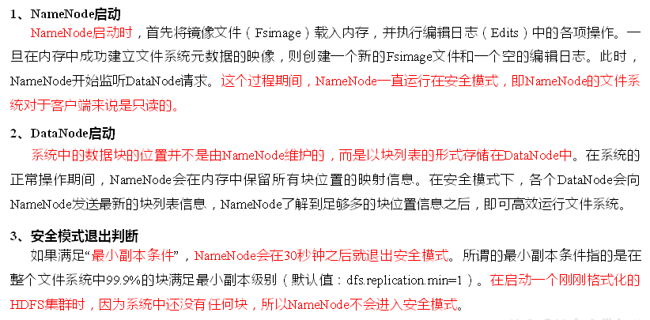

# NameNode和SecondaryNameNode

## NN和2NN工作机制

  - NN和2NN工作机制
  
  
  
  - 步骤细节：
    - 第一阶段：NameNode启动：
      - 第一次启动NameNode格式化后，创建Fsimage和Edits文件。如果不是第一次启动，直接加载编辑日志和镜像文件到内存。
      - 客户端对元数据进行增删改的请求。
      - NameNode记录操作日志，更新滚动日志。
      - NameNode在内存中对数据进行增删改。
    - 第二阶段：Secondary NameNode工作：
      - Secondary NameNode询问NameNode是否需要CheckPoint。直接带回NameNode是否检查结果。
      - Secondary NameNode请求执行CheckPoint。
      - NameNode滚动正在写的Edits日志。
      - 将滚动前的编辑日志和镜像文件拷贝到Secondary NameNode。
      - Secondary NameNode加载编辑日志和镜像文件到内存，并合并。
      - 生成新的镜像文件fsimage.chkpoint。
      - 拷贝fsimage.chkpoint到NameNode。
      - NameNode将fsimage.chkpoint重新命名成fsimage。
  - 相关概念：
    - Fsimage：NameNode内存中元数据序列化后形成的文件。
    - Edits：记录客户端更新元数据信息的每一步操作（可通过Edits运算出元数据）。
    - SecondaryNameNode的作用就是帮助NameNode进行Edits和Fsimage的合并工作。
      
## NameNode故障处理

  - 方法一：将SecondaryNameNode中数据拷贝到NameNode存储数据的目录：
    - kill -9 NameNode进程
    - 删除NameNode存储的数据
    - 拷贝SecondaryNameNode中数据到原NameNode存储数据目录
    - 重新启动NameNode
  - 方法二：使用-importCheckpoint选项启动NameNode守护进程，从而将SecondaryNameNode中数据拷贝到NameNode目录中。
  
## 集群安全模式

  - 集群安全模式：
  
  

  - 基本语法：
    - bin/hdfs dfsadmin -safemode get : 查看安全模式状态。
    - bin/hfds dfsadmin -safemode enter : 进入安全模式状态。
    - bin/hdfs dfsadmin -safemode leave : 离开安全模式状态。
    - bin/hdfs dfsadmin -safemode wait : 等待安全模式状态。
    
    
  
