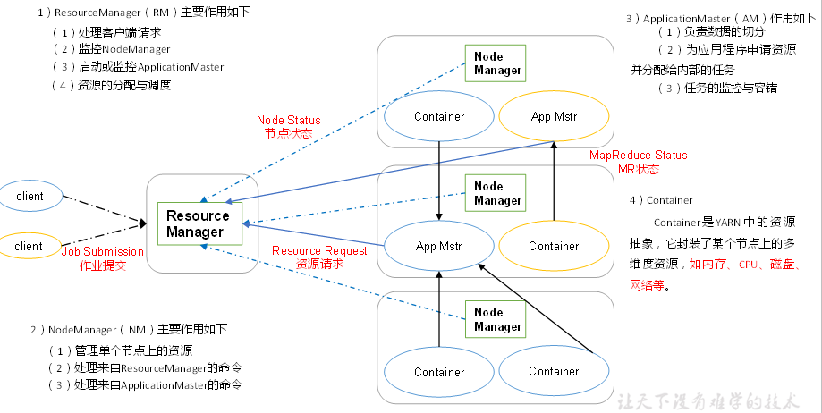
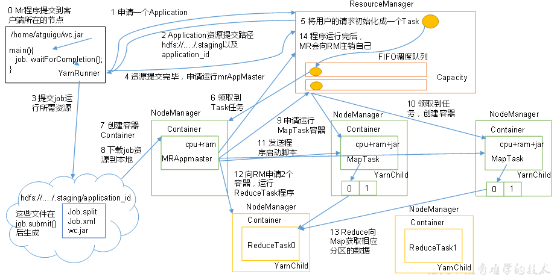
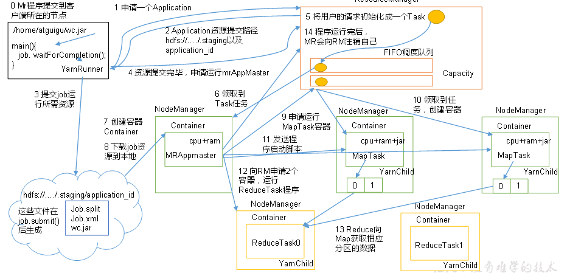
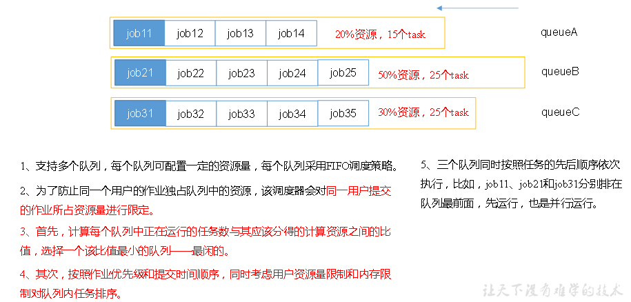
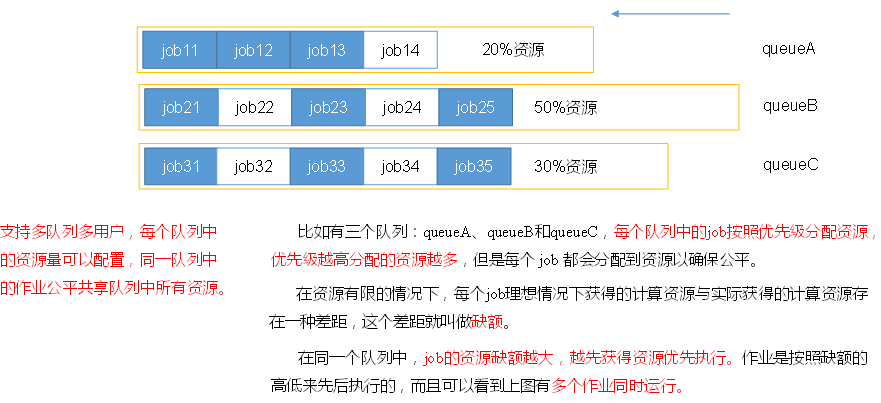

# Yarn资源调度器

  - Yarn是一个资源调度平台，负责为运算程序提供服务器运算资源，相当于一个分布式的操作系统平台，而MapReduce等运算程序则相当于运行于操作系统之上的应用程序。
  
## Yarn基本架构

  - Yarn架构：
  
  
  
## Yarn工作机制

  - Yarn工作机制：
  
  
  
  - 注意细节：
    - MR程序提交到客户端所在的节点。
    - YarnRunner向ResourceManager申请一个Application。
    - RM将该应用程序的资源路径返回给YarnRunner。
    - 该程序将运行所需资源提交到HDFS上。
    - 程序资源提交完毕后，申请运行mrAppMaster。
    - RM将用户的请求初始化成一个Task。
    - 其中一个NodeManager领取到Task任务。
    - 该NodeManager创建容器Container，并产生MRAppmaster。
    - Container从HDFS上拷贝资源到本地。
    - MRAppmaster向RM 申请运行MapTask资源。
    - RM将运行MapTask任务分配给另外两个NodeManager，另两个NodeManager分别领取任务并创建容器。
    - MR向两个接收到任务的NodeManager发送程序启动脚本，这两个NodeManager分别启动MapTask，MapTask对数据分区排序。
    - MrAppMaster等待所有MapTask运行完毕后，向RM申请容器，运行ReduceTask。
    - ReduceTask向MapTask获取相应分区的数据。
    - 程序运行完毕后，MR会向RM申请注销自己。
    
## 作业提交过程

  - 作业提交过程之YARN：
  
  
  
  - 作业提交：
    - Client调用job.waitForCompletion方法，向整个集群提交MapReduce作业。
    - Client向RM申请一个作业id。
    - RM给Client返回该job资源的提交路径和作业id。
    - Client提交jar包、切片信息和配置文件到指定的资源提交路径。
    - Client提交完资源后，向RM申请运行MrAppMaster。
  - 作业初始化：
    - 当RM收到Client的请求后，将该job添加到容量调度器中。
    - 某一个空闲的NM领取到该Job。
    - 该NM创建Container，并产生MRAppmaster。
    - 下载Client提交的资源到本地。
  - 任务分配：
    - MrAppMaster向RM申请运行多个MapTask任务资源。
    - RM将运行MapTask任务分配给另外两个NodeManager，另两个NodeManager分别领取任务并创建容器。
  - 任务运行：
    - MR向两个接收到任务的NodeManager发送程序启动脚本，这两个NodeManager分别启动MapTask，MapTask对数据分区排序。
    - MrAppMaster等待所有MapTask运行完毕后，向RM申请容器，运行ReduceTask。
    - ReduceTask向MapTask获取相应分区的数据。
    - 程序运行完毕后，MR会向RM申请注销自己。
  - 进度和状态更新：
    - YARN中的任务将其进度和状态(包括counter)返回给应用管理器, 客户端每秒(通过mapreduce.client.progressmonitor.pollinterval设置)向应用管理器请求进度更新, 展示给用户。
  - 作业完成：
    - 客户端每5秒都会通过调用waitForCompletion()来检查作业是否完成。
    - 时间间隔可以通过mapreduce.client.completion.pollinterval来设置。
    - 作业完成之后, 应用管理器和Container会清理工作状态。
    - 作业的信息会被作业历史服务器存储以备之后用户核查。
    
## 资源调度器

  - Hadoop作业调度器主要有三种：FIFO、Capacity Scheduler和Fair Scheduler。
  - 先进先出调度器（FIFO）：先到先服务。
  - 容量调度器（Capacity Scheduler）：
  
  
  
  - 公平调度器（Fair Scheduler）：
  
  
  
  
  
  
  
    
    
    
    
    
    
    
    
    
    
    
    
    
    
    
    
    
  
  
    
    
    
    
    
    
    
    
    
    
    
    
    
    
    
    
  
  
