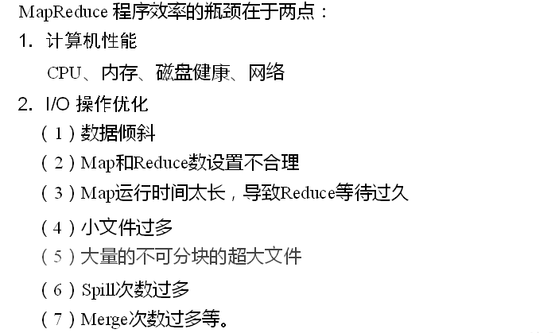
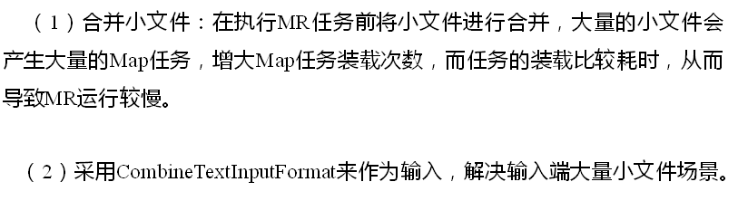
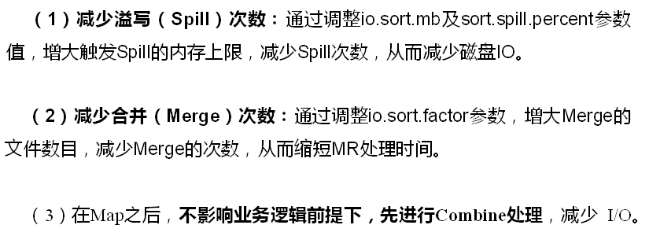
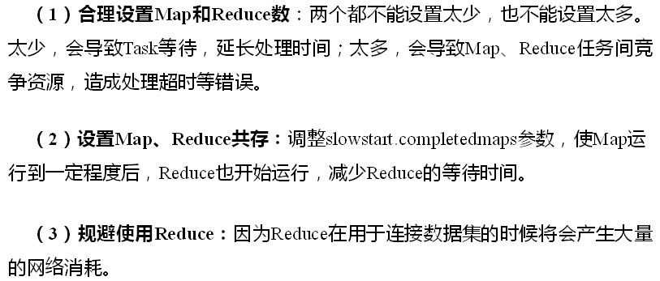
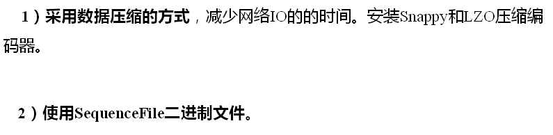
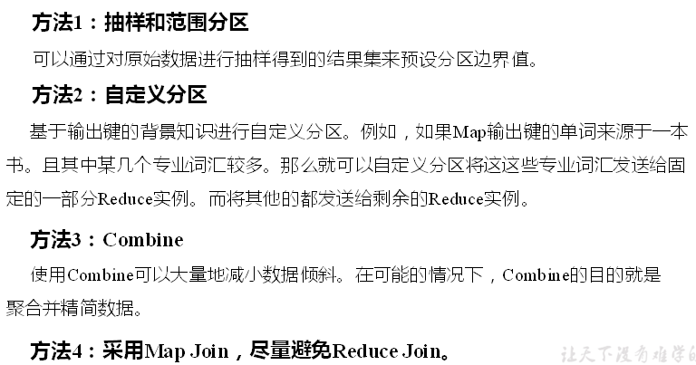

# Hadoop优化

## MapReduce效率的瓶颈

  - MapReduce效率的瓶颈：
  
  
  
## MapReduce优化方法

  - 数据输入：
  
  
  
  - Map阶段优化：
  
  
  
  - Reduce阶段优化：
  
  
  
  - IO传输优化：
  
  
  
  - 数据倾斜问题：
  
  
  
  - 数据倾斜问题的优化：
  
  
  
  - HDFS小文件优化：
    - 在数据采集的时候，就将小文件或小批数据合成大文件再上传HDFS。
    - 在业务处理之前，在HDFS上使用MapReduce程序对小文件进行合并。
    - 在MapReduce处理时，可采用CombineTextInputFormat提高效率。
     
  
  
  
  
  
  
