# MapReduce框架原理

## InputFormat数据输入

  - MapTask并行度决定机制：
    - 数据切片：数据切片只是在逻辑上对输入进行分片，它只是引用到输入数据的位置。
    - InputFormat负责创建输入分段，并划分为一系列的记录。
    - 客户端通过getSplits()计算分段，然后发送到Application Master。AM将map任务调度到距离分段数据近的节点。Map任务调用createRecordReader()获取分段的RecordReader，它用来迭代记录，并生成键值对传给map函数。
    - 图示：
    
      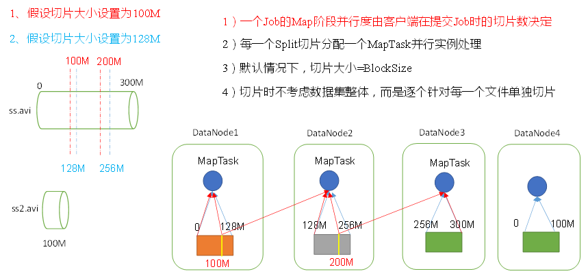
    
    - InputFormat类分级：
      
     
    
### FileInputFormat

  - 使用文件作为数据源的基类，做两件事情：定义输入数据包含哪些文件，生成输入文件的分段。
  - FileInputFormat切片机制：
  
    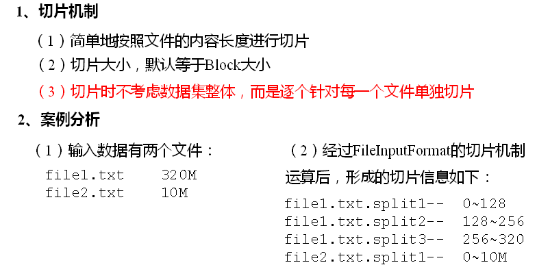
  
  - 切片大小的计算：
  
    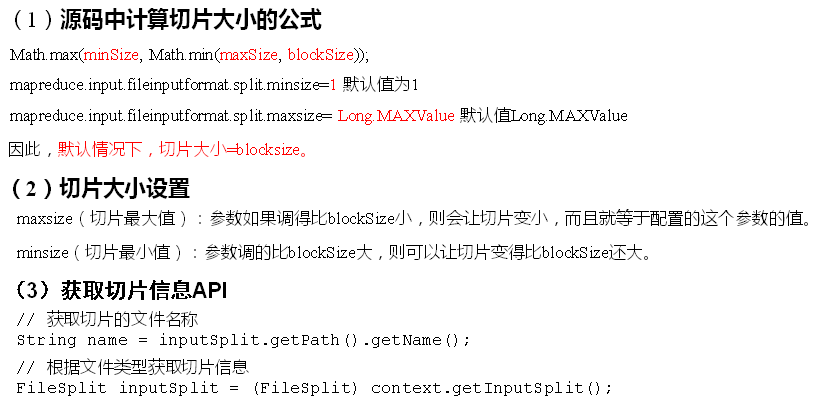
  
### CombineTextInputFormat

  - CombineTextInputFormat用于小文件过多的场景，它可以将多个小文件从逻辑上规划到一个切片中，这样，多个小文件就可以交给一个MapTask处理。
  - 处理小文件缺点：
    - 大量的小文件需要对应数量的map任务，每个map任务会引入额外的开销
    - 大量的小文件增加查找文件的开销。
    - 存储大量的小文件浪费NameNode内存
  - CombineTextInputFormat切片机制：
  
    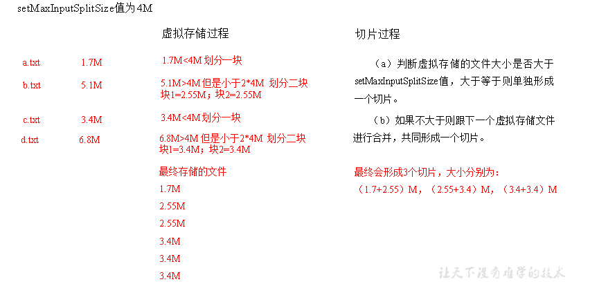
  
### TextInputFormat

  - TextInputFormat是默认的InputFormat，每条记录是输入的一行。键是每行起点的字节偏移量，值是每行内容。
  
    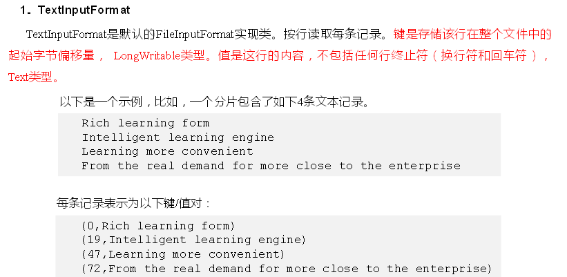
  
### KeyValueTextInputFormat

  - KeyValueTextInputFormat：
  
    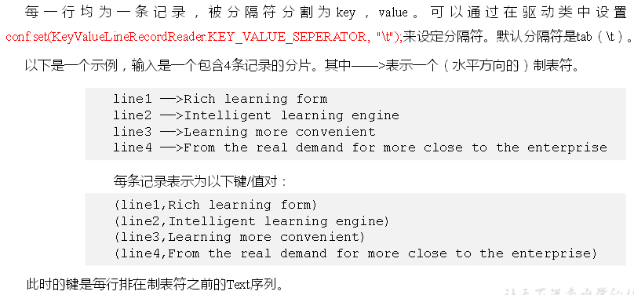
  
### NLineInputFormat

  - NLineInputFormat：N指的是每个mapper接收N行数据。
  
    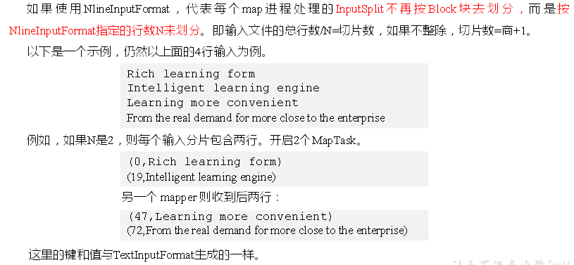
    
### SequenceFileInputFormat

  - SequenceFileInputFormat: 存储二进制键值对

### DBInputFormat

  - DBInputFormat支持用JDBC从关系型数据库读取数据
  - 另一种在HDFS和关系型数据库移动数据的方式是Sqoop
  
## MapReduce工作流程

  - MapReduce工作流程：
  
    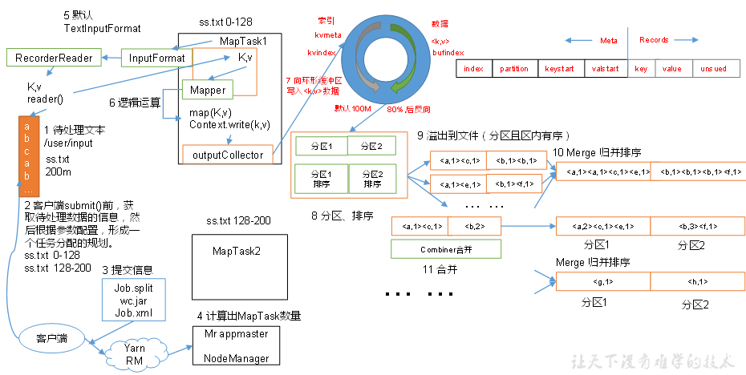
  
    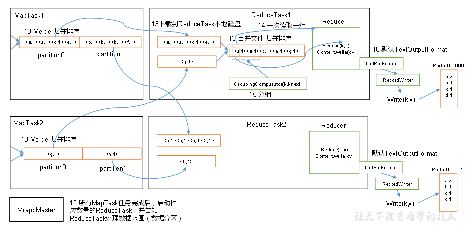
    
    - 作业提交：
      - Resource Manager分配新的Application ID，用于MR Job ID
      - 检查作业的输出规范，例如输出目录是否存在等
      - 计算作业的输入分段
      - 拷贝资源：Jar文件，配置文件，计算的输入分段等到共享文件系统（HDFS）
    - 作业初始化：
      - Yarn调度器分配Container，然后RM在这个Container里启动Application Master进程，并且AM进程受Node Manager管理
      - AM是一个Java进程，它创建一些bookkeeping对象追踪作业的进度；然后从HDFS获取输入分段，给每个输入分段创建对应的map任务，以及指定的reduce任务。
    - 任务分配：
      - AM向RM申请运行map和reduce任务的containers。
      - Reduce任务可以在集群任意位置运行，而Map任务有数据本地化的限制
    - 任务执行：
      - 任务由Java进程运行，它的主类是YarnChild。运行任务之前，它会确定资源，包括：Jar，配置文件，缓存中的文件等
      - 任务会向AM报告进度和状态
    - 作业完成：
      - 作业完成时，AM和Container会清理工作状态，中间输出会被删除。作业信息会被归档到Job History Server。

### Failures

  - Task Failure:
    - Task JVM在退出之前把错误报告给AM，错误记录到用户日志，AM标记任务为失败并且释放容器资源用于其他任务。
    - 如果AM一段时间没有收到某个任务的进度更新，则标记该任务为失败。超时周期通常是10分钟，由mapreduce.task.timeout配置。超时后task JVM会自动被终止。
    - AM会避免在同一个Node Manager上重新调度之前失败的任务。如果任务失败了4次，则不会再重试。整个作业会标记为失败。
  - AM Failure:
    - AM失败重试次数由mapreduce.am.max-attempts参数控制，超过之后整个作业失败。
    - AM周期性地向RM发送心跳。如果AM失败，RM会检测到AM失败并再新的容器里启动新的AM实例。对于MR的AM，它会通过job history恢复任务的状态，因此不需要重新运行所有任务。
  - Node Manager Failure:
    - 如果Node Manager失败或运行很慢，它会停止向RM发送心跳。RM会检测到NM失败，并将它从可用的节点池中移除。
    - 如果NM失败次数过高会被加入黑名单
  - Resource Manager Failure:
    - 默认配置RM是单点失败，所有运行的作业都会失败，并且不能恢复。
    - 可以通过active-standby的配置运行一对RM实现高可用。如果Active RM失败了，Standby RM接管任务
    - 所有运行应用的信息可以存储在ZK或者HDFS，因此Standby RM可以通过它恢复失败的RM核心状态。当新的RM启动时，它读取应用信息，并重启应用的AM。
    - 由Standby到Active转换的过程是故障处理控制器完成。

### Shuffle and Sort

  - MR保证reduce的输入都是根据key排序，这个排序过程以及将map输出传输到reduce作为输入的过程被称为shuffle
  - Map端：
    
    - 图片

    - 每个map任务有一个环形内存缓冲区，默认100MB，可以通过mapreduce.task.io.sort.mb参数调优。当缓冲区数据达到阈值，通常是80%时，一个后台线程启动，将数据会溢写到磁盘。
    - 数据写入到磁盘之前，后台线程先将数据分区，对应于reducers。在每个分区内根据key排序。如果有combiner函数，则应用于排序后的输出数据。
  - Reducer端:
    - Reduce任务有一些复制线程并行地获取map输出。默认5个线程，可以由mapreduce.reduce.shuffle.parallelcopies参数配置。
    - 对于一个作业，AM知道map输出和节点之间地映射，reducer中的线程周期性地询问AM map输出的节点，然后去各个MapTask机器上取相应的结果分区数据。
    - 如果map输出比较小，拷贝到reduce任务的内存中；否则拷贝到磁盘。当拷贝的数据在磁盘上积累时，后台线程会将数据合并成更大的，有序的文件。
    - 所有的map输出拷贝之后，reduce任务进入排序阶段，这个阶段合并map输出，并排序。
    - 然后是reduce阶段，对于每个key应用reduce函数，结果输出到外部文件系统，例如HDFS。
  - 配置调优:
    - 通用的规则是给shuffle尽可能大的内存，然而需要保证map和reduce函数有足够的内存运行。
    - 对于map端，减少数据溢写磁盘的次数可以提高性能。增加mapreduce.task.io.sort.mb参数可以减少溢写的次数。
    - 对于reduce端，中间数据可以存入内存中可以提高性能。

### 任务执行

  - 输出Committers：
    - 新MR API中，OutputCommitter由OutputFormat确定，默认是FileOutputCommitter。
    - 当作业成功时，commitJob()被调用会删除临时工作空间。如果作业失败，abortJob()被调用，同样会删除临时工作空间。
    
### Partition分区

  - 默认分区是根据key的hashcode对ReduceTasks个数取模得到的。用户没法控制哪个key存储到哪个分区。
  - Partition注意细节：
  
    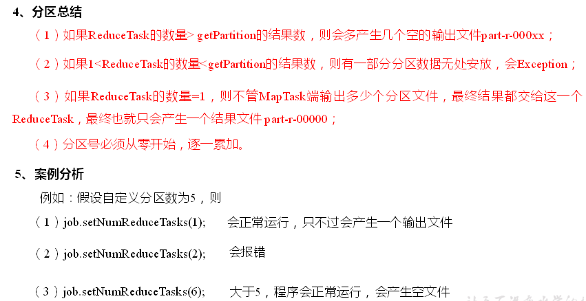
  
### WritableComparable排序

  - Maptask和ReduceTask都会按照key进行排序，该操作是Hadoop默认行为。默认排序是按照字典顺序排序，实现的方法是快速排序。
  - 排序概述：
  
  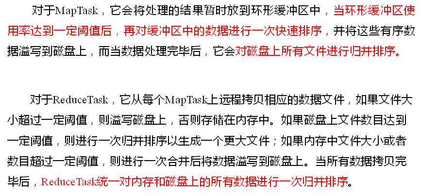
  
  - 排序分类：
  
  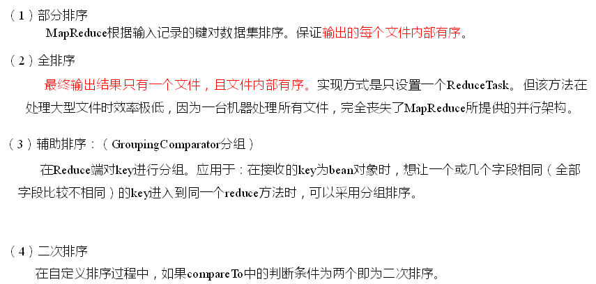
  
### Combiner合并

  - Combiner概述：
  
    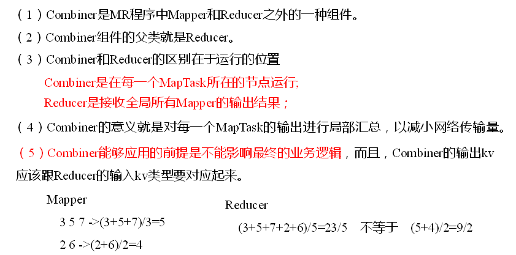
  
### GroupingComparator分组（辅助排序）

  - 对Reduce阶段的数据根据某一个或几个字段进行分组。
  - 分组排序步骤：
    - 自定义类继承WritableComparator。
    - 重写compare()方法。
    - 创建一个构造将比较对象的类传给父类。
    
## MapTask工作机制

  - MapTask工作机制：
  
    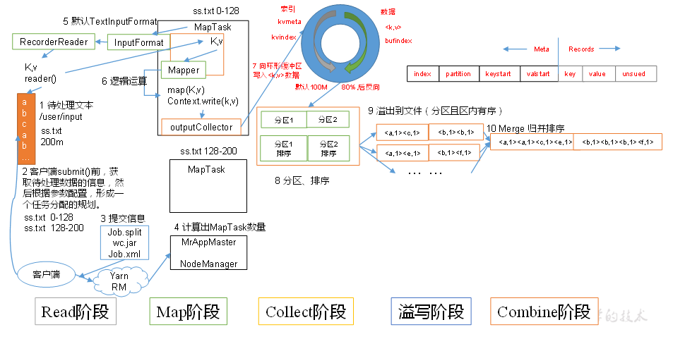
  
## ReduceTask工作机制

  - ReduceTask工作机制：
  
    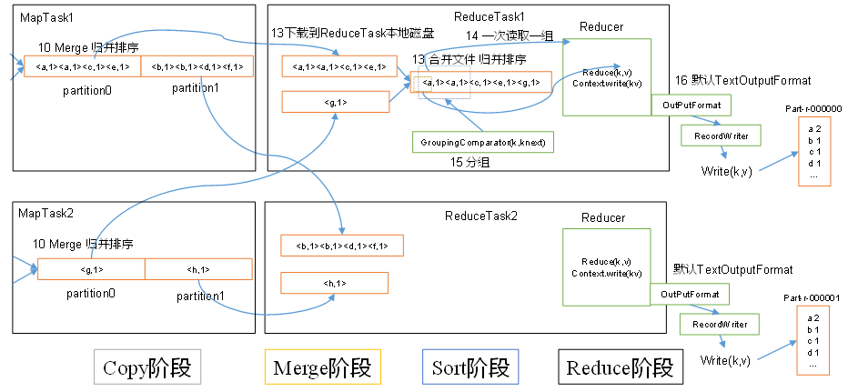
  
  - 设置ReduceTask并行度（个数）：ReduceTask的并行度同样影响整个Job的执行并发度和执行效率，但与MapTask的并发数由切片数决定不同，ReduceTask数量的决定是可以直接手动设置：
    - example : job.setNumReduceTasks(4);
  - ReduceTask注意细节：
  
   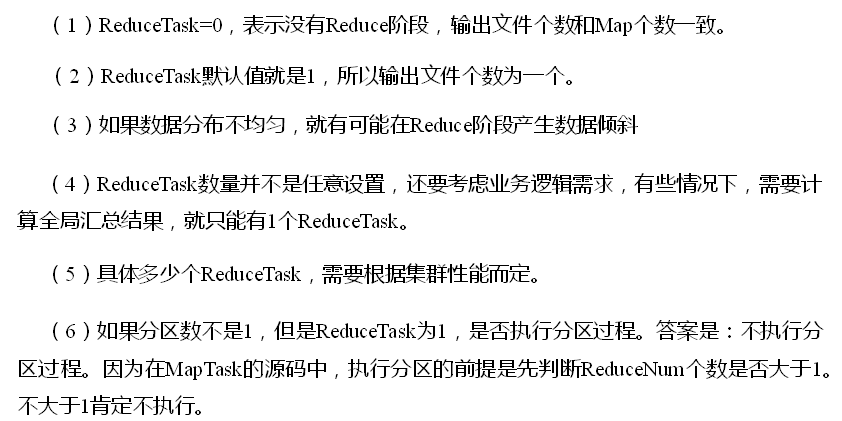
  
## OutputFormat数据输出

  - OutputFormat概述：
  
    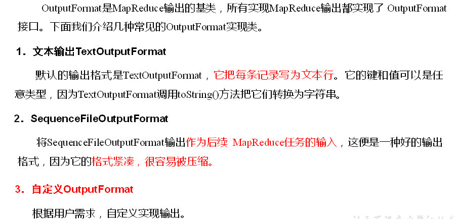
    
  - MultipleOutputs：可以写数据到文件，并且文件名字可以从键和值中构造。Map输出文件名格式为name-m-nnnnn，reduce输出文件名格式为name-r-nnnnn。nnnnn是对应分区数。
  - LazyOutputFormat：输出文件只有包含记录时才会被创建

## MR特性

### Counters

  - Counters聚集作业的统计信息，用于质量控制或者应用级别的统计数据。
  - 内置的counter组：

    - 图片

  - Task Counters：
    - Task Counter收集任务执行过程中的信息，将作业中的所有任务信息聚集起来。
    - Task Counter由每个任务维护，并且周期性地发送到Application Master。
  - Job Counters：
    - Job Counter由Application Master维护，它收集作业级别的统计数据。

### Joins

  - Mapper执行连接操作为map-side连接，reducer端为reduce-side连接。
  - Mapper-Side连接：在数据到达map函数之前做连接操作。输入数据集会被分为相同数量的分区，并且由相同的键（join键）排序。
  - Reducer-Side连接：Mapper使用join键作为map输出键，因此键相同的记录会发送到同一个reducer。

### Side Data分布

  - Side Data是作业处理主数据集所需的额外的只读数据。
  - 作业配置：
    - 调用Configuration的setter方法以键值对的形式设置作业的配置
    - 作业配置加载到内存，由客户端，Application Master，Task JVM读取
  - 分布式缓存：
    - 使用Hadoop分布式缓存可以拷贝文件和归档文件到执行任务的节点：
      ```
      -files选项将文件分发到节点
      -archives选项拷贝归档文件
      -libjars选项将jar文件加载到mapper和reducer任务的类路径
      ```
    - 当启动作业时，Hadoop将相应的文件拷贝到分布式文件系统（HDFS）。然后在任务运行之前，Node Manager将文件从HDFS拷贝到本地磁盘（缓存）。因此任务可以访问到这些文件。
      
## MapReduce开发总结

  - MapReduce开发总结：
  
  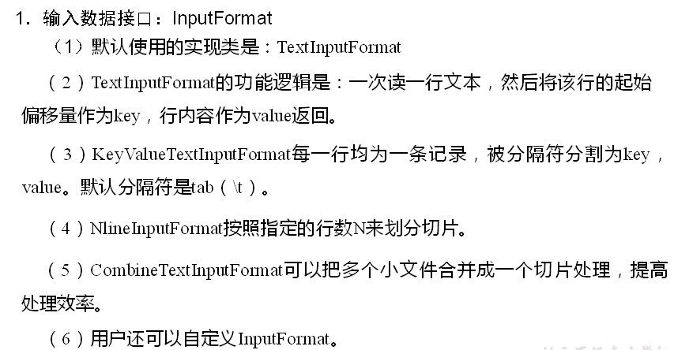
  
  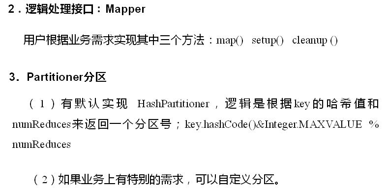
  
  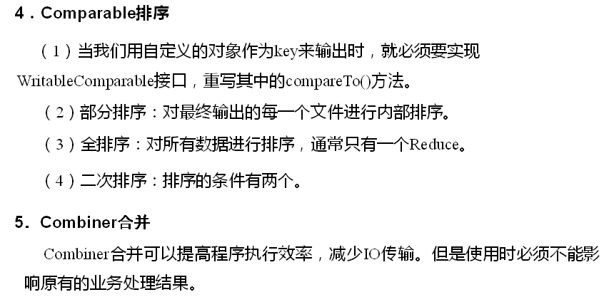
  
  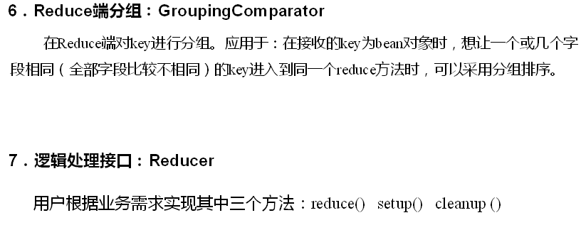
  
  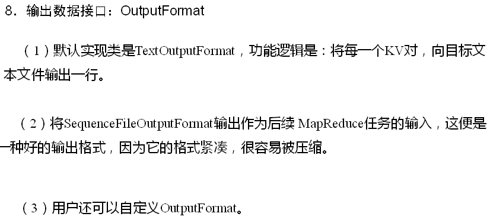
  
  
