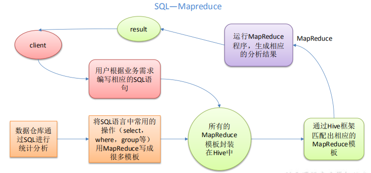
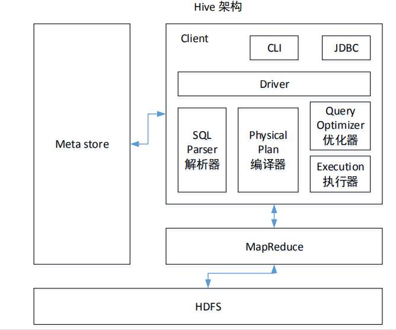
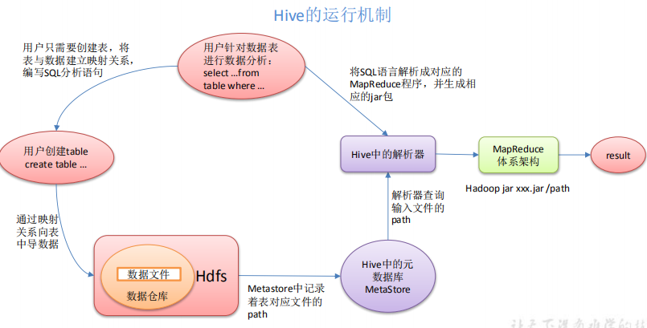

# Hive概述

## Hive基本概念

  - Hive是基于Hadoop的一个数据仓库工具，可以将结构化的数据文件映射为一张表，并提供类SQL(HQL)查询功能。
  - 本质是：将HQL转化成MapReduce程序。
  - HQL转换MR流程：
  
  
  
  - Hive处理的数据存储在HDFS。
  - Hive分析数据底层的默认实现是MapReduce。
  - 执行程序运行在Yarn上。
  
## Hive优缺点

  - 优点：
    - 操作接口采用类SQL语法，提供快速开发的能力，避免了去写MapReduce，减少开发人员的学习成本
    - 可扩展性好，Hive支持扩展集群的规模
    - Hive支持用户自定义函数，用户可以根据自己的需求来实现自己的函数。
  - 缺点：
    - Hive不支持记录级别的增删改操作
    - Hive查询延时严重，因为MapReduce作业消耗很长时间，因此Hive常用于数据分析，对实时性要求不高的场合
    
## Hive架构原理

  - Hive架构：
  
  
  
  - 注意细节：
    - Client(用户接口)：
      - CLI: hive shell
      - JDBC/ODBC: 基于JDBC操作访问hive
      - Web UI: 浏览器访问hive
    - Thrift Server：
      - Thrift是Facebook开发的一个软件框架，可以用来进行可扩展且跨语言的服务的开发，Hive集成了该服务，能让不同的编程语言调用Hive的接口
    - Meta store(元数据):
      - 元数据包括：表名、表所属的数据库、表的拥有者、列/分区字段、表的类型（内部表/外部表）、表的数据所在目录等；
      - 默认存储在自带的derby数据库中，推荐使用MySQL存储Metastore。
    - Hadoop: 使用HDFS进行存储，使用MapReduce进行计算。
    - Driver(驱动器)：
      - 组成：
        - 解释器：解释器的作用是将HiveSQL语句转换为抽象语法树（AST）
        - 编译器：编译器是将语法树编译为逻辑执行计划
        - 优化器：优化器是对逻辑执行计划进行优化
        - 执行器：执行器是调用底层的运行框架执行逻辑执行计划
      - 执行流程：
        - HiveQL通过命令行或者客户端提交，经过编译器，运用MetaStore中的元数据进行类型检测和语法分析，生成一个逻辑方案(Logical Plan)，然后通过优化产生一个MapReduce任务。
      
  - Hive运行机制：
  
  
  
  - Hive运行机制总结：Hive通过给用户提供的一系列交互接口，接收到用户的指令(SQL)，使用自己的Driver，结合元数据(MetaStore)，将这些指令翻译成MapReduce，提交到Hadoop中执行，最后，将
执行返回的结果输出到用户交互接口。

## Hive和关系型数据库比较

  - 查询语言：
    - 针对Hive的特性设计了类SQL的查询语言HQL。
    - 熟悉SQL开发的开发者可以很方便的使用Hive进行开发。
  - 数据存储位置：
    - Hive的数据都是存储在HDFS中的，而数据库则可以将数据保存在本地文件系统中。
  - 数据更新：
    - 由于Hive数据仓库的内容是读多写少的。因此，Hive中不建议对数据的改写，所有的数据都是在加载的时候确定好的。
    - 而数据库中的数据通常是需要经常进行修改的。
  - 索引：
    - Hive 0.8之后加入简单索引，数据库支持复杂索引
  - 执行：
    - Hive中大多数查询的执行是通过MapReduce来实现的，而数据库通常有自己的执行引擎。
    - Hive延时高，数据库延时低
  - 可扩展性：
    - 由于Hive是建立在Hadoop之上的，因此Hive的可扩展性是和Hadoop的可扩展性是一致的。
    - 而数据库由于ACID语义的严格限制，扩展性非常有限。
  - 数据规模：
    - Hive支持很大规模的数据，而数据库可以支持的数据规模较小。
    
 
