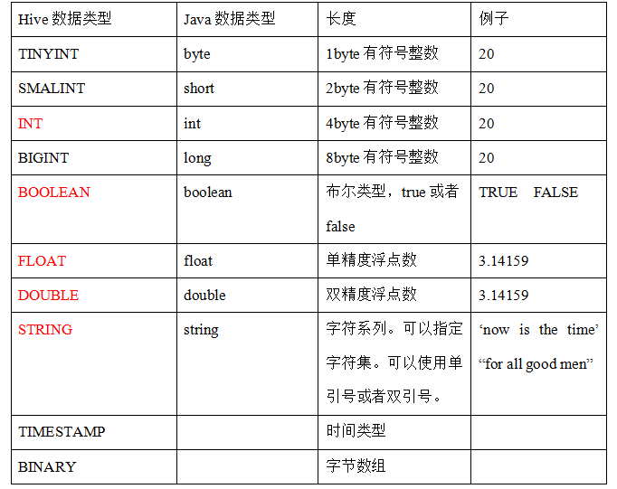
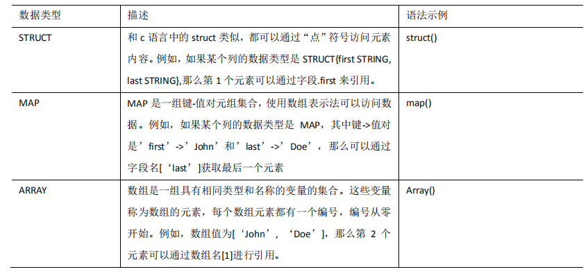

# Hive数据类型

## 基本数据类型

  - Hive基本数据类型：
  
  
  
## 集合数据类型

  - Hive集合数据类型:
  
  
  
## 类型转化

  - Hive的原子数据类型是可以进行隐式转换的，类似于Java的类型转换。
  - 隐式类型转换规则：
    - 任何整数类型都可以隐式地转换为一个范围更广的类型，如TINYINT可以转换成INT，INT可以转换成BIGINT。
    - 所有整数类型、FLOAT和STRING类型都可以隐式地转换成DOUBLE。
    - TINYINT、SMALLINT、INT都可以转换为FLOAT。
    - BOOLEAN类型不可以转换为任何其它的类型。
  - 可以使用CAST操作显示进行数据类型转换，例如：
    - CAST('1' AS INT)将把字符串'1' 转换成整数1；
    - CAST('X' AS INT)，表达式返回空值NULL。
