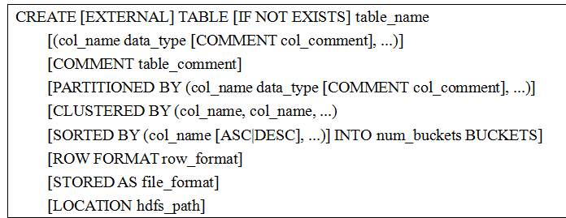
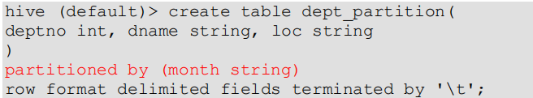
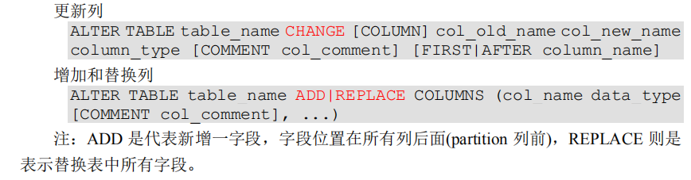

# DDL数据定义

## 创建数据库

  - 创建一个数据库，数据库在HDFS上的默认存储路径是/user/hive/warehouse/*.db：
    - create database cn_hive;
  - 避免要创建的数据库已经存在错误，增加if not exists判断：
    - create database if not exists cn_hive;
  - 创建一个数据库，指定数据库在 HDFS 上存放的位置：
    - create database cn_hive2 location '/cn_hive2.db';
  
## 查询数据库

  - 显示数据库：
    - show databases;
  - 过滤显示查询的数据库：
    - show databases like 'cn_hive*';
  - 显示数据库信息：
    - desc database cn_hive;
  - 显示数据库详细信息：
    - desc database extended cn_hive;
  - 切换当前数据库：
    - use cn_hive;
    
## 修改数据库

  - 用户可以使用ALTER DATABASE命令为某个数据库的DBPROPERTIES设置键-值对属性值，来描述这个数据库的属性信息。
  - 数据库的其他元数据信息都是不可更改的，包括数据库名和数据库所在的目录位置。
  - 例如：alter database cn_hive2 set dbproperties('createtime'='20191005');
  
## 删除数据库

  - 删除空数据库：
    - drop database cn_hive2;
  - 如果删除的数据库不存在，最好采用if exists判断数据库是否存在：
    - drop database if exists cn_hive2;
  - 如果数据库不为空，可以采用cascade命令，强制删除：
    - drop database cn_hive2 cascade;
    
## 创建表

  - Hive建表语法：
  
  

  - 字段解释说明：
    - CREATE TABLE创建一个指定名字的表。如果相同名字的表已经存在，则抛出异常；用户可以用IF NOT EXISTS选项来忽略这个异常。
    - EXTERNAL关键字可以让用户创建一个外部表，在建表的同时指定一个指向实际数据的路径（LOCATION）。
      - Hive 创建内部表时，会将数据移动到数据仓库指向的路径。
      - 若创建外部表，仅记录数据所在的路径，不对数据的位置做任何改变。
      - 在删除表的时候，内部表的元数据和数据会被一起删除，而外部表只删除元数据，不删除数据。
    - COMMENT：为表和列添加注释。
    - PARTITIONED BY：创建分区表。
    - CLUSTERED BY：创建分桶表。
    - SORTED BY：不常用。
    - ROW FORMAT：用户在建表的时候可以自定义SerDe或者使用自带的SerDe。如果没有指定ROW FORMAT 或者 ROW FORMAT DELIMITED，将会使用自带的SerDe。
      - SerDe 是 Serialize/Deserilize 的简称，目的是用于序列化和反序列化。
    - STORED AS：指定存储文件类型。
      - 常用的存储文件类型：
        - SEQUENCEFILE（二进制序列文件）
        - TEXTFILE（文本）
        - RCFILE（列式存储格式文件）
    - LOCATION ：指定表在HDFS上的存储位置。
    
### 管理表

  - 默认创建的表都是所谓的管理表，有时也被称为内部表。
  - Hive默认情况下会将这些表的数据存储在由配置项hive.metastore.warehouse.dir(例如，/user/hive/warehouse)所定义的目录的子目录下。
  - 当我们删除一个管理表时，Hive也会删除这个表中数据。
  - 管理表不适合和其他工具共享数据。
 
### 外部表

  - 因为表是外部表，所以Hive并非认为其完全拥有这份数据。
  - 删除该表并不会删除掉这份数据，不过描述表的元数据信息会被删除掉。
  - 管理表和外部表的使用场景：
    - 每天将收集到的网站日志定期流入HDFS文本文件。在外部表（原始日志表）的基础上做大量的统计分析，用到的中间表、结果表使用内部表存储，数据通过 SELECT+INSERT
进入内部表。

### 管理表与外部表的互相转换

  - 创建管理表cn_table1。
  - 转换为外部表：
    - alter table cn_table1 set tblproperties('EXTERNAL'='TRUE');
  - 转换为管理表：
    - alter table cn_table1 set tblproperties('EXTERNAL'='FALSE');
  - 注意：('EXTERNAL'='TRUE')和('EXTERNAL'='FALSE')为固定写法，区分大小写！
 
## 分区表

  - 分区表实际上就是对应一个HDFS文件系统上的独立的文件夹，该文件夹下是该分区所有的数据文件。
  - Hive中的分区就是分目录，把一个大的数据集根据业务需要分割成小的数据集。
  - 在查询时通过WHERE子句中的表达式选择查询所需要的指定的分区，这样的查询效率会提高很多。
  
### 分区表基本操作

  - 引入分区表（需要根据日期对日志进行管理）。
  - 创建分区表语法：
  
  
  
  - 加载数据到分区表中。
  - 查询分区表中数据：
    - select * from dept_partition where month='201901';
  - 增加分区：
    - alter table dept_partition add partition(month='201905');
    - alter table dept_partition add partition(month='201906') partition(month='201907');
  - 删除分区：
    - alter table dept_partition drop partition(month='201905');
    - alter table dept_partition drop partition(month='201906') partition(month='201907');
  - 查看分区表有多少分区:
    - show partitions dept_partition;
  - 查看分区表结构:
    - desc formatted dept_partition;
    
## 修改表

  - 重命名表：
    - alter table <table_name> rename to <new_table_name>;
  - 增加/修改/替换列信息：
    - 修改表语法：
    
    
    
## 删除表

  - drop table dept_partition;
  
  
    
  
  
  
  
  
  
    
    
      
    
    
    
    
    
    
    
    
