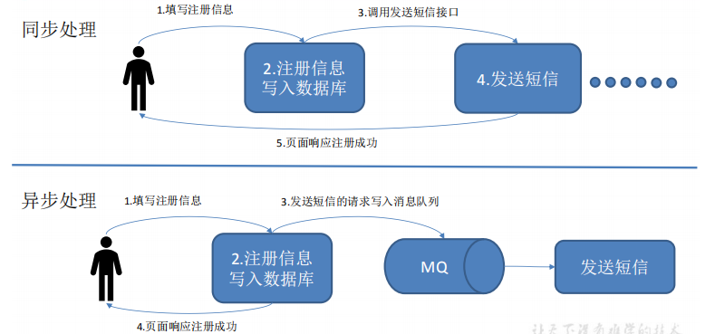
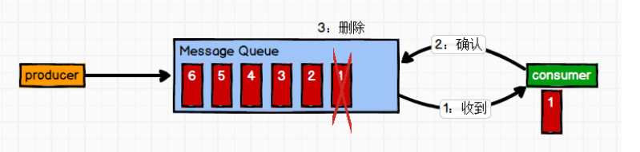
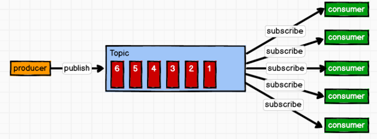

# Kafka概述

  - Kafka是一个分布式的基于发布/订阅模式的消息队列（Message Queue），主要应用于大数据实时处理领域。
  
## 消息队列

  - 传统消息队列的应用场景：
  
  
  - 使用消息队列的好处：
    - 解耦：允许你独立的扩展或修改两边的处理过程，只要确保它们遵守同样的接口约束。
    - 可恢复性：系统的一部分组件失效时，不会影响到整个系统。消息队列降低了进程间的耦合度，所以即使一个处理消息的进程挂掉，加入队列中的消息仍然可以在系统恢复后被处理。
    - 缓冲：有助于控制和优化数据流经过系统的速度，解决生产消息和消费消息的处理速度不一致的情况。
    - 灵活性 & 峰值处理能力：使用消息队列能够使关键组件顶住突发的访问压力，而不会因为突发的超负荷的请求而完全崩溃。
    - 异步通信：消息队列提供了异步处理机制，允许用户把一个消息放入队列，但并不立即处理它。想向队列中放入多少消息就放多少，然后在需要的时候再去处理它们。
  - 消费队列的两种模式：
    - 点对点模式（一对一，消费者主动拉取数据，消息收到后消息清除）：
      - 消息生产者生产消息发送到Queue中，然后消息消费者从Queue中取出并且消费消息。
      - 消息被消费以后，queue 中不再有存储，所以消息消费者不可能消费到已经被消费的消息。
      - Queue 支持存在多个消费者，但是对一个消息而言，只会有一个消费者可以消费。
      - 点对点模式：
      
      
    - 发布/订阅模式（一对多，消费者消费数据之后不会清除消息）:
      - 消息生产者（发布）将消息发布到 topic 中，同时有多个消息消费者（订阅）消费该消息。
      - 和点对点方式不同，发布到 topic 的消息会被所有订阅者消费。
      - 发布-订阅模式:
       
      
      
## Kafka基础架构

  - Kafka基础架构：
  
  
  - 核心概念：
    - Producer: 消息生产者，就是向kafka broker发消息的客户端。
    - Consumer: 消息消费者，从kafka broker取消息的客户端。
    - Consumer Group(CG)：
      - 消费者组，由多个consumer组成。
      - 消费者组内每个消费者负责消费不同分区的数据。
      - 一个分区只能由组内的一个消费者消费。
      - 消费者组之间互不影响。
      - 所有的消费者都属于某个消费者组，即消费者组是逻辑上的一个订阅者。
    - Broker: 
      - 一台kafka服务器就是一个broker。
      - 一个集群由多个broker组成。
      - 一个broker可以容纳多个topic。
    - Topic: 可以理解为一个队列，生产者和消费者面向的都是一个topic。
    - Partition: 一个topic可以分为多个partition，每个partition是一个有序的队列。
    - Replica: 
      - kafka提供了副本机制，一个topic 的每个分区都有若干个副本，一个leader和若干个follower。
      - 为保证集群中的某个节点发生故障时，该节点上的 partition 数据不丢失，且kafka仍然能够继续工作。
    - Leader: 每个分区多个副本的“主”，生产者发送数据的对象，以及消费者消费数据的对象都是leader。
    - Follower: 每个分区多个副本中的“从”，实时从leader中同步数据，保持和leader数据的同步。leader发生故障时，某个follower会成为新的leader。
    
    
 
      
    
