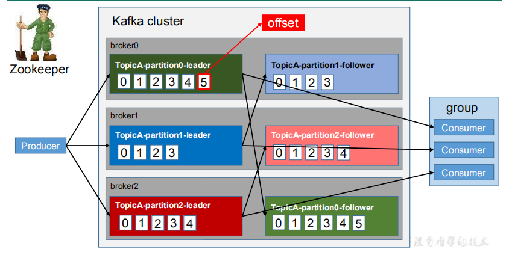
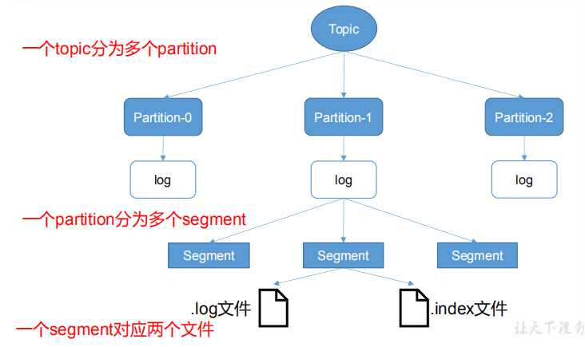
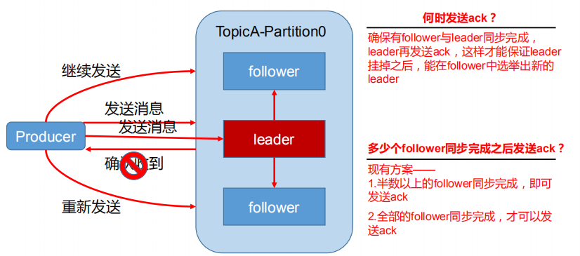
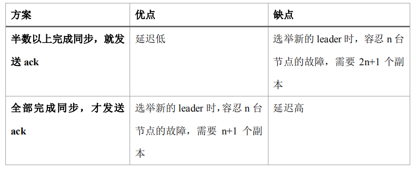
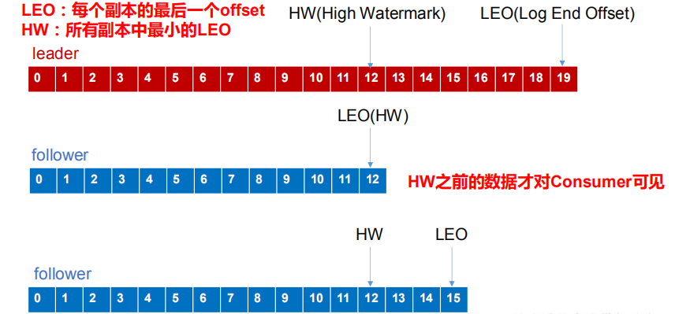
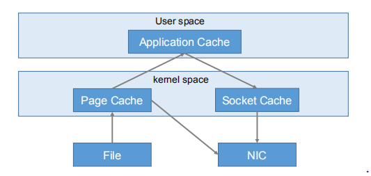
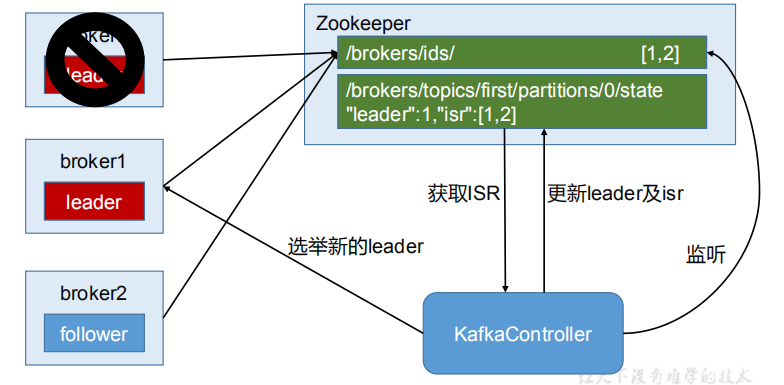

# Kafka架构深入

## Kafka工作流程

  - Kafka工作流程：
  
  
  
  - Kafka中消息是以topic进行分类的，生产者生产消息，消费者消费消息，都是面向topic的。
  - topic是逻辑上的概念，而partition是物理上的概念。
  - 每个partition对应于一个log文件，该log文件中存储的就是producer生产的数据。
  - Producer生产的数据会被不断追加到该log文件末端，且每条数据都有自己的offset。
  - 消费者组中的每个消费者，都会实时记录自己消费到了哪个offset，以便出错恢复时，从上次的位置继续消费。
    
## Kafka文件存储机制

  - Kafka文件存储机制：
  
  
  
  - 由于生产者生产的消息会不断追加到log文件末尾，为防止log文件过大导致数据定位效率低下，Kafka采取了分片和索引机制将每个partition分为多个segment。
  - 每个segment对应两个文件".index"文件和".log"文件。
  - 这些文件位于一个文件夹下，该文件夹的命名规则为：topic名称+分区序号。
  - index和log文件以当前segment的第一条消息的offset命名。
  - ".index"文件存储大量的索引信息，".log"文件存储大量的数据。
  - 索引文件中的元数据指向对应数据文件中message的物理偏移地址。
    
## Kafka生产者

### Kafka生产者分区策略

  - 分区的原因：
    - 方便在集群中扩展，每个Partition可以通过调整以适应它所在的机器，而一个topic又可以有多个Partition组成，因此整个集群就可以适应任意大小的数据了。
    - 可以提高并发，因为可以以Partition为单位读写了。
  - 分区的原则：
    - 指明partition的情况下，直接将指明的值直接作为partiton值。
    - 没有指明partition值但有key的情况下，将key的hash值与topic的partition数进行取余得到partition值。
    - 既没有partition值又没有key值的情况下，第一次调用时随机生成一个整数（之后每次调用在这个整数上自增），将这个值与topic可用的partition总数取余得到partition值，也就是常说的round-robin算法。
    
### 数据可靠性保证

  - 为保证producer发送的数据，能可靠的发送到指定的topic，topic的每个partition收到producer发送的数据后，都需要向producer发送ack（acknowledgement 确认收到） 。如果
producer收到ack，就会进行下一轮的发送，否则重新发送数据。
  - 生产者数据传送：
  
  
  
  - 副本数据同步策略
  
  
  
  - Kafka选择了第二种方案, 因为Kafka的每个分区都有大量的数据，第一种方案会造成大量数据的冗余。虽然第二种方案的网络延迟会比较高，但网络延迟对Kafka的影响较小。
  - ISR(in-sync replica set): 
    - Leader维护了一个动态的in-sync replica set (ISR)，意为和leader保持同步的follower集合。
    - 当ISR中的follower完成数据的同步之后，就会给leader发送ack。
    - 如果follower长时间未向leader同步数据 ， 则该follower将被踢出ISR， 该时间阈值由replica.lag.time.max.ms 参数设定。
    - Leader发生故障之后，就会从ISR中选举新的leader。
  - ack应答机制：
    - Kafka为用户提供了三种可靠性级别，用户根据对可靠性和延迟的要求进行权衡。
    - acks参数配置：
      - 0： producer不等待broker的ack，这一操作提供了一个最低的延迟，broker一接收到还没有写入磁盘就已经返回，当broker故障时有可能丢失数据。
      - 1： producer等待broker的ack，partition的leader落盘成功后返回ack。如果在follower同步成功之前leader故障，那么将会丢失数据。
      - -1(all): producer等待broker的ack，partition的leader和follower全部落盘成功后才返回ack。但是如果在follower同步完成后，broker发送ack之前，leader发生故障，那么会造成数据重复。
    - 故障处理细节:
      - Log文件中的HW和LEO:
      
      
      
      - follower故障: follower发生故障后会被临时踢出ISR，待该follower恢复后，follower会读取本地磁盘记录的上次的HW，并将log文件高于HW的部分截取掉，从HW开始向leader进行同步。等该follower的LEO大于等于该Partition的HW，即follower追上leader之后，就可以重新加入ISR了。
      - leader故障: leader发生故障之后，会从ISR中选出一个新的leader，之后，为保证多个副本之间的数据一致性，其余的follower会先将各自的log文件高于 HW的部分截掉，然后从新的leader同步数据。注意：这只能保证副本之间的数据一致性，并不能保证数据不丢失或者不重复。
  - 数据丢失问题：
    - Producer端数据丢失：
      - 当Producer的ack设置为0或1，最多只能保证leader有数据。若有一条发送的数据leader刚接收完毕，此时leader挂掉，那么partition的副本还未来得及同步，就会造成数据丢失。要想数据不丢失，就要将ack设置为-1，即所有的follower也同步到这条数据了，才发第二条数据，但是这样就降低了我们的性能。所以在实际工作中，往往得结合业务来平衡数据的一致性和系统的性能。
    - Consumer端数据丢失：
      - 消费者自动offset时，如果刚好将offset提交后，但这条数据还没消费完，机器发生宕机，此时数据就丢失。需要关闭偏移量自动提交offset，改成手动提交，每次数据处理完后，再提交offset。
  - 数据重复问题：
    - 消费者消费了几条数据，但是还没有到提交offset之时机器宕机了。在下一次机器重启的时候，消费者会先去读上次提交的偏移量进行消费，这就会导致数据重复消费。需要关闭偏移量自动提交offset，改成手动提交。
      
### Exactly Once 语义

  - 将服务器的ACK级别设置为-1，可以保证Producer到Server之间不会丢失数据，即At Least Once语义。相对的，将服务器ACK级别设置为0，可以保证生产者每条消息只会被发送一次，即At Most Once语义。
  - At Least Once可以保证数据不丢失，但是不能保证数据不重复；相对的， At Most Once可以保证数据不重复，但是不能保证数据不丢失。
  - 对于一些非常重要的信息，比如说交易数据，下游数据消费者要求数据既不重复也不丢失，即 Exactly Once 语义。
  - 0.11版本的Kafka，引入了一项重大特性：幂等性。所谓的幂等性就是指Producer不论向Server发送多少次重复数据，Server端都只会持久化一条。
  - 幂等性结合 At Least Once 语义，就构成了Kafka的Exactly Once语义。
  - 要启用幂等性，只需要将 Producer 的参数中 enable.idompotence 设置为 true 即可。
  - Kafka的幂等性实现其实就是将原来下游需要做的去重放在了数据上游。
  - 开启幂等性的Producer在初始化的时候会被分配一个PID，发往同一Partition的消息会附带Sequence Number。而Broker端会对<PID, Partition, SeqNumber>做缓存，当具有相同主键的消息提交时，Broker只会持久化一条。
  - 但是PID重启就会变化，同时不同的Partition也具有不同主键，所以幂等性无法保证跨分区跨会话的Exactly Once。
  
## Kafka消费者

### 消费方式

  - consumer采用pull（拉）模式从broker中读取数据。
  - push（推）模式很难适应消费速率不同的消费者，因为消息发送速率是由broker决定的。因为它的目标是尽可能以最快速度传递消息，但是这样很容易造成consumer来不及处理消息，典型的表现就是拒绝服务以及网络拥塞。
  - pull模式则可以根据consumer的消费能力以适当的速率消费消息。pull模式不足之处是，如果kafka没有数据，消费者可能会陷入循环中，一直返回空数据。针对这一点，Kafka的消费者在消费数据时会传入一个时长参数timeout，如果当前没有数据可供消费，consumer会等待一段时间之后再返回，这段时长即为timeout。

### 分区分配策略

  - 一个consumer group中有多个consumer，一个topic有多个partition，所以必然会涉及到partition的分配问题，即确定那个partition由哪个consumer来消费。
  - Kafka有两种分配策略，一是RoundRobin，一是Range。
  
### offset的维护

  - 由于consumer在消费过程中可能会出现断电宕机等故障，consumer恢复后，需要从故障前的位置的继续消费，所以consumer需要实时记录自己消费到了哪offset，以便故障恢复后继续消费。
  - Kafka 0.9版本之前，consumer默认将offset保存在Zookeeper中，从0.9版本开始，consumer默认将offset保存在Kafka一个内置的topic中，该topic为__consumer_offsets。
  - 使用外部存储，如关系数据库，HBase，Redis等保存offset，在消费数据之前从外部存储中读取上次提交的offset。
    - 实际项目中使用Gauss数据库保存offset，但是没有实现事务性，所以是At Least Once语义。Spark Streaming在消费数据之前从GaussDB中读取上次提交的offset，消费一个主题的数据之后更新GaussDB中的offset。
  
###  Kafka高效读写数据

  - 顺序写磁盘:
    - Kafka的producer生产数据，要写入到log文件中，写的过程是一直追加到文件末端，为顺序写。
    - 同样的磁盘，顺序写能到600M/s，而随机写只有100K/s。
  - 零复制技术: 
  
  
  
### Zookeeper在Kafka中的作用

  - Kafka集群中有一个broker会被选举为Controller，负责管理集群broker的上下线，所有topic的分区副本分配和leader选举等工作。
  - Controller的管理工作都是依赖于ZooKeeper的。
  - Leader选举流程:
  
  
  
## Kafka事务

  - Kafka从0.11版本开始引入了事务支持。事务可以保证Kafka在Exactly Once语义的基础上，生产和消费可以跨分区和会话，要么全部成功，要么全部失败。
  
### Producer事务

  - 为了实现跨分区跨会话的事务，需要引入一个全局唯一的Transaction ID，并将Producer获得的PID和Transaction ID绑定。这样当Producer重启后就可以通过正在进行的Transaction ID获得原来的PID。
  - 为了管理Transaction，Kafka引入了一个新的组件Transaction Coordinator。Producer就是通过和Transaction Coordinator交互获得Transaction ID对应的任务状态。Transaction Coordinator还负责将事务所有写入Kafka的一个内部Topic，这样即使整个服务重启，由于事务状态得到保存，进行中的事务状态可以得到恢复，从而继续进行。
  
### Consumer事务

  - 对于Consumer而言，事务的保证就会相对较弱，尤其是无法保证Commit的信息被精确消费。这是由于Consumer可以通过offset访问任意信息，而且不同的Segment File生命周期不同，同一事务的消息可能会出现重启后被删除的情况。
  
## Kafka安全性

### Kafka安全协议

  - PLAINTEXT：支持无认证的明文访问
    - 配置：security.protocol=PLAINTEXT
  - SASL_PLAINTEXT：支持Kerberos认证的明文访问
    - 配置：security.protocol=SASL_PLAINTEXT，sasl.kerberos.service.name = kafka
  - SSL：支持无认证的SSL加密访问
    - 配置：security.protocol=SSL，ssl.mode.enable=true
  - SASL_SSL：支持Kerberos认证的SSL加密访问
    - 配置：sasl.kerberos.service.name = kafka，ssl.mode.enable=true
  - allow.everyone.if.no.acl.found设置为false开启Kafka集群安全模式，访问主题需要权限认证

## Kafka常见问题

  - Flume可以正常连接Kafka，但是发送消息失败：
    - 可能原因：
      - Kafka服务异常
      - Flume连接Kafka地址错误，导致发送失败
      - Flume发送超过Kafka大小限制的消息，导致发送失败
    - 解决方法：
      - 查看Kafka集群当前状态，如果Kafka服务异常，则根据异常相应地处理
      - 如果Flume连接地址错误，则修改为正确的地址
      - 如果发送的消息超过大小限制，则调整Kafka服务端相关参数，修改"message.max.bytes"值，使得message.max.bytes > 当前业务中消息最大值
  - Kafka生产者发送数据时鉴权失败：
    - 可能原因：
      - 客户端Producer侧配置jaas.conf和user.keytab文件错误
    - 解决方法：
      - 修改jaas.conf和user.keytab文件为正确的配置
  - Kafka生产者访问主题时报权限错误：
    - 可能原因：
      - 集群为安全模式，生产者没有该主题的访问权限
    - 解决方法：
      - 修改"allow.everyone.if.no.acl.found"参数为ture，将集群设置为非安全模式
      - 赋予生产者访问权限
  - 消费者消费数据失败，一直处于等待状态; 或者报错：Error getting partition metadata
    - 同上
  - 消费者消费数据报错：SchemaException: Error reading field 'brokers'
    - 可能原因：
      - 客户端和服务端Jar版本不一致
    - 解决方法：
      - 修改消费者使用的Kafka依赖版本，与服务端保持一致
  - 网络不稳定导致分区Leader无法选举出来，引起消费卡死：
    - 可能原因：
      - 出现网络异常后，新老controller感知的可用节点不同，导致新controller某个分区的Leader信息与ZooKeeper记录元数据的信息不一致，导致controller选举流程出现错误，选不出Leader
    - 解决方法：
      - 需要有新的选举事件才能触发Leader选出来，例如重启
  - 消费卡顿问题（中途消费不到数据，过一会又继续消费）：
    - 可能原因：
      - 网络问题，环境出现大量丢包情况
    - 解决方法:
      - 解决网络丢包问题
  - 执行Kakfa Topic创建操作，发现无法创建提示replication factor larger than available brokers：
    - 可能原因：
      - Kafka服务当前可用Broker小于设置的replication factor
    - 解决方法：
      - 增加可用Broker，或者减小设置的replication factor
  - 执行topic的消费时会自动创建不存在的topic：
    - 可能原因：
      - auto.create.topics.enable值为true
    - 解决方法：
      - 将auto.create.topics.enable值设置为false
      
  
