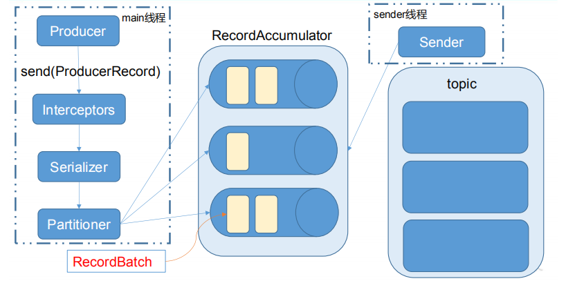

# Kafka API

## Producer API

  - 消息发送流程:
    - Kafka的Producer发送消息采用的是异步发送的方式。
    - 在消息发送的过程中，涉及到了两个线程main线程和Sender线程，以及一个线程共享变量RecordAccumulator。
    - main线程将消息发送给RecordAccumulator，Sender线程不断从RecordAccumulator中拉取消息发送到Kafka broker。
    - 消息发送流程:
    
    
    - 相关参数：
      - batch.size：只有数据积累到batch.size之后，sender才会发送数据。
      - linger.ms：如果数据迟迟未达到batch.size，sender等待linger.time之后就会发送数据。
      
### 异步发送API

  - 需要用到的类：
    - KafkaProducer：需要创建一个生产者对象，用来发送数据。
    - ProducerConfig：获取所需的一系列配置参数。
    - ProducerRecord：每条数据都要封装成一个ProducerRecord对象。
  - 不带回调函数的API:
  
  

  - 带回调函数的API:
  
  
  - 回调函数会在producer收到ack时调用，为异步调用，该方法有两个参数，分别是RecordMetadata 和 Exception。
  - 注意：消息发送失败会自动重试，不需要我们在回调函数中手动重试。
  
### 同步发送API

  - 同步发送的意思就是，一条消息发送之后，会阻塞当前线程，直至返回ack。
  
## Consumer API

  - Consumer消费数据时的可靠性是很容易保证的，因为数据在Kafka中是持久化的，故不用担心数据丢失问题。
  - 由于consumer在消费过程中可能会出现断电宕机等故障，consumer恢复后，需要从故障前的位置的继续消费，所以consumer需要实时记录自己消费到了哪个offset，以便故障恢复后继续消费。所以offset的维护是Consumer消费数据是必须考虑的问题。
  
### 自动提交offset

  - 需要用到的类：
    - KafkaConsumer：需要创建一个消费者对象，用来消费数据。
    - ConsumerConfig：获取所需的一系列配置参数。
    - ConsuemrRecord：每条数据都要封装成一个ConsumerRecord对象。
  - 自动提交offset的相关参数：
    - enable.auto.commit：是否开启自动提交offset功能。
    - auto.commit.interval.ms：自动提交offset的时间间隔。
    
### 手动提交offset

  - 手动提交offset的方法有两种：分别是commitSync（同步提交）和commitAsync（异步提交）。
    - 相同点是：都会将本次poll的一批数据最高的偏移量提交。
    - 不同点是：commitSync阻塞当前线程，一直到提交成功，并且会自动失败重试；而commitAsync则没有失败重试机制，故有可能提交失败。
    
  - Consumer API
  
  

  - 数据漏消费和重复消费分析
    - 先提交offset后消费，有可能造成数据的漏消费。
    - 先消费后提交offset，有可能会造成数据的重复消费。
    
## 拦截器

  - Producer拦截器(interceptor)是在Kafka 0.10版本被引入的，主要用于实现client端的定制化控制逻辑。
  - 对于producer而言，interceptor使得用户在消息发送前以及producer回调逻辑前有机会对消息做一些定制化需求，比如修改消息等。
  - producer允许用户指定多个interceptor按顺序作用于同一条消息从而形成一个拦截链(interceptor chain)。
  - Intercetpor的实现接口是org.apache.kafka.clients.producer.ProducerInterceptor，其定义的方法包括：
    - configure(configs)： 获取配置信息和初始化数据时调用。
    - onSend(ProducerRecord)：Producer确保在消息被序列化以及计算分区前调用该方法。用户可以在该方法中对消息做任何操作，但最好保证不要修改消息所属的 topic和分区，否则会影响目标分区的计算。
    - onAcknowledgement(RecordMetadata, Exception)：该方法会在消息从RecordAccumulator成功发送到Kafka Broker之后，或者在发送过程中失败时调用。并且通常都是在producer回调逻辑触发之前。onAcknowledgement运行在producer的IO线程中，因此不要在该方法中放入很重的逻辑，否则会拖慢producer的消息发送效率。
    - close：关闭interceptor，主要用于执行一些资源清理工作。
