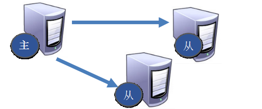
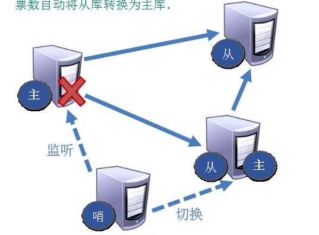

# Redis主从复制

  - 主从复制，从实例是主实例的完整拷贝，从实例会在连接断开时重新连接主实例
  - 数据的复制是单向的，只能由主实例到从实例
  - 主实例可以有多个从实例
  - 主实例在复制过程中是非阻塞的，当从实例在进行初始同步或部分重新同步时，主实例可以继续处理查询命令
  - 复制的安全性：
    - 当使用复制功能时，建议在主/从实例上启用持久化，否则应该在配置中禁用自动重启
    - 主实例没有启用持久化，并配置了自动重启是一个危险的操作，例如：
      - 节点A作为主节点，禁用持久性，节点B和C从节点A复制
      - 节点A崩溃了，但是它配置了自动重启，可以重启进程。由于禁用持久性，节点A以空数据集重新启动
      - 节点B和C将从节点A复制，节点A是空的，因此它们将销毁其数据副本
    - 考虑数据安全，如果主实例没有启用持久化，则应该禁用自动重启实例
  - 只读副本：
    - Redis 2.6之后，默认启用复制副本是只读模式，可以在redis.conf文件中通过replica-read-only参数配置
    - 但是存在一些用例需要将临时数据写入到从实例副本，例如：计算set或sorted set的慢操作，并将他们存入本地的key
    - 写入副本只限于本地，不会传播到下一级副本，下一级副本始终接收最顶层主实例同步的数据，例如：
      ```
      A ---> B ---> C
      Even if B is writable, C will not see B writes and will instead have identical dataset as the master instance A
      ```
    
## 主从复制相关概念

  - 主从复制作用：
    - 数据冗余/数据安全：实现了数据的热备份，是持久化之外的一种数据冗余方式
    - 故障恢复/高可用：当主实例出现问题时，可以由从实例提供服务
    - 负载均衡：配合读写分离，可以由主实例提供写服务，由从实例提供读服务。例如：可以将一些慢操作移动到多个从实例上执行
  - 建立主从复制的方式：
    - 主从复制的开启，是在从节点发起的，不需要我们在主节点做任何事情。
    - 3种方式：
      - 配置文件：在从服务器的配置文件中加入：replicaof masterip masterport
      - 启动命令：redis-server启动命令后加入 --replicaof masterip masterport
      - 客户端命令：Redis服务器启动后，直接通过客户端执行命令：replicaof masterip masterport，则该Redis实例成为从节点。
  - 断开复制关系：
    - 从节点执行replicaof no one命令
    - 从节点断开复制后，不会删除已有的数据，只是不再接受主节点新的数据变化
  - 常用配置/命令：
    - info replication: 打印主从复制的相关信息
    - replicaof <masterip> <masterport> : 成为某个实例的从实例
    - role : 返回当前实例的角色，master, slave, or sentinel，以及状态和偏移量信息
  - 主从复制原理：
    - 每个主实例有一个复制ID(一个假的随机字符串标识数据集)，还会维持一个偏移量：随着发送到从实例的复制数据每个字节的增加而累加。因此使用(Replication ID, offset)可以确认主实例数据集的版本
      - Replication ID说明：
        - Replication ID标识一个数据集的历史，每次主实例重启或从实例变成主实例，这个实例会产生一个新的Replication ID。从实例和主实例连接握手后会继承主实例的Replication ID，因此2个有相同Replication ID的实例有相同的数据集，但是在不同的时间，可以通过偏移量判断哪个实例维护更新的数据集（偏移量越大表示数据越新）
        - 有时从实例在故障转移之后变成主实例可能有2个Replication ID：一个是之前主实例的ID，一个是新生成的ID。当其他从实例和这个新的主实例同步时，可以使用旧的ID做增量复制
    - 建立连接阶段：
      - 从节点服务器内部维护了两个字段，即masterhost和masterport字段，用于存储主节点的ip和port信息
      - 从节点和主节点建立socket连接，负责后续的复制工作。
    - 数据同步阶段：
      - 从节点向主节点发送psync命令，发送旧的master replication ID和当前的偏移量，开始同步。这样主实例可以只发送增量的数据，然而如果主实例缓存中没有足够的backlog，或者从实例发送的replication ID不可知，还是会触发全量复制。
      - 数据同步阶段是主从复制最核心的阶段，根据主从节点当前状态的不同，可以分为全量复制和部分复制。
         - 全量复制：主节点中的所有数据都发送给从节点，是一个非常重型的操作。主实例后台会启动一个进程生成RDB文件，同时会缓存所有客户端新的写命令。当生成RDB文件完成时，主实例将文件发送到从实例，从实例会保存到磁盘，然后加载到内存中。之后主实例将缓存的写命令同步给从实例
         - 增量复制：用于网络中断等情况后的复制，只将中断期间主节点执行的写命令发送给从节点
    - 命令传播阶段：
      - 当主从实例正常连接时，主实例将命令流（包含客户端写，key过期或被清除，以及其他更新主实例数据集的行为）发送给从实例，从节点接收命令并执行，从而保证主从节点数据的一致性。
      - Redis默认使用异步复制，这种方式有低延迟和高性能，从实例会周期性地和主实例确认接收到的数据量，即主实例发送写命令后并不会等待从实例的回复。
      - 同步复制是可选的，客户端可以使用wait命令请求将部分数据同步复制，但是不能保证强一致性：被确认的写命令在故障转移时依然会丢失。然而使用wait，在失败事件后丢失写入命令的可能性大大降低
  - 常用的配置模式：
    - 一主二仆：
      - 一个Master两个Slave
      
      
      
    - 薪火相传：
      - 上一个slave可以是下一个slave的Master，slave同样可以接收其他slaves的连接和同步请求。
      - 那么该slave作为了链条中下一个的master, 可以有效减轻master的写压力,去中心化降低风险。
      - 中途变更转向:会清除之前的数据，重新建立拷贝最新的。
      - 风险是一旦某个slave宕机，后面的slave都没法备份。
      
      
      
    - 反客为主：
      - 当一个master宕机后，后面的slave可以立刻升为master，其后面的slave不用做任何修改。
      - replicaof no one : 使当前数据库停止与其他数据库的同步，转成主数据库。
      
## 哨兵模式：
  
  - 哨兵模式提供了高可用，可以抵抗某些失败的场景
  
    
  
  - 其他的功能：
    - 监控：哨兵会不断地检查主实例和从实例是否运作正常
    - 通知：哨兵可以通过API通知系统管理员或其他程序被监控的实例出现了问题
    - 自动故障转移：当主实例不能正常工作时，哨兵会开始自动故障转移操作，它会将其中一个从实例升级为新的主实例，其他从实例重新配置为使用新的主实例，使用Redis服务器的应用也会在连接时被通知新主实例的地址
    - 配置提供者：客户端通过连接哨兵来获得当前Redis服务的主实例地址，如果发生故障转移，会通知新主实例的地址
  - 哨兵的分布式特性：
    - 哨兵模式的设计是配置多个哨兵进程互相合作，这样做的优势是：
      - 当多个哨兵进程对某个主实例不可用达成一致时，执行失败检测，这样可以降低假正例的概率
      - 如果不是所有哨兵进程有故障，哨兵依然可以工作，使系统对故障有健壮性
  - 选取新master的方式：
    - 选择优先级靠前的，由slave-priority设置优先级。
    - 选择偏移量最大的，即已经复制数据量最大的从节点。
    - 选择runid最小的从服务，每个Redis实例启动后都会随机生成一个40位的runid。
 
### 哨兵的使用
  
  - 运行哨兵：
    ```
    redis-sentinel /path/to/sentinel.conf
    或者
    redis-server /path/to/sentinel.conf --sentinel
    ```
    - 运行哨兵时配置文件是必须的，系统会使用它来保存当前的状态，然后在重启时加载。
    - 哨兵默认监听26379 TCP端口
  - 部署哨兵的注意事项：
    - 至少3个哨兵实例，提高集群部署的健壮性
    - 这些哨兵实例应该放置在不同的物理机上
  - 配置哨兵：
    - sentinel.conf配置文件示例：
      ```
      sentinel monitor mymaster 127.0.0.1 6379 2
      sentinel down-after-milliseconds mymaster 60000
      sentinel failover-timeout mymaster 180000
      sentinel parallel-syncs mymaster 1

      sentinel monitor resque 192.168.1.3 6380 4
      sentinel down-after-milliseconds resque 10000
      sentinel failover-timeout resque 180000
      sentinel parallel-syncs resque 5
      ```
      - 只需要指定需要监控的主实例，从实例是自动被发现的
      - 哨兵会自动更新配置，获取关于从实例的额外信息
      - 每次从实例在故障转移中升级为主实例，或者新的哨兵被发现时都会重写这个配置文件
      - 参数说明：
        - down-after-milliseconds：主实例被哨兵认定不可用的时间间隔
        - parallel-syncs：故障转移后可以重新配置为使用新主服务器的副本数量
        - 配置参数可以在运行时修改：
          - SENTINEL SET：修改主实例相关的参数
          - SENTINEL CONFIG SET：全局的配置参数
    - sentinel monitor语法解析：
      ```
      sentinel monitor <master-group-name> <ip> <port> <quorum>
      ```
      - quorum参数是对某个主实例不可用达成一致的哨兵的数量，这些哨兵决定标记该主实例为故障，并开始故障转移的流程
      - 开始故障转移之前，需要大多数哨兵进程投票选举出其中一个哨兵为leader，并授权它处理故障转移的操作
    - 查看状态命令：
      - sentinel master mymaster: 获取主实例的信息
      - sentinel replicas mymaster: 获取连接该主实例的从实例的信息
      - sentinel sentinels mymaster: 获取其他哨兵的信息
      - sentinel get-master-addr-by-name mymaster: 获取主实例的地址
    - 运行时重新配置哨兵：
      - sentinel monitor name ip port quorum：监控特定名字的新实例
      - sentinel remove name: 移除对主实例的监控
      - sentinel set name [<option> <value> ...]: 可以修改在sentinel.conf配置的参数值
    - 增加或移除哨兵
      - 添加新的哨兵需要配置新的哨兵去监控当前活跃的主实例，在10秒之内这个哨兵会获取到其余哨兵的列表和连接主实例的从实例
      
      
  
## 参考
  
  - https://redis.io/topics/replication#replication-id-explained
      
