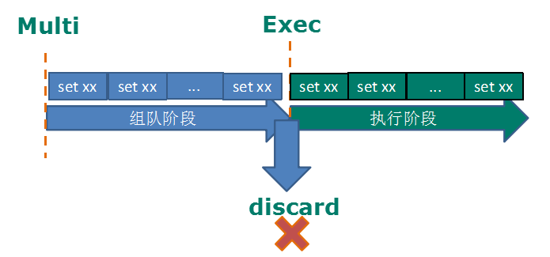

# Redis事务

  - MULTI, EXEC, DISCARD and WATCH是Redis事务的基础
  - 可以一次执行多个命令，本质是一组命令的集合。有2个重要的保证：
    - 一个事务中的所有命令都会序列化，按顺序地串行化执行，可以保证这些命令作为一个独立的操作而执行
    - Redis事务是原子性的，或者全部命令执行成功，或者一个命令也不执行
  - Redis事务的主要作用就是串联多个命令防止别的命令插队，不许加塞。
  
## 事务的使用

  - 开启：从输入Multi命令开始事务。
  - 入队列：发出多个命令，这些命令并不会立即执行，而是放到等待执行的事务队列里面。
  - 执行：调用EXEC命令触发事务的执行。
  - Discard命令会清空事务队列，退出事务
  - 事务示例：
  
  
  
## 事务错误处理

  - 命令错误处理：
    - 在执行Exec命令之前，队列中某个命令出现了错误，例如语法错误
    - 客户端会检查queued命令返回结果，如果返回QUEUED则命令入队列成功，返回error则会丢弃这个事务操作
  
    
  
  - 执行错误处理：
    - 在执行Exec命令时，某个命令报出了错误
    - 只有报错的命令不会被执行，而其他的命令都会执行
  
    
  
## 事务相关概念

  - 悲观锁(Pessimistic Lock)：
    - 每次去拿数据的时候都认为别人会修改，所以每次在拿数据的时候都会上锁，这样别人想拿这个数据就会block直到它拿到锁。
    - 传统的关系型数据库里边就用到了很多这种锁机制，比如行锁，表锁，读锁，写锁等，都是在做操作之前先上锁。
  - 乐观锁(Optimistic Lock)：
    - 每次去拿数据的时候都认为别人不会修改，所以不会上锁，但是在更新的时候会判断一下在此期间别人有没有去更新这个数据，使用版本号等机制。
    - 乐观锁适用于多读的应用类型，这样可以提高吞吐量。Redis就是利用这种check-and-set机制实现事务的。
    
## 事务的监控(watch/unwatch)

  - watch: 
    - 在执行multi之前，先执行watch key1 [key2], 可以监视一个(或多个)key ，如果在事务执行之前这个(或这些)key被其他命令所改动，那么事务将被打断。
  - unwatch:
    - 取消watch命令对所有key的监视。
    - 如果在执行watch命令之后，exec命令或discard命令先被执行，那么就不需要再执行unwatch。
    
## 事务的特性

  - 单独的隔离操作：
    - 事务中的所有命令都会序列化、按顺序地执行。
    - 事务在执行的过程中，不会被其他客户端发送来的命令请求所打断。
  - 没有隔离级别的概念：
    - 队列中的命令没有提交之前都不会实际的被执行，因为事务提交前任何指令都不会被实际执行，也就不存在“事务内的查询要看到事务里的更新，在事务外查询不能看到”
的问题。
  - 不保证原子性：
    - Redis同一个事务中如果有一条命令执行失败，其后的命令仍然会被执行，没有回滚。

      
  
