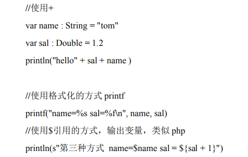
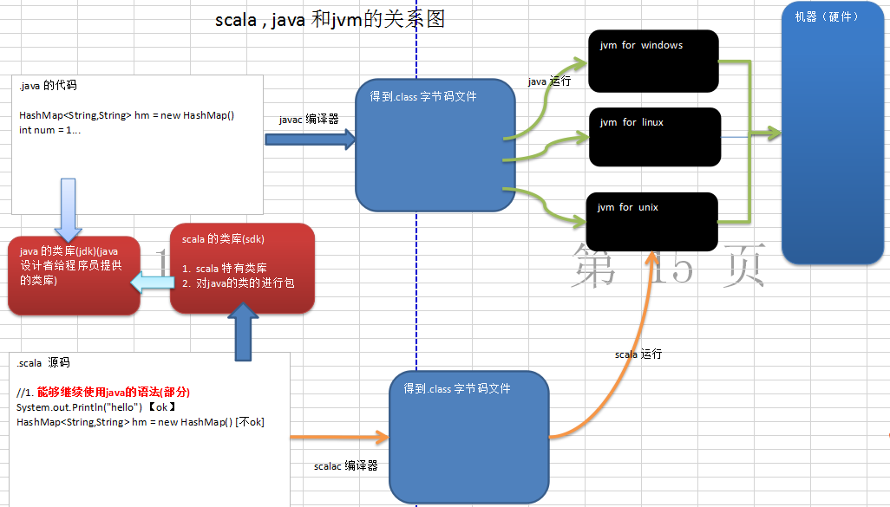

# Scala概述

## Scala语言的特点

  - Scala是一门以java虚拟机（JVM）为运行环境并将面向对象和函数式编程的最佳特性结合在一起的静态类型编程语言。
  - Scala 是一门多范式 (multi-paradigm) 的编程语言，Scala支持面向对象和函数式编程。
  - Scala源代码(.scala)会被编译成Java字节码(.class)，然后运行于JVM之上，并可以调用现有的Java类库，实现两种语言的无缝对接。
  - scala 单作为一门语言来看， 非常的简洁高效。
  - 快速有效掌握Scala的建议：
    - 学习scala 特有的语法
    - 搞清楚 scala 和java 区别
    - 如何规范的使用scala
  
## Scala的开发工具

  - IDEA 全称IntelliJ IDEA，是用于java语言开发的集成环境。
  - IDEA不是专门用于开发Scala的IDE，但是确是最适合开发Scala的工具，因为在我们实际工作中，大部分是开发项目，而大数据项目不可避免的会使用到Java, 所以会进行Java 和 Scala 两种语言的混合编程。 而Idea 可以很好的支持Java和Scala的开发。
 
## Scala语言快速开发入门

   - Scala执行流程示意图
   
   - Scala程序开发注意事项:
    - Scala源文件以 “.scala" 为扩展名。
    - Scala程序的执行入口是main()函数。
    - Scala语言严格区分大小写。
    - Scala方法由一条条语句构成，每个语句后不需要分号(Scala语言会在每行后自动加分号)。
    - 如果在同一行有多条语句，除了最后一条语句不需要分号，其它语句需要分号。
   
## Scala语言输出的三种方式

  - 字符串通过+号连接（类似java）。
  - printf用法 （类似C语言）字符串通过 % 传值。
  - 字符串通过$引用(类似PHP）。
  
 
## scala, java和jvm的关系

