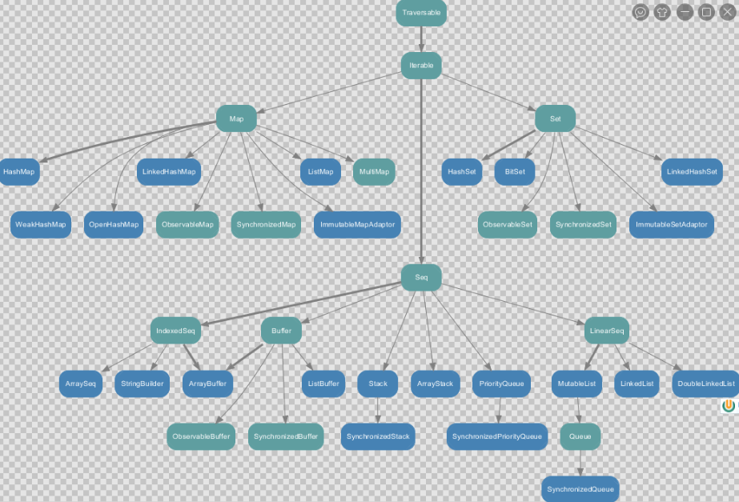

# 数据结构

## Scala集合基本介绍

  - Scala同时支持不可变集合和可变集合，不可变集合可以安全的并发访问.
  - 两个主要的包：
    - 不可变集合：scala.collection.immutable
    - 可变集合：  scala.collection.mutable
  - Scala默认采用不可变集合，对于几乎所有的集合类，Scala都同时提供了可变(mutable)和不可变(immutable)的版本.
  - Scala的集合有三大类：序列Seq、集Set、映射Map，所有的集合都扩展自Iterable特质.
  - 可变集合和不可变集合区别：
    - 不可变集合，就是这个集合本身不能动态变化。(类似java的数组，是不可以动态增长的)。
    - 可变集合，就是这个集合本身可以动态变化的。(比如:ArrayList , 是可以动态增长的) 。
    
### 不可变集合

  - 不可变集合图示：
  
  
  - 不可变集合小结：
    - Set、Map是Java中也有的集合。
    - Seq是Java没有的，我们发现List归属到Seq了,因此这里的List就和java不是同一个概念。
    - for循环有一个 1 to 3，就是IndexedSeq下的Vector。
    - String也是属于IndexeSeq。
    - 经典的数据结构比如Queue和Stack被归属到LinearSeq。
    - Scala中的Map体系有一个SortedMap,说明Scala的Map可以支持排序。
    - IndexSeq 和 LinearSeq 的区别：
      - IndexSeq是通过索引来查找和定位，因此速度快，比如String就是一个索引集合，通过索引即可定位。
      - LineaSeq 是线型的，即有头尾的概念，这种数据结构一般是通过遍历来查找，它的价值在于应用到一些具体的应用场景 (电商网站, 大数据推荐系统 :最近浏览的10个商品。
      
### 可变集合

  - 可变集合图示：
  
  
  - 不可变集合小结：
    - 可变集合比不可变集合更丰富。
    - 在Seq中，增加了Buffer集合，常用的有ArrayBuffer和ListBuffer。
    - 涉及到线程安全时可以选择同步的集合。
  
  
  

  
  
  

  
