# 数据结构

## Scala集合基本介绍

  - Scala同时支持不可变集合和可变集合，不可变集合可以安全的并发访问.
  - 两个主要的包：
    - 不可变集合：scala.collection.immutable
    - 可变集合：  scala.collection.mutable
  - Scala默认采用不可变集合，对于几乎所有的集合类，Scala都同时提供了可变(mutable)和不可变(immutable)的版本.
  - Scala的集合有三大类：序列Seq、集Set、映射Map，所有的集合都扩展自Iterable特质.
  - 可变集合和不可变集合区别：
    - 不可变集合，就是这个集合本身不能动态变化。(类似java的数组，是不可以动态增长的)。
    - 可变集合，就是这个集合本身可以动态变化的。(比如:ArrayList , 是可以动态增长的) 。
    
### 不可变集合

  - 不可变集合图示：
  
  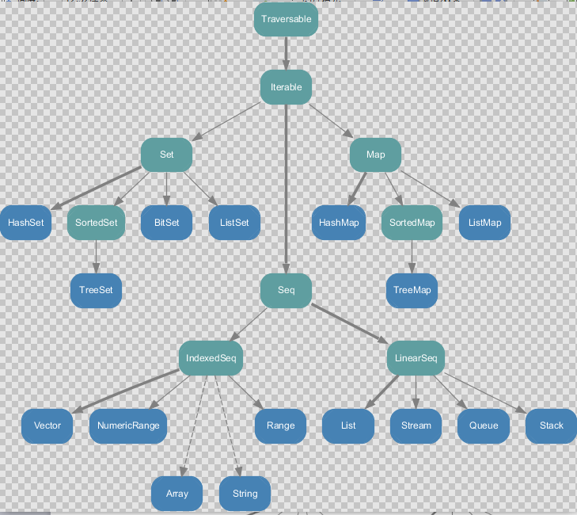
  - 不可变集合小结：
    - Set、Map是Java中也有的集合。
    - Seq是Java没有的，我们发现List归属到Seq了,因此这里的List就和java不是同一个概念。
    - for循环有一个 1 to 3，就是IndexedSeq下的Vector。
    - String也是属于IndexeSeq。
    - 经典的数据结构比如Queue和Stack被归属到LinearSeq。
    - Scala中的Map体系有一个SortedMap,说明Scala的Map可以支持排序。
    - IndexSeq 和 LinearSeq 的区别：
      - IndexSeq是通过索引来查找和定位，因此速度快，比如String就是一个索引集合，通过索引即可定位。
      - LineaSeq 是线型的，即有头尾的概念，这种数据结构一般是通过遍历来查找，它的价值在于应用到一些具体的应用场景 (电商网站, 大数据推荐系统 :最近浏览的10个商品。
      
### 可变集合

  - 可变集合图示：
  
  
  - 不可变集合小结：
    - 可变集合比不可变集合更丰富。
    - 在Seq中，增加了Buffer集合，常用的有ArrayBuffer和ListBuffer。
    - 涉及到线程安全时可以选择同步的集合。

### 数组-定长数组

  - 定义数组方式1：
    - ``` var array = new Array[Int](10) ```
    - 赋值,集合元素采用小括号访问: array(1) = 5
    - 这里的数组等同于Java中的数组,中括号的类型就是数组的类型。
  - 定义数组方式2：
    - ``` var array = Array(1, 2) ```
    - 在定义数组时，直接赋值。
    
### 数组-变长数组

  - ``` 定义：var array = ArrayBuffer[Int]() ```
  - ``` 追加元素：array.append(5) ```
  - ``` 重新赋值/修改：array(1) = 5 ```
  - ``` 删除元素：array.remove(1) ```
  - 变长数组小结：
    - ArrayBuffer是变长数组，类似java的ArrayList。
    - def append(elems: A*) { appendAll(elems) } 接收的是可变参数。
    - 每append一次，数组在底层会重新分配空间，进行扩容，内存地址会发生变化，也就成为新的ArrayBuffer。
    
### 定长数组与变长数组的转换

  - 定长数组转可变数组：array.toBuffer
  - 可变数组转定长数组：array.toArray
  - 说明：array本身没有变化，返回的结果是一个新的数组。
  
### 多维数组

  - ``` 定义：var array = Array.ofDim[Double](3, 4) 三行四列 ```
  - ``` 赋值：array(1)(2) = 5.0 ```
  
### 元组(Tuple)

  - 元组也是可以理解为一个容器，就是将多个无关的数据封装为一个整体，称为元组, 最多的特点灵活,对数据没有过多的约束。
  - 元组中最多只能有22个元素。
  - 元组的创建：val tuple4 = (1, 2, 3, "hello") ---> Tuple4类型
  - 元组数据的访问：访问元组中的数据,可以采用顺序号（_顺序号），也可以通过索引（productElement）访问。
    - tuple4._1 // 访问元组第一个元素, 从1开始
    - tuple4.productElement(0) // 访问元组第一个元素, 从0开始
  - 元组数据的遍历：
  
  
  
### 列表(List)

  - Scala中的List和Java中的List不一样，在Java中List是一个接口，真正存放数据是ArrayList，而Scala的List可以直接存放数据，就是一个object。
  - 默认情况下Scala的List是不可变的，List属于序列Seq。
  - 列表的创建：val list = List(1, 2, 3), val emList = Nil // 空集合
  - 创建List的小结：
    - List默认为不可变的集合。
    - List 在 scala包对象声明的,因此不需要引入其它包也可以使用。
    - val List = scala.collection.immutable.List
    - List 中可以放任何数据类型。
    - 如果希望得到一个空列表，可以使用Nil对象。
  - 列表的访问：val value = list(0) // 访问列表第一个元素
  - 列表追加元素：
    - 方式1：val list1 = list :+ 4 // 在列表的最后增加数据
    - 方式2：val list2 = 4 +: list // 在列表的最前增加数据
    - 方式3：val list3 = 4 :: 5 :: list ---> (4, 5, 1, 2, 3)
    - 方式4：val list4 = 4 :: 5 :: list ::: Nil ---> (4, 5, 1, 2, 3)
    - 说明：
      - 向列表中增加元素, 会返回新的列表/集合对象。
      - 符号 :: 表示向集合中添加元素。
      - 运算时，集合对象一定要放置在最右边。
      - 运算规则，从右向左。
      - ::: 运算符是将集合中的每一个元素加入到空集合中去。
      
### 列表(ListBuffer)

  - ListBuffer是可变的list集合，可以添加，删除元素。
  - ListBuffer属于序列。
  
### 队列(Queue)

  - 队列的说明:
    - 队列是一个有序列表，在底层可以用数组或是链表来实现。
    - 其输入和输出要遵循先入先出的原则。
    - 在Scala中，由设计者直接给我们提供队列类型使用。
    - 在Scala中, 有 scala.collection.mutable.Queue 和 scala.collection.immutable.Queue , 一般来说，我们在开发中通常使用可变集合中的队列。
  - ``` 队列的创建：val queue = new mutable.Queue[Int] ```
  - 追加元素：
    - 方式1：queue += 5 ---> (5)
    - 方式2：queue ++= List(1, 2, 3) ---> (5, 1, 2, 3)
  - 添加和删除元素：
    - queue.enqueue(7, 8) ---> 将数据添加到队列的最后。
    - queue.dequeue() ---> 将队列头部数据取出
  - 返回队列元素：
    - queue.head ---> 第一个元素
    - queue.last ---> 最后一个元素
  
### 映射(Map)

  - Map介绍：
    - Scala中的Map 和Java类似，也是一个散列表，它存储的内容也是键值对(key-value)映射。
    - Scala中，有可变Map (scala.collection.mutable.Map) 和 不可变Map(scala.collection.immutable.Map) 。
    - Scala中不可变的Map是有序的，可变的Map是无序的。
  - 构造Map:
    - 构造不可变Map: 不可变Map是有序，构建Map中的元素底层是Tuple2类型。
      - val map1 = Map("Alice" -> 10, "Bob" -> 20, "Kotlin" -> "北京")
      - 默认情况下（即没有引入其它包的情况下）,Map是不可变的。
    - 构造可变Map:
      - val map2 = scala.collection.mutable.Map("Alice" -> 10, "Bob" -> 20, "Kotlin" -> "北京")
    - 构造空Map:
      - val map3 = new scala.collection.mutable.HashMap[String, Int]
    - 对偶元组：
      - val map4 = mutable.Map(("A", 1), ("B", 2), ("C", 3),("D", 4))
  - Map取值：
    - 方式1：使用map(key)
      - val value1 = map1("Alice")
      - 说明：
        - 如果key存在，则返回对应的值。
        - 如果key不存在，则抛出异常（java.util.NoSuchElementException）。
        - 在Java中,如果key不存在则返回null。
    - 方式2：使用contains方法检查是否存在key
      - ``` 
            if(map4.contains("A")){
              println("key存在 值= " + map4("A"))
            } else{
              println("key不存在")
            }
        ```
    - 方式3：使用map.get(key).get取值
      - 这种调用返回一个Option对象，要么是Some，要么是None。
      - ``` 
            println(map4.get("A")) // Some
            println(map4.get("A").get) // 得到Some再取出
        ```
      - 小结：
        - map.get方法会将数据进行包装。
        - 如果 map.get(key) key存在返回some,如果key不存在，则返回None。
        - 如果 map.get(key).get  key存在，返回key对应的值,否则抛出异常ava.util.NoSuchElementException（None.get）。
    - 方式4：使用map.getOrElse()取值 
      - ``` println(map4.getOrElse("A","默认")) ```
      - 说明：
        - 如果key存在，返回key对应的值。
        - 如果key不存在，返回默认值。
    - 选择取值方式建议：
      - 如果我们确定map有这个key ,则应当使用map(key), 速度快。
      - 如果我们不能确定map是否有key ,而且有不同的业务逻辑，使用map.contains() 先判断在加入逻辑。
      - 如果只是简单的希望得到一个值，使用map.getOrElse()。
  - 更新元素
    - map4("E") = 10
    - 说明：
      - map是可变的，才能修改，否则报错。
      - 如果key存在，则修改对应的值；key不存在,就添加一个（key-val）。
  - 添加元素：
    - 增加单个元素：map4 += ("E" -> 10)
    - 增加多个元素: val map5 = map4 + ("E"->1, "F"->3)
  - 删除元素：
    - map4 -= ("A", "B")
    - 说明：
      - "A","B" 就是要删除的key, 可以写多个。
      - 如果key存在，就删除；如果key不存在，也不会报错。
  - 遍历元素：
  
  
### 集(Set)

  - 集是不重复元素的集合。集不保留顺序，默认是以哈希集实现。
  - 默认情况下，Scala使用的是不可变集合，如果你想使用可变集合，需要引用 scala.collection.mutable.Set包。
  - Set创建：
    - 不可变Set: 
      ``` val set1 = Set(1, 2, 3) ```
    - 可变Set:
      ``` 
        import scala.collection.mutable.Set
        val set2 = Set(1, 2, 3)
      ```
  - 添加元素：
    - 方式1：set2.add(4)
    - 方式2：set2 += 5
    - 方式3: set2.+= (6)
    - 说明：如果添加的对象已经存在，则不会重复添加，也不会报错。
  - 删除元素：
    - 方式1：set2 -= 1
    - 方式2：set2.remove(2)
    - 说明：如果删除的对象不存在，则不生效，也不会报错。
  - 遍历元素：
    ```
      for (x <- set2){
        println(x)
      }
    ```
    
### Map映射操作

  - Map映射操作: 将集合中的每一个元素通过指定功能（函数）映射（转换）成新的结果集合。这里就是将函数作为参数传递给另外一个函数,这是函数式编程的特点。
  - HashSet示例：
    - ``` def map[B](f:(A) -> B): HashSet[B] ```
    - 说明：
      - [B]是泛型。
      - map是一个高阶函数(可以接受一个函数的函数，就是高阶函数)，可以接收函数 f:(A) -> B。
      - HashSet[B] 就是返回的新的集合。
  - Map映射实例：
  
  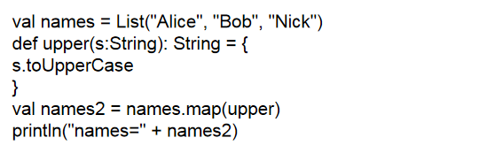
  
  - 高阶函数实例：
  
  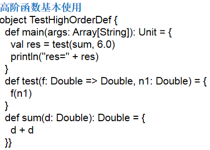
  - flatmap映射: 扁平化映射
    - flatmap：flat即压扁，压平，扁平化，效果就是将集合中的每个元素的子元素映射到某个函数并返回新的集合。
    - flatmap实例：
    
    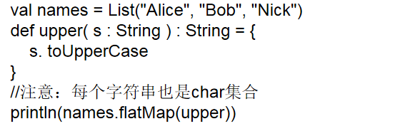
  
### 集合元素的过滤-filter

  - filter：将符合要求的数据(筛选)放置到新的集合中。
  - filter实例：
  
  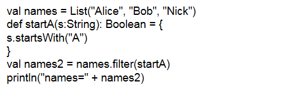
  
### 化简(reduceLeft)

  - 化简：将二元函数引用于集合中的函数。
  - 化简实例：
  
  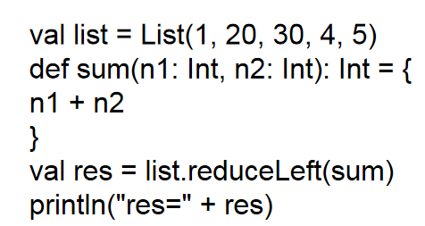
  
  - 说明：
    - reduceLeft(f) 接收的函数需要的形式为 op: (B, A) => B): B。
    - reduceleft(f) 的运行规则是 从左边开始执行将得到的结果返回给第一个参数。
    - 然后继续和下一个元素运行，将得到的结果继续返回给第一个参数...
    - 结果：((((1 + 20) + 30) + 4) + 5)
    
### 折叠(fold)

  - fold函数将上一步返回的值作为函数的第一个参数继续传递参与运算，直到list中的所有元素被遍历。
  - 折叠实例：
  
  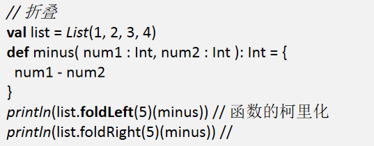
  - foldLeft和foldRight 缩写方法分别是：/:和:\。
  
### 扫描(scanLeft)

  - 扫描，即对某个集合的所有元素做fold操作，但是会把产生的所有中间结果放置于一个集合中保存。
  - 扫描实例：
  
  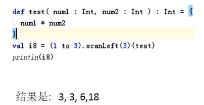
  
### 拉链(zip)

  - 在开发中，当我们需要将两个集合进行对偶元组合并，可以使用拉链。
  - 拉链实例：
  
  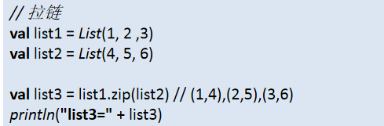
  - 小结：
    - 拉链的本质就是两个集合的合并操作，合并后每个元素是一个对偶元组。
    - 如果两个集合个数不对应，会造成数据丢失。
    - 集合不限于List, 也可以是其它集合比如 Array。
    - 如果要取出合并后的各个对偶元组的数据，可以遍历，按照元组的方式取出即可。
    
### 迭代器(iterator)

  - 通过iterator方法从集合获得一个迭代器，然后通过while循环和for表达式对集合进行遍历。
  - 迭代器实例：
  
  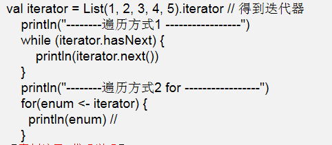
  - 小结：
    - iterator 的构建实际是 AbstractIterator 的一个匿名子类。
    - 该AbstractIterator 子类提供了 hasNext next 等方法。
    
### 流(Stream)

  - Stream是一个集合。这个集合，可以用于存放无穷多个元素，但是这无穷个元素并不会一次性生产出来，而是需要用到多大的区间，就会动态的生产，末尾元素遵循lazy规则(即：要使用结果才进行计算的) 。
  - Stream实例：
  
  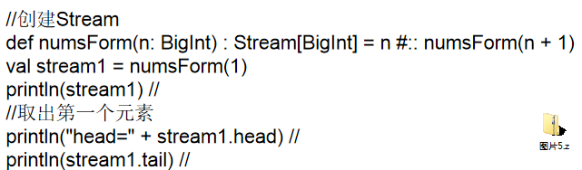
  - 小结：
    - Stream 集合存放的数据类型是BigInt。
    - numsForm 是自定义的一个函数，函数名是程序员指定的。
    - 创建的集合的第一个元素是 n , 后续元素生成的规则是 n + 1。
    - 使用tail，会动态的向Stream集合按规则生成新的元素。
    - 如果使用流集合，就不能使用last属性，否则集合就会进行无限循环。
    
### 视图(view)

  - Stream的懒加载特性，也可以对其他集合应用view方法来得到类似的效果。
  - view特点：
    - view方法产出一个总是被懒执行的集合。
    - view不会缓存数据，每次都要重新计算，比如遍历View时。
    
### 线程安全的集合

  - 所有线程安全的集合都是以Synchronized开头的集合。
  - 包括：SynchronizedBuffer, SynchronizedMap, SynchronizedPriorityQueue, SynchronizedQueue, SynchronizedSet, SynchronizedStack。
  
### 并行集合(par)

  - Scala为了充分使用多核CPU，提供了并行集合（有别于前面的串行集合），用于多核环境的并行计算。
  - 主要用到的算法有：
    - Divide and conquer : 分治算法，Scala通过splitters(分解器)，combiners（组合器）等抽象层来实现，主要原理是将计算工作分解很多任务，分发给一些处理器去完成，并将它们处理结果合并返回。
    - Work stealin算法：主要用于任务调度负载均衡（load-balancing），通俗点完成自己的所有任务之后，发现其他人还有活没干完，主动（或被安排）帮他人一起干，这样达到尽早干完的目的。
  - 并行集合实例：
  
  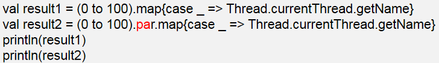

    
    
    
  
    
    
    
  

  

  

  
  
    
    
    
  
   


    


    
  

      
    

  
  
  

  
  
  


  
