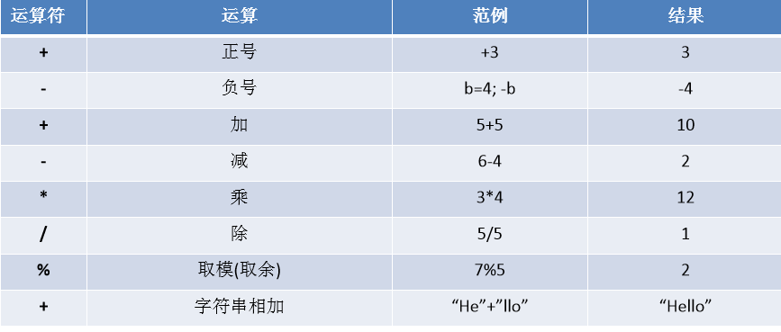
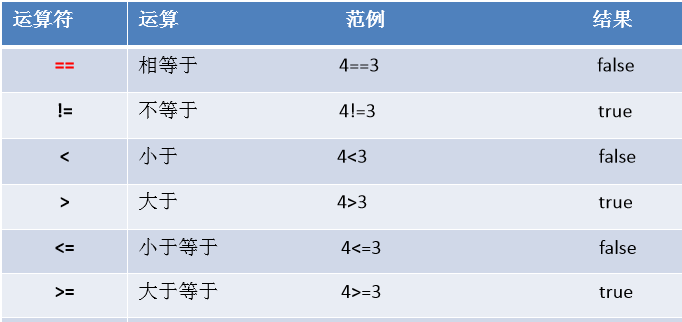
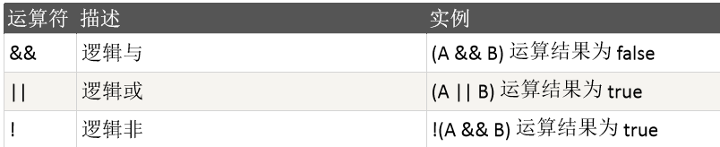
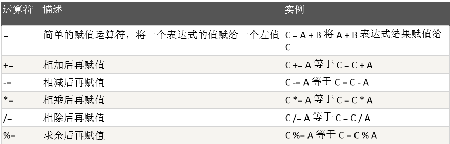
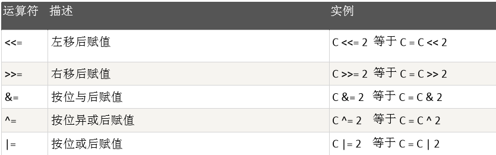
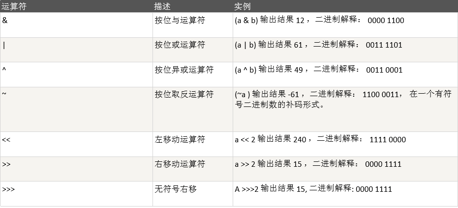
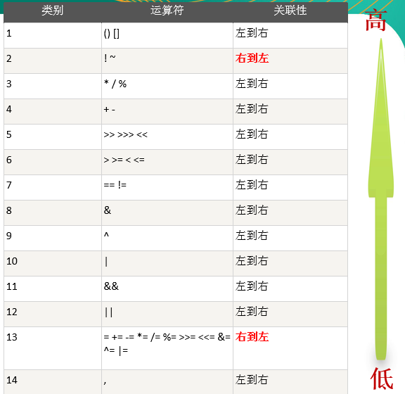

# Scala运算符

## 算术运算符

  - 算术运算符图
  
  
  
  - 细节说明:
    - 对于除号'/'，它的整数除和小数除是有区别的：整数之间做除法时，只保留整数部分而舍弃小数部分。
    - 当对一个数取模时，可以等价 a%b=a-a/b*b ， 这样我们可以看到取模的一个本质运算(和java 的取模规则一样)。
    - Scala中没有++、--操作符，需要通过+=、-=来实现同样的效果。
  
## 关系运算符(比较运算符)

  - 关系运算符图
  
  
  
  - 细节说明：
    - 关系运算符的结果都是Boolean型，也就是要么是true，要么是false。
    - 关系运算符组成的表达式，我们称为关系表达式。
    - 比较运算符'=='不能误写成'='。
    - 使用陷阱: 如果两个浮点数进行比较，应当保证数据类型一致。
    
## 逻辑运算符

  - 逻辑运算符图
  
  
  
## 赋值运算符

  - 赋值运算符图
  
  
  
  
  
  - 赋值运算符特点：
    - 运算顺序从右往左。
    - 赋值运算符的左边 只能是变量,右边可以是变量、表达式、常量值/字面量。
    
## 位运算符

  - 位运算符图
  
  
  
## 运算符优先级

  - 运算符优先级图
  
  
  
  - 细节说明：
    - 运算符有不同的优先级，所谓优先级就是表达式运算中的运算顺序。
    - 只有单目运算符、赋值运算符是从右向左运算的。
    - 运算符的优先级和Java一样。
  

  

  
  

