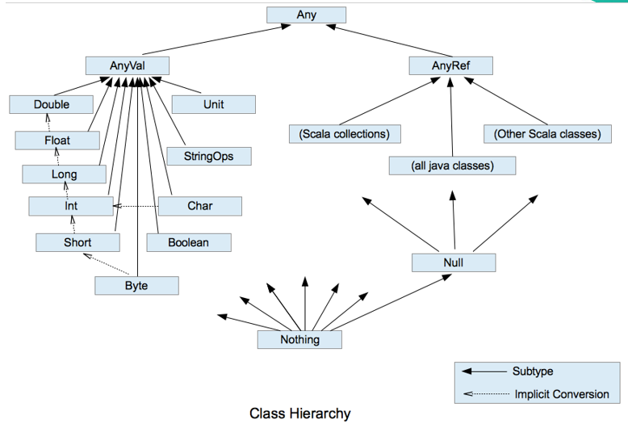
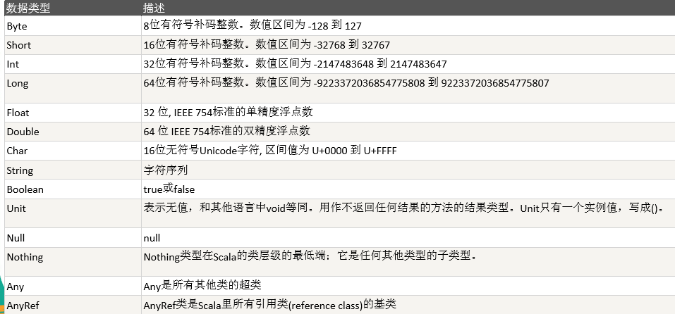
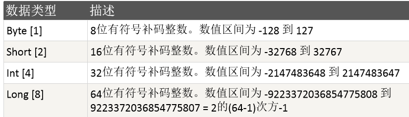
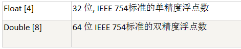

# Scala变量

## 变量介绍

  - 变量相当于内存中一个数据存储空间的表示，通过变量名可以访问到变量(值)。
  - 变量使用的基本步骤：
    - 声明/定义变量 (scala要求变量声明时初始化) 
    - 使用变量
  - 变量使用说明
    - var | val 变量名 [: 变量类型] = 变量值
    - 注意事项：
      - 声明变量时，类型可以省略（编译器自动推导,即类型推导）。
      - 类型确定后，就不能修改，说明Scala是强数据类型语言。
      - 在声明/定义一个变量时，可以使用var或者val来修饰， var修饰的变量可改变，val修饰的变量不可改。
      - val修饰的变量在编译后，等同于加上final。
      - var修饰的对象引用可以改变，val修饰的则不可改变，但对象的状态(值)却是可以改变的。(比如: 自定义对象、数组、集合等等)。
      - 变量声明时，需要初始值。
     
## 数据类型

  - Scala与Java有着相同的数据类型，在Scala中数据类型都是对象，也就是说scala没有java中的原生类型。
  - Scala数据类型分为两大类 AnyVal(值类型) 和 AnyRef(引用类型)， 注意：不管是AnyVal还是AnyRef 都是对象。
  - 数据类型图：
  
  - 数据类型表：
  
  
## 整数类型

  - 整数类型图
  
  - 整型的使用细节：
    - Scala各整数类型有固定的表数范围和字段长度，不受具体OS的影响，以保证Scala程序的可移植性。
    - Scala的整型 常量/字面量  默认为 Int 型，声明Long型 常量/字面量 须后加'l'或'L'。
    - Scala程序中变量常声明为Int型，除非不足以表示大数，才使用Long。
   
## 浮点类型

  - 浮点类型图
  

