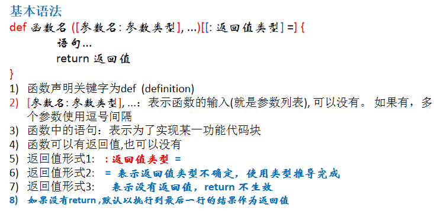
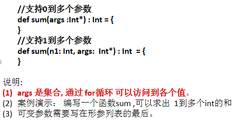

# 函数式编程

## 函数式编程概念说明

  - 在scala中，方法和函数几乎可以等同，只是函数的使用方式更加的灵活多样。
  - 函数式编程是从编程方式(范式)的角度来谈的，可以这样理解：函数式编程把函数当做一等公民，充分利用函数、 支持的函数的多种使用方式。
  - 面向对象编程是以对象为基础的编程方式。
  - 在scala中函数式编程和面向对象编程融合在一起了。
  
## 函数式编程介绍

  - "函数式编程"是一种"编程范式"（programming paradigm）。
  - 它属于"结构化编程"的一种，主要思想是把运算过程尽量写成一系列嵌套的函数调用。
  - 函数式编程中，将函数也当做数据类型，因此可以接受函数当作输入（参数）和输出（返回值）。
  
## 函数介绍

  - 为完成某一功能的程序指令(语句)的集合,称为函数。
  - 函数定义：
  
  
  
  - 函数注意事项和细节讨论：
    - 函数的形参列表可以是多个, 如果函数没有形参，调用时 可以不带()。
    - 形参列表和返回值列表的数据类型可以是值类型和引用类型。
    - Scala中的函数可以根据函数体最后一行代码自行推断函数返回值类型。那么在这种情况下，return关键字可以省略。
    - 如果函数明确使用return关键字，那么函数返回就不能使用自行推断了,这时要明确写成 : 返回类型 =。
    - 如果函数明确声明无返回值（声明Unit），那么函数体中即使使用return关键字也不会有返回值。
    - 如果明确函数无返回值或不确定返回值类型，那么返回值类型可以省略(或声明为Any)。
    - Scala语法中任何的语法结构都可以嵌套其他语法结构(灵活)，即：函数中可以再声明/定义函数，类中可以再声明类 ，方法中可以再声明/定义方法。
    - Scala函数的形参，在声明参数时，直接赋初始值(默认值)，这时调用函数时，如果没有指定实参，则会使用默认值。如果指定了实参，则实参会覆盖默认值。
    - 如果函数存在多个参数，每一个参数都可以设定默认值，那么这个时候，传递的参数到底是覆盖默认值，还是赋值给没有默认值的参数，就不确定了(默认按照声明顺序[从左到右])。在这种情况下，可以采用带名参数。
    - Scala 函数的形参默认是val的，因此不能在函数中进行修改。
    - 递归函数未执行之前是无法推断出来结果类型，在使用时必须有明确的返回值类型。
    - Scala函数支持可变参数:
    
    
    
## 过程

  - 将函数的返回类型为Unit的函数称之为过程(procedure)，如果明确函数没有返回值，那么等号可以省略。
  - 注意事项和细节说明：
    - 注意区分: 如果函数声明时没有返回值类型，但是有 = 号，可以进行类型推断最后一行代码。这时这个函数实际是有返回值的，该函数并不是过程。
  
## 惰性函数

  - 惰性计算（尽可能延迟表达式求值）是许多函数式编程语言的特性。
  - 惰性集合在需要时提供其元素，无需预先计算它们，这带来了一些好处。首先，您可以将耗时的计算推迟到绝对需要的时候。其次，您可以创造无限个集合，只要它们继续收到请求，就会继续提供元素。
  - 函数的惰性使用让您能够得到更高效的代码。Java 并没有为惰性提供原生支持，Scala提供了。
  
### 惰性函数介绍

  - 当函数返回值被声明为lazy时，函数的执行将被推迟，直到我们首次对此取值，该函数才会执行。这种函数我们称之为惰性函数，在Java的某些框架代码中称之为懒加载(延迟加载)。
  - 注意事项和细节：
    - lazy 不能修饰 var 类型的变量。
    - 不但是在调用函数时，加了lazy ,会导致函数的执行被推迟，我们在声明一个变量时，如果给声明了 lazy ,那么变量值的分配也会推迟。
  
## 函数-递归调用

  - 一个函数在函数体内又调用了本身，我们称为递归调用。
  - 函数递归需要遵守的重要原则：
    - 程序执行一个函数时，就创建一个新的受保护的独立空间(新函数栈)。
    - 函数的局部变量是独立的，不会相互影响。
    - 递归必须向退出递归的条件逼近，否则就是无限递归。
    - 当一个函数执行完毕，或者遇到return，就会返回，遵守谁调用，就将结果返回给谁。

## 异常

  - Scala提供try和catch块来处理异常。try块用于包含可能出错的代码。catch块用于处理try块中发生的异常。可以根据需要在程序中有任意数量的try...catch块。
  - 注意事项和细节：
    - 我们将可疑代码封装在try块中。 在try块之后使用了一个catch处理程序来捕获异常。如果发生任何异常，catch处理程序将处理它，程序将不会异常终止。
    - Scala的异常的工作机制和Java一样，但是Scala没有“checked(编译期)”异常，即Scala没有编译异常这个概念，异常都是在运行的时候捕获处理。
    - 用throw关键字，抛出一个异常对象。所有异常都是Throwable的子类型。throw表达式是有类型的，就是Nothing，因为Nothing是所有类型的子类型，所以throw表达式可以用在需要类型的地方。
    - 在Scala里，借用了模式匹配的思想来做异常的匹配，因此，在catch的代码里，是一系列case子句来匹配异常。
    - 异常捕捉的机制与其他语言中一样，如果有异常发生，catch子句是按次序捕捉的。因此，在catch子句中，越具体的异常越要靠前，越普遍的异常越靠后，如果把越普遍的异常写在前，把具体的异常写在后，在scala中也不会报错，但这样是非常不好的编程风格。
    - finally子句用于执行不管是正常处理还是有异常发生时都需要执行的步骤，一般用于对象的清理工作，这点和Java一样。
    - Scala提供了throws关键字来声明异常。可以使用方法定义声明异常。 它向调用者函数提供了此方法可能引发此异常的信息。 它有助于调用函数处理并将该代码包含在try-catch块中，以避免程序异常终止。
