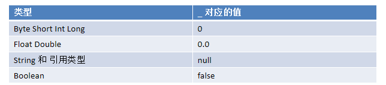
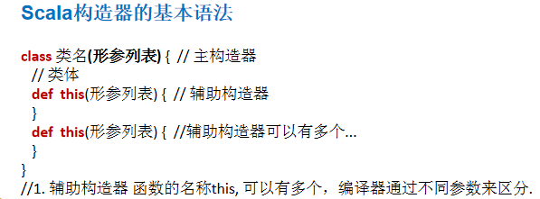

# 面向对象编程

## 类与对象

  - Java是面向对象的编程语言，由于历史原因，Java中还存在着非面向对象的内容:基本类型 ，null，静态方法等。
  - Scala语言来自于Java，所以天生就是面向对象的语言，而且Scala是纯粹的面向对象的语言，即在Scala中，一切皆为对象。 
  
### 类和对象的区别和联系

  - 类是抽象的，概念的，代表一类事物。
  - 对象是具体的，实际的，代表一个具体事物。
  - 类是对象的模板，对象是类的一个个体，对应一个实例。
  
### 类的定义

  - 类的定义：
  
  
  - 注意事项：
    - Scala语法中，类并不声明为public，所有这些类都具有公有可见性(即默认就是public)。
    - 一个Scala源文件可以包含多个类。
    
### 属性/成员变量

  - 属性是类的一个组成部分，一般是值数据类型,也可是引用类型。
  - 注意事项和细节说明：
    - 属性的定义语法同变量，示例：[访问修饰符] var 属性名称 [：类型] = 属性值。
    - 属性的定义类型可以为任意类型，包含值类型或引用类型。
    - Scala中声明一个属性,必须显式的初始化，然后根据初始化数据的类型自动推断，属性类型可以省略(这点和Java不同)。
    - 如果赋值为null,则一定要加类型，因为不加类型, 那么该属性的类型就是Null类型。
    - 如果在定义属性时，暂时不赋值，也可以使用符号_(下划线)，让系统分配默认值。
    
    
    - 不同对象的属性是独立，互不影响，一个对象对属性的更改，不影响另外一个。
    - Scala类的主构造器的形参未用任何修饰符修饰，那么这个参数是局部变量。
    - 如果参数使用val关键字声明，那么Scala会将参数作为类的私有的只读属性使用。
    - 如果参数使用var关键字声明，那么Scala会将参数作为类的成员属性使用,并会提供属性对应的xxx()[类似getter]/xxx_$eq()[类似setter]方法，即这时的成员属性是私有的，但是可读写。
    
### 创建对象

  - 创建对象：
  
  
  - 流程分析：
    - 加载类的信息(属性信息，方法信息)。
    - 在内存中(堆)开辟空间。
    - 使用父类的构造器(主和辅助)进行初始。
    - 使用主构造器对属性进行初始化。
    - 使用辅助构造器对属性进行初始化。
    - 将开辟的对象的地址赋给引用对象。
  
  - 注意事项和细节说明：
    - 如果我们不希望改变对象的引用(即：内存地址), 应该声明为val性质的，否则声明为var, Scala设计者推荐使用val ,因为一般来说，在程序中，我们只是改变对象属性的值，而不是改变对象的引用。
    - Scala在声明对象变量时，可以根据创建对象的类型自动推断，所以类型声明可以省略，但当类型和后面new 对象类型有继承关系即多态时，就必须写了。
    
### 方法

  - Scala中的方法其实就是函数，声明规则请参考函数式编程中的函数声明。主构造器的声明直接放置于类名之后。
  - 基本语法：
  
  
  - 调用机制原理：
    - 当Scala开始执行时，先在栈区开辟一个main栈。main栈是最后被销毁。。
    - 当Scala程序在执行到一个方法时，总会开一个新的栈。
    - 每个栈是独立的空间，变量（基本数据类型）是独立的，相互不影响（引用类型除外）。
    - 当方法执行完毕后，该方法开辟的栈就会被jvm机回收。
    
### 构造器

  - 构造器(constructor)又叫构造方法，是类的一种特殊的方法，它的主要作用是完成对新对象的初始化。
  - 和Java一样，Scala构造对象也需要调用构造方法，并且可以有任意多个构造方法（即Scala中构造器也支持重载）。
  - Scala类的构造器包括：主构造器和辅助构造器。
  - 构造器语法：
  
  
  - 注意事项和细节说明：
    - Scala构造器作用是完成对新对象的初始化，构造器没有返回值。
    - 主构造器的声明直接放置于类名之后。
    - 主构造器会执行类定义中的所有语句，这里可以体会到Scala的函数式编程和面向对象编程融合在一起，即：构造器也是方法（函数）。
    - 如果主构造器无参数，小括号可省略，构建对象时调用的构造方法的小括号也可以省略。
    - 辅助构造器名称为this（这个和Java是不一样的），多个辅助构造器通过不同参数列表进行区分， 在底层就是构造器重载。
    - 如果想让主构造器变成私有的，可以在()之前加上private，这样用户只能通过辅助构造器来构造对象了。
    - 辅助构造器的声明不能和主构造器的声明一致,会发生错误(即构造器名重复)。

  
  
