# 程序流程控制

  - 在程序中，程序运行的流程控制决定程序是如何执行的，是我们必须掌握的，主要有三大流程控制语句。
    - 顺序控制
    - 分支控制
    - 循环控制
    
## 顺序控制

  - 程序从上到下逐行地执行，中间没有任何判断和跳转。
  
## 分支控制if-else

  - 让程序有选择的的执行,分支控制有三种:
    - 单分支
    - 双分支
    - 多分支
    
  - 单分支：
  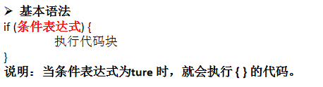
  
  - 双分支：
  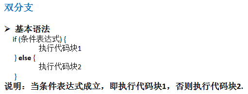
  
  - 多分支：
  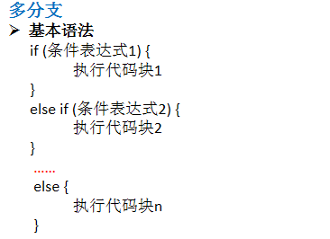
  
  - 分支控制if-else注意事项：
    - 如果大括号{}内的逻辑代码只有一行，大括号可以省略, 这点和java 的规定一样。
    - Scala中任意表达式都是有返回值的，也就意味着if else表达式其实是有返回结果的，具体返回结果的值取决于满足条件的代码体的最后一行内容。
    
  - switch分支结构：在scala中没有switch,而是使用模式匹配来处理。
 
## for循环控制

  - Scala 也为for 循环这一常见的控制结构提供了非常多的特性，这些for 循环的特性被称为for 推导式（for comprehension）或for 表达式（for expression）。
  - 范围数据循环两种方式：
    - 方式1：
    
    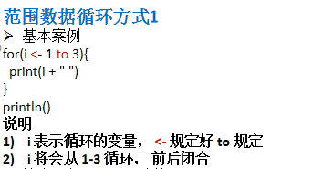
    - 方式2：
    
    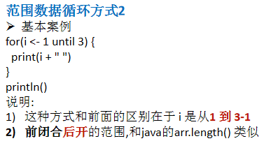
  - 循环守卫
  
  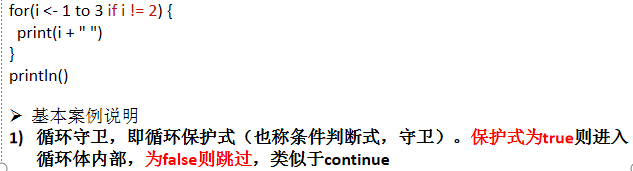
  
  - 引入变量
  
  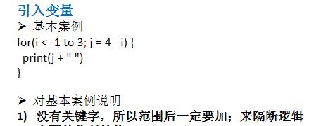
  
  - 嵌套循环
  
  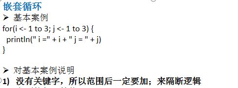
  
  - 循环返回值
  
  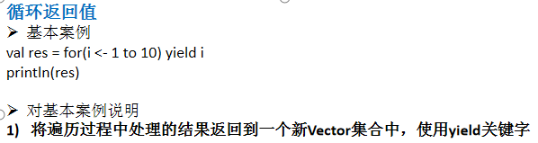
  
  - 注意事项和细节说明：
    - scala 的for循环形式和java是较大差异，但是基本的原理还是一样的。
    - scala 的for循环的步长控制：[for(i <- Range(1,3,2)]
    
## while循环控制

  - while循环
  
  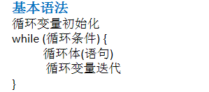
  
  - 注意事项和细节说明：
    - 循环条件是返回一个布尔值的表达式。
    - while循环是先判断再执行语句。
    - 与If语句不同，while语句本身没有值，即整个while语句的结果是Unit类型的。
    - 因为while中没有返回值,所以当要用该语句来计算并返回结果时,就不可避免的使用变量 ，而变量需要声明在while循环的外部，那么就等同于循环的内部对外部的变量造成了影响，所以不推荐使用，而是推荐使用for循环。
    
## do..while循环控制

  - do-while循环
  
  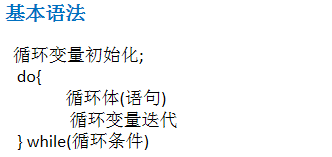
  
  - 注意事项和细节说明:
    - 循环条件是返回一个布尔值的表达式。
    - do..while循环是先执行，再判断。
    - 和while 一样，因为do…while中没有返回值,所以当要用该语句来计算并返回结果时,就不可避免的使用变量 ，而变量需要声明在do...while循环的外部，那么就等同于循环的内部对外部的变量造成了影响，所以不推荐使用，而是推荐使用for循环。
    
## 多重循环控制

  - 将一个循环放在另一个循环体内，就形成了嵌套循环。其中，for ,while ,do…while均可以作为外层循环和内层循环。
  - 实质上，嵌套循环就是把内层循环当成外层循环的循环体。
  - 设外层循环次数为m次，内层为n次， 则内层循环体实际上需要执行m*n=mn次。
  
## 循环的中断

  - Scala内置控制结构特地去掉了break和continue，是为了更好的适应函数化编程，推荐使用函数式的风格解决break和contine的功能，而不是一个关键字。
    - breakable ---> break
    - if..else 或者 循环守卫 ---> continue

