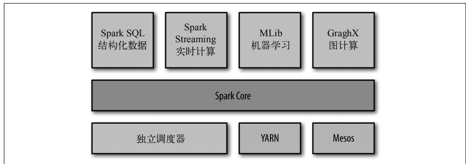

# Spark数据分析导论

## Spark是什么

  - Spark是一个用来实现快速而通用的集群计算的平台。
  - Spark特点：
    - Spark的一个主要特点就是能够在内存中进行计算，因而更快。不过即使是必须在磁盘上进行的复杂计算，Spark依然比MapReduce更加高效。
    - Spark适用于各种各样原先需要多种不同的分布式平台的场景，包括批处理、迭代算法、交互式查询、流处理。通过在一个统一的框架下支持这些不同的计算，Spark
使我们可以简单而低耗地把各种处理流程整合在一起。
  - Spark组件：
  
    
    
    - Spark Core：实现了Spark的基本功能，包含任务调度、内存管理、错误恢复、与存储系统交互等模块。还包含了对弹性分布式数据集(RDD)的API定义。RDD表示分布在多个计算节点上可以并行操作的元素集合，是
Spark主要的编程抽象。
    - Spark SQL：Spark用来操作结构化数据的程序包。
    - Spark Streaming：Spark提供的对实时数据进行流式计算的组件。Spark Streaming提供了用来操作数据流的API，并且与Spark Core中的RDD API高度对应。
    - MLlib：提供常见的机器学习（ML）功能的程序库。提供了很多种机器学习算法，包括分类、回归、聚类、协同过滤等，还提供了模型评估、数据导入等额外的支持功能。
    - GraphX：用来操作图的程序库，可以进行并行的图计算。GraphX也扩展了Spark的RDD API，能用来创建一个顶点和边都包含任意属性的有向图。GraphX 还支持针对图的各种操作以及一些常用图算法（比如 PageRank
和三角计数）。
  
    
  
