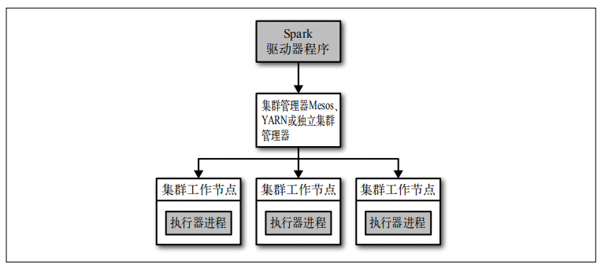
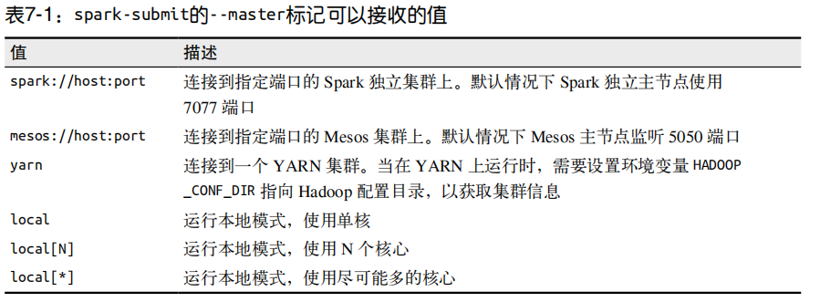
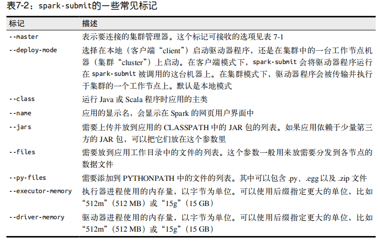

# 在集群上运行Spark

## Spark运行时架构

  - 在分布式环境下，Spark集群采用的是主/从结构。在一个Spark集群中，有一个节点负责中央协调，调度各个分布式工作节点。这个中央协调节点被称为驱动器（Driver）节点，与之对应的工作节点被称为执行器（executor）节点。驱动器节点和所有的执行器节点一起被
称为一个 Spark应用（application）。
  - 分布式Spark应用中的组件：
    
    
    
### 驱动器节点

  - Spark驱动器是执行你的程序中的main()方法的进程。它执行用户编写的用来创建SparkContext、创建RDD，以及进行RDD的转化操作和行动操作的代码。驱动器程序一旦终止，Spark应用也就结束了。
  - 驱动器程序的两个职责：
    - 把用户程序转为任务：
      - Spark驱动器程序负责把用户程序转为多个物理执行的单元，这些单元也被称为任务task）。
      - Spark程序都遵循同样的结构：程序从输入数据创建一系列RDD，再使用转化操作派生出新的RDD，最后使用行动操作收集或存储结果RDD中的数据。
      - Spark程序其实是隐式地创建出了一个由操作组成的逻辑上的有向无环图（Directed Acyclic Graph，简称 DAG）。当驱动器程序运行时，它会把这个逻辑图转为物理执行计划。
      - 这样Spark就把逻辑计划转为一系列步骤（stage）。而每个步骤又由多个任务组成。这些任务会被打包并送到集群中。任务是Spark中最小的工作单元，用户程序通常要启动成百上千的独立任务。
    - 为执行器节点调度任务：
      - 有了物理执行计划之后，Spark 驱动器程序必须在各执行器进程间协调任务的调度。
      - 执行器进程启动后，会向驱动器进程注册自己。因此，驱动器进程始终对应用中所有的执行器节点有完整的记录。每个执行器节点代表一个能够处理任务和存储RDD数据的进程。
      - Spark驱动器程序会根据当前的执行器节点集合，尝试把所有任务基于数据所在位置分配给合适的执行器进程。当任务执行时，执行器进程会把缓存数据存储起来，而驱动器
进程同样会跟踪这些缓存数据的位置，并且利用这些位置信息来调度以后的任务，以尽量减少数据的网络传输。
  
### 执行器节点

  - Spark执行器节点是一种工作进程，负责在Spark作业中运行任务，任务间相互独立。
  - Spark应用启动时，执行器节点就被同时启动，并且始终伴随着整个Spark应用的生命周期而存在。
  - 执行器进程有两大作用：
    - 负责运行组成 Spark 应用的任务，并将结果返回给驱动器进程。
    - 通过自身的块管理器（Block Manager）为用户程序中要求缓存的RDD提供内存式存储。
  - 在本地模式下，Spark驱动器程序和各执行器程序在同一个 Java 进程中运行。
  
### 集群管理器

  - 集群管理器是 Spark 中的可插拔式组件。除了Spark自带的独立集群管理器，Spark也可以运行在其他外部集群管理器上，比如YARN和Mesos。
  - Spark 文档中始终使用驱动器节点和执行器节点的概念来描述执行Spark应用的进程。
  - 而主节点（master）和工作节点（worker）的概念则被用来分别表述集群管理器中的中心化的部分和分布式的部分。

### 启动一个程序

  - 不论是哪一种集群管理器，都可以使用 Spark 提供的统一脚本spark-submit将你的应用提交到那种集群管理器上。
  - 通过不同的配置选项，spark-submit 可以连接到相应的集群管理器上，并控制应用所使用的资源数量。
  
### 小结

  - 用户通过 spark-submit 脚本提交应用。
  - spark-submit 脚本启动驱动器程序，调用用户定义的 main() 方法。
  - 驱动器程序与集群管理器通信，申请资源以启动执行器节点。
  - 集群管理器为驱动器程序启动执行器节点。
  - 驱动器进程执行用户应用中的操作。根据程序中所定义的对 RDD 的转化操作和行动操作，驱动器节点把工作以任务的形式发送到执行器进程。
  - 任务在执行器程序中进行计算并保存结果。
  - 如果驱动器程序的 main() 方法退出，或者调用了 SparkContext.stop()，驱动器程序会终止执行器进程，并且通过集群管理器释放资源。
  
## 使用spark-submit部署应用

  - spark-submit用--master标记指定要连接的集群URL。
    
    
    
  - spark-submit的一些常见标记：
    
    
    
## 打包代码与依赖

  - 依赖冲突：
    - 通常，依赖冲突表现为 Spark 作业执行过程中抛出 NoSuchMethodError、ClassNotFoundException，或其他与类加载相关的 JVM 异常。
    - 主要有两种解决方式：
      - 一是修改你的应用，使其使用的依赖库的版本与 Spark 所使用的相同。
      - 二是使用通常被称为“shading”的方式打包你的应用。shading可以让你以另一个命名空间保留冲突的包，并自动重写应用的代码使它们使用重命名后的版本。
      
## Spark应用内与应用间调度

  - 在调度多用户集群时，Spark主要依赖集群管理器来在Spark应用间共享资源。
  - 许多集群管理器支持队列，可以为队列定义不同优先级或容量限制，这样 Spark 就可以把作业提交到相应的队列中。
  - Spark提供了一种用来配置应用内调度策略的机制。Spark内部的公平调度器（Fair Scheduler）会让长期运行的应用定义调度任务的优先级队列。
  
## 集群管理器

  - 独立集群管理器：
    - 这种集群管理器由一个主节点和几个工作节点组成，各自都分配有一定量的内存和CPU核心。
    - 当提交应用时，你可以配置执行器进程使用的内存量，以及所有执行器进程使用的CPU核心总数。
    - 启动独立集群管理器：
      - 要启动独立集群管理器，你既可以通过手动启动一个主节点和多个工作节点来实现，也可以使用Spark的sbin目录中的启动脚本来实现。
    - 提交应用：
      - 要向独立集群管理器提交应用，需要把集群的URL作为主节点参数传给spark-submit。
      - 提交时使用的主机名和端口号必须精确匹配用户界面中的URL。
      - 例子：
        ```
        spark-submit --master spark://masternode:port appName
        ```
    - 独立集群管理器支持两种部署模式：
      - 在客户端模式中（默认情况），驱动器程序会运行在你执行spark-submit的机器上，是spark-submit命令的一部分。
      - 在集群模式下，驱动器程序会作为某个工作节点上一个独立的进程运行在独立集群管理器内部。它也会连接主节点来申请执行器节点。
    - 配置资源用量：
      - 在独立集群管理器中，资源分配靠下面两个设置来控制：
        - 执行器进程内存：通过spark-submit的--executor-memory参数来配置此项。此设置项的默认值是1GB。
        - 占用核心总数的最大值：一个应用中所有执行器进程所占用的核心总数。此项的默认值是无限。可以通过spark-submit的 --total-executorcores 参数
设置这个值，或者在你的 Spark 配置文件中设置spark.cores.max 的值。
  - Hadoop YARN：
    - 在Spark里使用YARN很简单：只需要设置指向Hadoop配置目录(HADOOP_CONF_DIR)的环境变量，然后使用spark-submit向一个特殊的主节点URL提交作业即可。
    - 两种模式：
      - 在客户端模式下应用的驱动器程序运行在提交应用的机器上。
      - 在集群模式下，驱动器程序也运行在一个 YARN 容器内部。你可以通过spark-submit的--deploy-mode 参数设置不同的模式。
    - 配置资源用量：
      - --num-executors：设置固定数量的执行器节点。默认情况下，这个值仅为2。
      - --executor-memory：设置每个执行器的内存用量。
      - --executor-cores：设置每个执行器进程从 YARN 中占用的核心数目。
   
