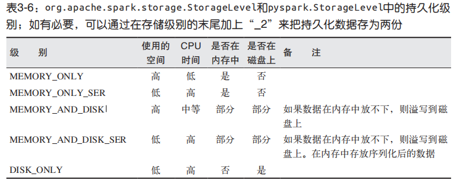

# RDD编程

  - RDD其实就是分布式的元素集合。
  - 在 Spark 中，对数据的所有操作不外乎创建RDD、转化已有 RDD 以及调用 RDD 操作进行求值。
  - Spark 会自动将RDD中的数据分发到集群上，并将操作并行化执行。
  
## RDD基础

  - RDD就是一个不可变的分布式对象集合。
  - 每个 RDD 都被分为多个分区，这些分区运行在集群中的不同节点上。
  - RDD可以包含Python、Java、Scala中任意类型的对象，甚至可以包含用户自定义的对象。
  - RDD支持的操作：
    - 转化操作（transformation）
    - 行动操作（action）
    - Spark对RDD的操作是惰性计算，只有第一次在一个行动操作中用到时，才会真正计算。
    - 如果想在多个行动操作中重用同一个RDD，可以使用RDD.persist()让Spark把这个RDD缓存下来。
  - Spark程序的工作方式：
    - 从外部数据创建出输入RDD。
    - 对 RDD 进行转化，以定义新的 RDD。
    - 对需要被重用的中间结果 RDD 执行 persist() 操作。
    - 使用行动操作来触发一次并行计算，Spark会对计算进行优化后再执行。
  
## 创建RDD

 - 创建RDD的两种方法：
    - 读取一个外部数据集。
      - Python 中的 textFile() 方法：lines = sc.textFile("path")
      - Scala 中的 textFile() 方法：val lines = sc.textFile("path")
      - Java 中的 textFile() 方法：JavaRDD<String> lines = sc.textFile("path");
    - 在驱动器程序里对一个集合进行并行化。
      - Python 中的 parallelize() 方法：lines = sc.parallelize(["aa", "bb"])
      - Scala 中的 parallelize() 方法：val lines = sc.parallelize(List("aa", "bb"))
      - Java 中的 parallelize() 方法：JavaRDD<String> lines = sc.parallelize(Arrays.asList("aa", "bb"));
  
## RDD操作

  - RDD 支持两种操作:
    - 转化操作：返回一个新的 RDD 的操作，比如 map() 和 filter()。
    - 行动操作：向驱动器程序返回结果或把结果写入外部系统的操作，会触发实际的计算，比如 count() 和 first()。
    
### 转化操作

  - RDD 的转化操作是返回新 RDD 的操作。
  - 转化出来的RDD是惰性求值的，只有在行动操作中用到这些RDD时才会被计算。
  - 转化操作可以操作任意数量的输入RDD。
  - Spark会使用谱系图（lineage graph）来记录这些不同 RDD 之间的依赖关系。Spark需要用这些信息来按需计算每个RDD，也可以依靠谱系图在持久化的 RDD 丢失部分数据时恢复所丢失的数据。
  
### 行动操作

  - 行动操作是第二种类型的 RDD 操作，它们会把最终求得的结果返回到驱动器程序，或者写入外部存储系统中。由于行动操作需要生成实际的输出，它们会强制执行那些求值必须用到的 RDD 的转化操作。
  - 用 count() 来返回计数结果，用 take() 来收集RDD中的一些元素，collect() 函数，可以用来获取整个 RDD 中的数据。
  - 可以使用 saveAsTextFile()、saveAsSequenceFile()，或者任意的其他行动操作来把 RDD 的数据内容以各种自带的格式保存起来。
  - 每当我们调用一个新的行动操作时，整个 RDD 都会从头开始计算。要避免这种低效的行为，用户可以将中间结果持久化。
  
### 惰性求值

  - RDD 的转化操作都是惰性求值的。这意味着在被调用行动操作之前 Spark 不会开始计算。
  - 虽然转化操作是惰性求值的，但还是可以随时通过运行一个行动操作来强制Spark 执行 RDD 的转化操作，比如使用 count()。这是一种对你所写的程序进行部分测试的简单方法。

## 向Spark传递函数

  - Python：有三种方式来把函数传递给Spark。
    - 传递比较短的函数时，可以使用lambda表达式来传递。
    - 传递顶层函数。
    - 定义的局部函数。
  - Scala：
    - 定义的内联函数。
    - 方法的引用。
    - 静态方法。
  - Java：
    - 在 Java 中，函数需要作为实现了 Spark 的 org.apache.spark.api.java.function 包中的任一函数接口的对象来传递。
    - lambda表达式来简洁地实现函数接口。
    
## 　常见的转化操作和行动操作

  - 基本RDD：
    - 针对各个元素的转化操作：
      - map()：接收一个函数，把这个函数用于 RDD 中的每个元素，将函数的返回结果作为结果RDD中对应元素的值。map() 的返回值类型不需要和输入类型一样。
      - flatMap()：返回的不是一个元素，而是一个返回值序列的迭代器。得到的是一个包含各个迭代器可访问的所有元素的RDD。
      - filter()：接收一个函数，并将 RDD 中满足该函数的元素放入新的 RDD 中返回。
    - 伪集合操作：
      - distinct()：生成一个只包含不同元素的新RDD。distinct() 操作的开销很大，因为它需要将所有数据通过网络进行混洗（shuffle），以确保每个元素都只有一份。
      - union()：返回一个包含两个 RDD 中所有元素的 RDD。会包含这些重复数据。
      - intersection()：只返回两个 RDD 中都有的元素。会去掉所有重复的元素（单个 RDD 内的重复元素也会一起移除）。
      - subtract()：接收另一个 RDD 作为参数，返回一个由只存在于第一个 RDD 中而不存在于第二个 RDD 中的所有元素组成的 RDD。和intersection() 一样，它也需要数据混洗。
      - cartesian()：返回所有可能的 (a, b) 对，其中 a 是源 RDD 中的元素，而 b 则来自另一个 RDD。求大规模 RDD 的笛卡儿积开销巨大。
    - 行动操作：
      - reduce()：接收一个函数作为参数，这个函数要操作两个 RDD 的元素类型的数据并返回一个同样类型的新元素。使用 reduce()，可以很方便地计算出 RDD
中所有元素的总和、元素的个数，以及其他类型的聚合操作。
        ```
        val sum = rdd.reduce((x, y) => x + y)
        ```
      - fold()：接收一个与 reduce() 接收的函数签名相同的函数，再加上一个“初始值”来作为每个分区第一次调用时的结果。对这个初始值进行多次计算不会改变结果（例如 +
对应的 0，* 对应的 1，或拼接操作对应的空列表）。fold() 和 reduce() 都要求函数的返回值类型需要和我们所操作的 RDD 中的元素类型相同。
      - aggregate()：需要提供我们期待返回的类型的初始值。然后通过一个函数把 RDD 中的元素合并起来放入累加器。考虑到每个节点是在本地进行累加的，最终，还需要提供第二个函数来将累加器两两合并。
        ```
        val result = input.aggregate((0, 0))(
          (acc, value) => (acc._1 + value, acc._2 + 1),
          (acc1, acc2) => (acc1._1 + acc2._1, acc1._2 + acc2._2)
        )
        val avg = result._1 / result._2.toDouble
        ```
      - collect()：将整个 RDD 的内容返回。要求所有数据都必须能一同放入单台机器的内存中。
      - take(n)：返回 RDD 中的 n 个元素，并且尝试只访问尽量少的分区，因此该操作会得到一个不均衡的集合。
      - top()：从 RDD 中获取前几个元素。top() 会使用数据的默认顺序，但我们也可以提供自己的比较函数，来提取前几个元素。
      - takeSample(withReplacement, num, seed)：从数据中获取一个采样，并指定是否替换。
      - foreach：()：对 RDD 中的每个元素进行操作，而不需要把 RDD 发回本地。
      - count()：返回元素的个数。
      - countByValue()：返回一个从各值到值对应的计数的映射表。
      
## 持久化(缓存)

  - 当我们让Spark持久化存储一个RDD时，计算出RDD的节点会分别保存它们所求出的分区数据。如果一个有持久化数据的节点发生故障，Spark会在需要用到缓存的数据时重算丢失的数据分区。
  - 存储级别：
  
    
    
  - 注意：
    - 我们在第一次对这个 RDD 调用行动操作前就调用了 persist() 方法。persist()调用本身不会触发强制求值。
    - 如果要缓存的数据太多，内存中放不下，Spark 会自动利用最近最少使用（LRU）的缓存策略把最老的分区从内存中移除。 
    - 对于仅把数据存放在内存中的缓存级别，下一次要用到已经被移除的分区时，这些分区就需要重新计算。但是对于使用内存与磁盘的缓存级别的分区来说，被移除的分区都会写入磁盘。
    - RDD 还有一个方法叫作 unpersist()，调用该方法可以手动把持久化的 RDD 从缓存中移除。
    
    
  
