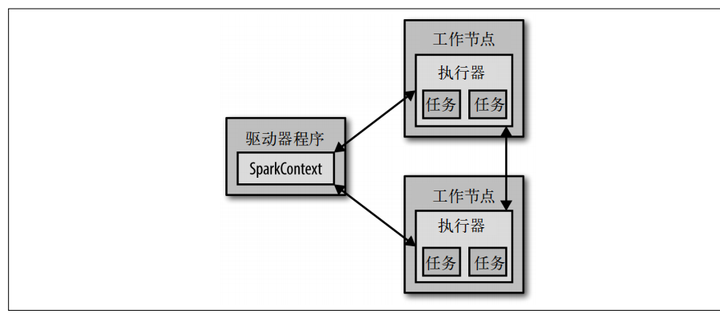
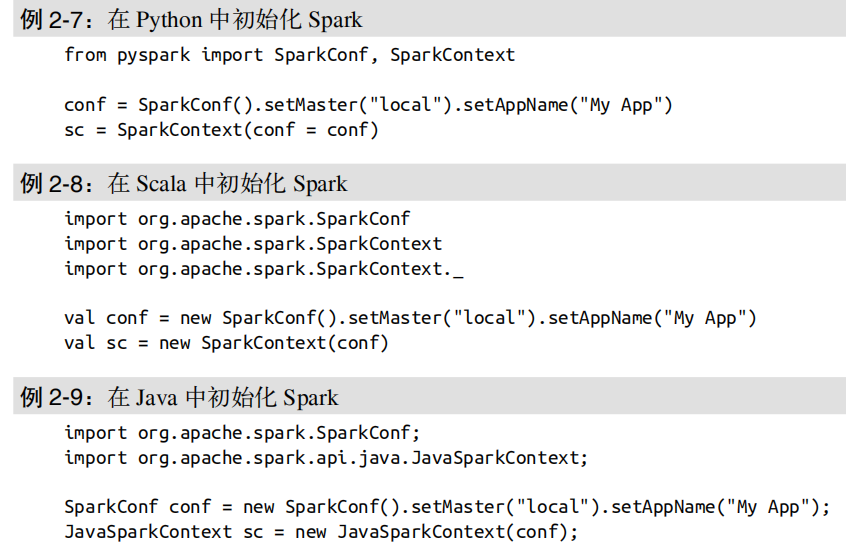

# Spark下载与入门

## Spark核心概念简介

  - Driver：
    - 每个Spark应用都由一个驱动器程序（driver program）来发起集群上的各种并行操作。
    - 驱动器程序包含应用的main函数，并且定义了集群上的分布式数据集，还对这些分布式数据集应用了相关操作。
    - 驱动器程序通过一个SparkContext对象来访问Spark。这个对象代表对计算集群的一个连接。
  - Executor：
    - 驱动器程序一般要管理多个执行器（executor）节点。Executor去执行具体的任务。
  - Spark工作的组件：
  
    
    
## 独立应用

  - 除了交互式运行之外，Spark也可以在 Java、Scala 或 Python的独立程序中被连接使用。
  - 在 Java 和 Scala 中，只需要给你的应用添加一个对于spark-core工件的Maven依赖。
  - 在 Python 中，你可以把应用写成 Python 脚本，但是需要使用 Spark 自带的bin/spark-submit脚本来运行。
  
### 初始化SparkContext
  
  - 初始化SparkContext：通过先创建一个 SparkConf 对象来配置你的应用，然后基于这个SparkConf创建一个 SparkContext 对象。
    
    
  
  - 创建SparkContext的最基本的方法：
    - 集群 URL：告诉Spark如何连接到集群上。在这几个例子中我们使用的是local，这个特殊值可以让Spark运行在单机单线程上而无需连接到集群。
    - 应用名：在例子中我们使用的是 My App。当连接到一个集群时，这个值可以帮助你在集群管理器的用户界面中找到你的应用。
  - 关闭Spark可以调用 SparkContext 的 stop() 方法，或者直接退出应用（比如通过System.exit(0) 或者 sys.exit()）。
