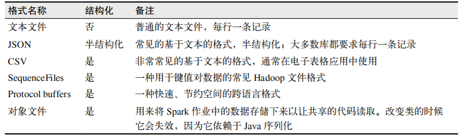
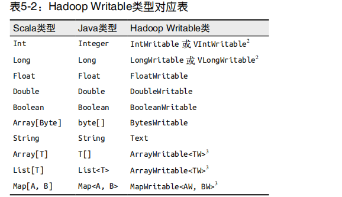
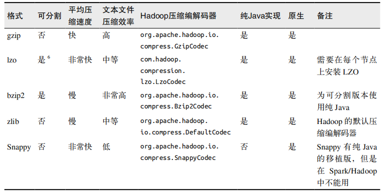

# 数据读取与保存

## 动机

  - 三类常见的数据源：
    - 文件格式与文件系统：
      - Spark 可以访问很多种不同的文件格式，包括文本文件、JSON、SequenceFile，以及protocol buffer。
    - Spark SQL中的结构化数据源
    - 数据库与键值存储：
      - Spark 自带的库和一些第三方库，它们可以用来连接 Cassandra、HBase、Elasticsearch 以及 JDBC 源。
  
## 文件格式

  - Spark支持的一些常见格式：
  
    
    
  - 文本文件：
    - 将一个文本文件读取为RDD时，输入的每一行都会成为RDD的一个元素。也可以将多个完整的文本文件一次性读取为一个pair RDD，其中键是文件名，值是文件内容。
    - 读取文本文件：
      - textFile()：读取一个文本文件。
      - wholeTextFiles()：处理多个输入文件，该方法会返回一个 pair RDD，其中键是输入文件的文件名。
    - 保存文本文件：
      - saveAsTextFile()：接收一个路径，并将RDD 中的内容都输入到路径对应的文件中。Spark 将传入的路径作为目录对待，会在那个目录下输出多个文件。
  - JSON：
    - 读取JSON：
      - 将数据作为文本文件读取，然后对 JSON 数据进行解析。这种方法假设文件中的每一行都是一条 JSON 记录。如果你有跨行的JSON 数据，你就只能读入整个文件，然后对每个文件进行解析。
    - 保存JSON：
      - 将由结构化数据组成的RDD转为字符串RDD，然后使用 Spark 的文本文件 API 写出去。
      - 例子：在 Scala 中保存为 JSON
        ```
        result.filter(p => P.lovesPandas).map(mapper.writeValueAsString(_)).saveAsTextFile(outputFile)
        ```
  - 逗号分隔值与制表符分隔值：
    - 逗号分隔值（CSV）文件每行都有固定数目的字段，字段间用逗号隔开（在制表符分隔值文件，即 TSV 文件中用制表符隔开）。
    - 读取CSV：
      - 对于Python我们会使用自带的csv库，在Scala和Java中则使用opencsv库。
      - 如果CSV的所有数据字段均没有包含换行符，你也可以使用 textFile() 读取并解析数据。如果在字段中嵌有换行符，就需要完整读入每个文件，然后解析各段。
    - 保存CSV：
      - 使用的CSV库要输出到文件或者输出器，可以使用StringWriter或StringIO来将结果放到RDD中。
  - SequenceFile：
    - SequenceFile是由没有相对关系结构的键值对文件组成的常用 Hadoop 格式。
    - SequenceFile文件有同步标记，Spark可以用它来定位到文件中的某个点，然后再与记录的边界对齐。
    - 读取SequenceFile：
      - 在SparkContext中，可以调用sequenceFile(path, keyClass, valueClass, minPartitions)。
      - SequenceFile使用Writable类，因此keyClass和valueClass参数都必须使用正确的Writable类。
      - Hadoop Writable类型
        
        
        
      - 例子：
        ```
        val data = sc.sequenceFile(inFile, classOf[Text], classOf[IntWritable]).map{case(x, y) => (x.toString, y.get())}
        ```
    - 保存SequenceFile：
      - 如果你要写出的是 Scala 的原生类型，可以直接调用 saveSequenceFile(path) 保存你的 PairRDD，它会帮你写出数据。
      - 如果键和值不能自动转为 Writable 类型，或者想使用变长类型（比如VIntWritable），就可以对数据进行映射操作，在保存之前进行类型转换。
  - 对象文件：
    - 对象文件看起来就像是对 SequenceFile 的简单封装，它允许存储只包含值的 RDD。和SequenceFile 不一样的是，对象文件是使用 Java 序列化写出的。
    - 要保存对象文件，只需在 RDD 上调用 saveAsObjectFile 就行了。
    - 读回对象文件用 SparkContext 中的 objectFile() 函数接收一个路径，返回对应的 RDD。
    - 使用对象文件的主要原因是它们可以用来保存几乎任意对象而不需要额外的工作。
    - 对象文件在 Python 中无法使用，不过 Python 中的 RDD 和 SparkContext 支持 saveAsPickleFile()和 pickleFile() 方法作为替代。
  - 　文件压缩：
    - 压缩选项只适用于支持压缩的 Hadoop 格式，也就是那些写出到文件系统的格式。写入数据库的 Hadoop 格式一般没有实现压缩支持。
    - 压缩选项：
    
      
      
## 文件系统

  - 本地/“常规”文件系统：
    - Spark 支持从本地文件系统中读取文件，不过它要求文件在集群中所有节点的相同路径下都可以找到。
  - Amazon S3
  - HDFS：
    - HDFS 被设计为可以在廉价的硬件上工作，有弹性地应对节点失败，同时提供高吞吐量。
    - Spark 和 HDFS 可以部署在同一批机器上，这样 Spark 可以利用数据分布来尽量避免一些网络开销。
    - 在 Spark 中使用 HDFS 只需要将输入输出路径指定为 hdfs://master:port/path 就够了。
    
## Spark SQL中的结构化数据

  - 结构化数据指的是有结构信息的数据——也就是所有的数据记录都具有一致字段结构的集合。
  - Spark SQL支持多种结构化数据源作为输入，而且由于 Spark SQL 知道数据的结构信息，它还可以从这些数据源中只读出所需字段。
  - 把一条SQL查询给Spark SQL，让它对一个数据源执行查询（选出一些字段或者对字段使用一些函数），然后得到由Row对象组成的RDD，每个Row对象表示一条记录。
  - 在Java和Scala中，Row对象的访问是基于下标的。每个Row都有一个get() 方法，会返回一个一般类型让我们可以进行类型转换。另外还有针对常见基本类型的专用 get()方法（例如 getFloat()、getInt()、getLong()、getString()、getShort()、getBoolean()等）。
  - 在Python 中，可以使用row[column_number] 以及 row.column_name 来访问元素。
  
### Apache Hive

  - Hive可以在HDFS内或者在其他存储系统上存储多种格式的表。Spark SQL可以读取Hive支持的任何表。
  - 要把Spark SQL连接到已有的Hive上，你需要提供Hive的配置文件。你需要将 hive-site.xml文件复制到Spark的 ./conf/目录下。再创建出HiveContext对象，也就是 Spark SQL 的入口，然后你就可以使用 Hive 查询语言（HQL）来对你的表进行查询，并以由行组成的 RDD 的形式拿到返回数据。
