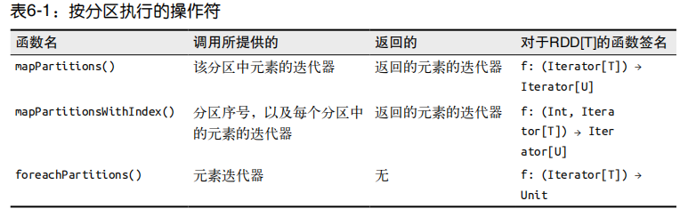
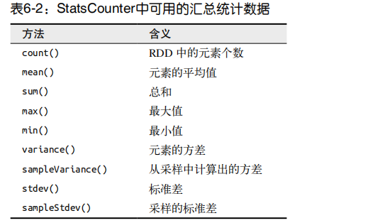

# Spark编程进阶

  - 两种类型的共享变量：累加器（accumulator）与广播变量（broadcast variable）。
  - 累加器用来对信息进行聚合，而广播变量用来高效分发较大的对象。
  
## 累加器

  - 累加器提供了将工作节点中的值聚合到驱动器程序中的简单语法。
  - 累加器的一个常见用途是在调试时对作业执行过程中的事件进行计数。
  - 例子：
    ```
    # 创建Accumulator[Int]并初始化为0
    val blankLines = sc.accumulator(0)
    ```
  - 累加器的用法：
    - 通过在驱动器中调用 SparkContext.accumulator(initialValue) 方法，创建出存有初始值的累加器。返回值为 org.apache.spark.Accumulator[T] 对象，其中 T 是初始值
initialValue 的类型。
    - Spark 闭包里的执行器代码可以使用累加器的 += 方法（在 Java 中是 add）增加累加器的值。
    - 驱动器程序可以调用累加器的 value 属性（在 Java 中使用 value() 或 setValue()）来访问累加器的值。
  - 注意细节：
    - 工作节点上的任务不能访问累加器的值。从这些任务的角度来看，累加器是一个只写变量。
  - 累加器与容错性：
    - Spark会自动重新执行失败的或较慢的任务来应对有错误的或者比较慢的机器。
    - 对于要在行动操作中使用的累加器，Spark只会把每个任务对各累加器的修改应用一次。因此，如果想要一个无论在失败还是重复计算时都绝对可靠的累加器，我们必须把它放在 foreach() 这样的行动操作中。
    - 对于在 RDD 转化操作中使用的累加器，就不能保证有这种情况了。转化操作中累加器可能会发生不止一次更新。在转化操作中，累加器通常只用于调试目的。
    
## 广播变量

  - Spark的第二种共享变量类型是广播变量，它可以让程序高效地向所有工作节点发送一个较大的只读值，以供一个或多个Spark操作使用。
  - 广播变量其实就是类型为spark.broadcast.Broadcast[T] 的一个对象，其中存放着类型为 T 的值。可以在任务中通过对Broadcast对象调用value来获取该对象的值。这个值只会被发送到各节点一次，使用的是一种高效的类似BitTorrent的通信机制。
  - 广播变量的用法：
    - 通过对一个类型 T 的对象调用 SparkContext.broadcast 创建出一个 Broadcast[T] 对象。任何可序列化的类型都可以这么实现。
    - 通过 value 属性访问该对象的值（在 Java 中为 value() 方法）。
    - 变量只会被发到各个节点一次，应作为只读值处理（修改这个值不会影响到别的节点）。
  - 广播的优化：
    - Spark的Scala和Java API中默认使用的序列化库为Java序列化库，因此它对于除基本类型的数组以外的任何对象都比较低效。
    - 可以使用 spark.serializer 属性选择另一个序列化库来优化序列化过程，也可以为你的数据类型实现自己的序列化方式。
    
## 基于分区进行操作

  - 基于分区对数据进行操作可以让我们避免为每个数据元素进行重复的配置工作。诸如打开数据库连接或创建随机数生成器等操作，都是我们应当尽量避免为每个元素都配置一次的工作。
  - 按分区执行的操作符：
  
    
    
## 与外部程序间的管道

  - Spark在RDD上提供pipe()方法。Spark的pipe()方法可以让我们使用任意一种语言实现Spark作业中的部分逻辑，只要它能读写Unix标准流就行。
  - 通过pipe()，你可以将RDD中的各元素从标准输入流中以字符串形式读出，并对这些元素执行任何你需要的操作，然后把结果以字符串的形式写入标准输出。
  
## 数值RDD的操作

  - Spark的数值操作是通过流式算法实现的，允许以每次一个元素的方式构建出模型。这些统计数据都会在调用stats()时通过一次遍历数据计算出来，并以 StatsCounter对象返回。
  - StatsCounter中可用的汇总统计数据：
    
    
    
  
