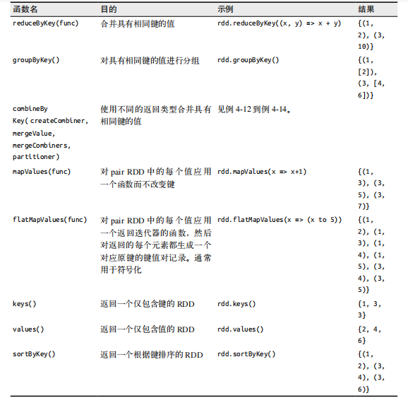
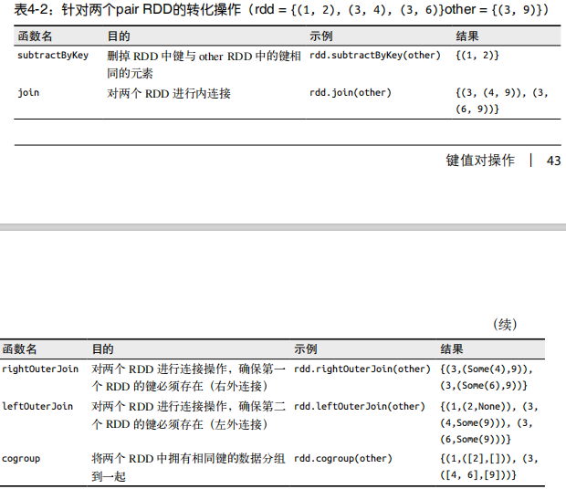
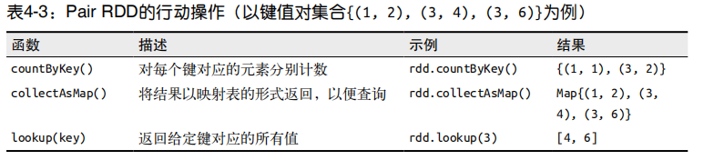

# 键值对操作

  - 键值对 RDD 通常用来进行聚合计算。
  - 一般要先通过一些初始ETL（抽取、转化、装载）操作来将数据转化为键值对形式。
  
## 动机

  - 包含键值对类型的RDD称为Pair RDD。它们提供了并行操作各个键或跨节点重新进行数据分组的操作接口。
    - reduceByKey()：分别归约每个键对应的数据。
    - join()：把两个 RDD 中键相同的元素组合到一起，合并为一个RDD。
  
## 创建Pair RDD

  - 很多存储键值对的数据格式会在读取时直接返回由其键值对数据组成的Pair RDD。
  - 当需要把一个普通的 RDD 转 为 pair RDD 时，可以调用 map() 函数来实现，传递的函数需要返回键值对。
    ```
    val pairs = lines.map(x => (x.split(" ")(0), x))
    ```
  - Spark的Java API让用户使用scala.Tuple2类来创建二元组。通过 new Tuple2(elem1, elem2) 来创建一个新的二元组，并且可以通过 ._1() 和 ._2() 方法访问其中的元素。
  
## Pair RDD的转化操作

  - Pair RDD 可以使用所有标准RDD上的可用的转化操作。由于pair RDD中包含二元组，所以需要传递的函数应当操作二元组而不是独立的元素。
  - Pair RDD的转化操作:
    
    
    
    
    
### 聚合操作

  - reduceByKey()：
    - 与 reduce() 相当类似；它们都接收一个函数，并使用该函数对值进行合并。
    - reduceByKey() 会为数据集中的每个键进行并行的归约操作，每个归约操作会将键相同的值合并起来。
    - 例子：在 Scala 中使用 reduceByKey() 和 mapValues() 计算每个键对应的平均值。
      ```
      rdd.mapValues(x => (x, 1)).reduceByKey((x, y) => (x._1 + y._1, x._2 + y._2))
      ```
    - 例子：用 Scala 实现单词计数
      ```
      val input = sc.textFile("path")
      val words = input.flatMap(x => x.split(" "))
      val result = words.map(x => (x, 1)).reduceByKey((x, y) => x + y)
      ```
  - foldByKey()：
    - 与 fold() 相当类似；它们都使用一个与 RDD 和合并函数中的数据类型相同的零值作为初始值。
  - 调用reduceByKey()和foldByKey()会在为每个键计算全局的总结果之前先自动在每台机器上进行本地合并。用户不需要指定合并器。更泛化的combineByKey() 接口可以让你自定义合并的行为。
  - combineByKey()：
    - 如果这是一个新的元素，combineByKey()会使用一个叫作 createCombiner() 的函数来创建那个键对应的累加器的初始值。
    - 如果这是一个在处理当前分区之前已经遇到的键，它会使用 mergeValue() 方法将该键的累加器对应的当前值与这个新的值进行合并。
    - 由于每个分区都是独立处理的，因此对于同一个键可以有多个累加器。如果有两个或者更多的分区都有对应同一个键的累加器，就需要使用用户提供的 mergeCombiners() 方法将各个分区的结果进行合并。
    
### 并行度调优
  
  - 每个 RDD 都有固定数目的分区，分区数决定了在RDD上执行操作时的并行度。
  - repartition()：把数据通过网络进行混洗，并创建出新的分区集合。
  - coalesce()：根据传入的参数来判断是否发生shuffle。
  - 可以使用 Java 或 Scala 中的 rdd.partitions.size() 以及 Python 中的 rdd.getNumPartitions 查看 RDD 的分区数，并确保调用coalesce()时将RDD合并到比现在的分区数更少的分区中。
  
### 数据分组

  - groupByKey()：使用 RDD 中的键来对数据进行分组。对于一个由类型 K 的键和类型 V 的值组成的 RDD，所得到的结果 RDD 类型会是[K, Iterable[V]]。
  - groupBy()：可以用于未成对的数据上，也可以根据除键相同以外的条件进行分组。可以接收一个函数，对源 RDD 中的每个元素使用该函数，将返回结果作为键再进行分组。
  - cogroup()：对多个共享同一个键的 RDD 进行分组。对两个键的类型均为 K 而值的类型分别为 V 和 W 的 RDD 进行cogroup() 时，得到的结果 RDD 类型为 [(K, (Iterable[V], Iterable[W]))]。如果其中的一个 RDD 对于另一个 RDD 中存在的某个键没有对应的记录，那么对应的迭代器则为空。

### 连接

  - 连接数据可能是 pair RDD 最常用的操作之一。连接方式多种多样：右外连接、左外连接、交叉连接以及内连接。
  - join()：普通的 join 操作符表示内连接。只有在两个 pair RDD 中都存在的键才叫输出。当一个输入对应的某个键有多个值时，生成的 pair RDD 会包括来自两个输入 RDD 的每一组相对应的记录。
  - leftOuterJoin()：源RDD的每一个键都有对应的记录。每个键相应的值是由一个源RDD中的值与一个包含第二个RDD的值的Option（在Java中为Optional）对象组成的二元组。 Python 中，如果一个值不存在，则使用 None 来表示。
  - rightOuterJoin()：预期结果中的键必须出现在第二个RDD中，而二元组中的可缺失的部分则来自于源RDD而非第二个RDD。
  
### 数据排序

  - sortByKey()：接收一个叫作 ascending 的参数，表示我们是否想要让结果按升序排序（默认值为 true）。按完全不同的排序依据进行排序。要支持这种情况，我们可以提供自定义的比较函数。
  
## Pair RDD的行动操作

  - 所有基础RDD支持的传统行动操作也都在pair RDD上可用。
    
    
    
## 数据分区

  - 在分布式程序中，通信的代价是很大的，因此控制数据分布以获得最少的网络传输可以极大地提升整体性能。
  - Spark中所有的键值对RDD都可以进行分区。系统会根据一个针对键的函数对元素进行分组。Spark可以确保同一组的键出现在同一个节点上。
  - 默认情况下，连接操作会将两个数据集中的所有键的哈希值都求出来，将该哈希值相同的记录通过网络传到同一台机器上，然后在那台机器上对所有键相同的记录进行连接操作。
  - partitionBy()：传递一个 spark.HashPartitioner 对象来实现分区操作。partitionBy() 是一个转化操作，因此它的返回值总是一个新的 RDD，但它不会改变
原来的 RDD。RDD 一旦创建就无法修改。因此应该对 partitionBy() 的结果进行持久化。如果没有将 partitionBy() 转化操作的结果持久化，那么后面每次用到这个
RDD 时都会重复地对数据进行分区操作。
  - 获取RDD的分区方式：
    - 在Scala和Java中，你可以使用RDD的partitioner属性（Java中使用partitioner()方法）来获取RDD的分区方式。
  - 从分区中获益的操作：
    - 能够从数据分区中获益的操作有 cogroup()、groupWith()、join()、leftOuterJoin()、rightOuterJoin()、groupByKey()、reduceByKey(), combineByKey() 以及 lookup()。
    - 对于诸如 cogroup() 和join() 这样的二元操作，预先进行数据分区会导致其中至少一个RDD（使用已知分区器的那个 RDD）不发生数据混洗。
  - 影响分区方式的操作:
    - 会为生成的结果 RDD 设好分区方式的操作：cogroup()、groupWith()、join()、lef tOuterJoin()、rightOuterJoin()、groupByKey()、reduceByKey()、
combineByKey()、partitionBy()、sort()、mapValues()（如果父 RDD 有分区方式的话）、flatMapValues()（如果父 RDD 有分区方式的话），以及 filter()（如果父 RDD 有分区方式的话）。其他所有的操作生成的结果都不会存在特定的分区方式。
    - 对于二元操作，输出数据的分区方式取决于父 RDD 的分区方式。默认情况下，结果会采用哈希分区，分区的数量和操作的并行度一样。
  - 自定义分区方式:
    - Spark提供的 HashPartitioner 与 RangePartitioner 已经能够满足大多数用例，但Spark还是允许你通过提供一个自定义的 Partitioner 对象来控制 RDD 的分区方式。
    - 要实现自定义的分区器，你需要继承 org.apache.spark.Partitioner 类并实现下面三个方法：
      - numPartitions: Int：返回创建出来的分区数。
      - getPartition(key: Any): Int：返回给定键的分区编号（0 到 numPartitions-1）。
      - equals()：Java 判断相等性的标准方法。Spark 需要用这个方法来检查你的分区器对象是否和其他分区器实例相同，这样 Spark 才可以判断两个RDD 的分区方式是否相同。
      
