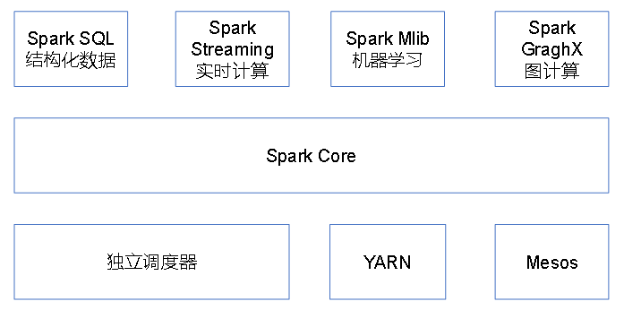
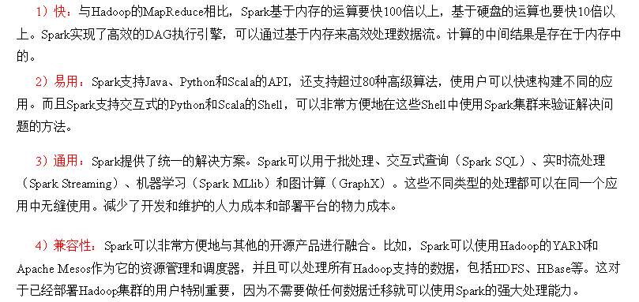
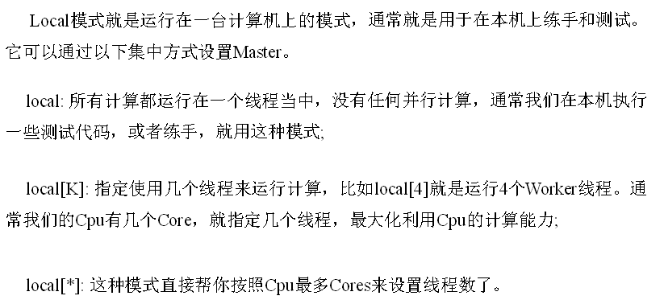
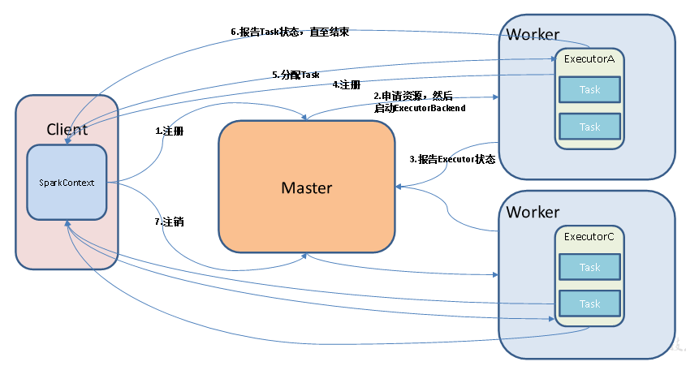
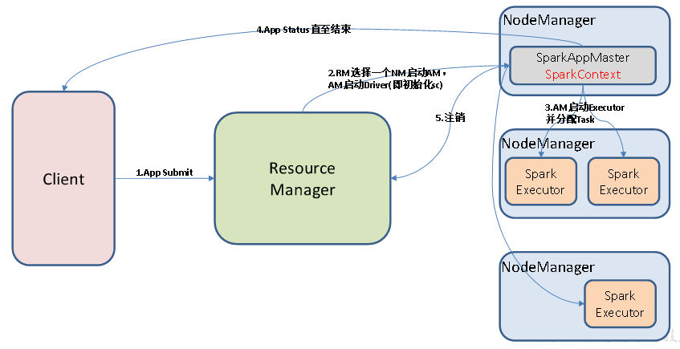
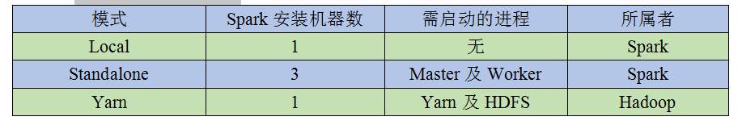

# Spark概述

  - Spark是一种基于内存的快速、通用、可扩展的大数据分析引擎。
  
## Spark内置模块

  - Spark内置模块：
  
  
  
  - Spark Core：
    - 实现了Spark的基本功能，包含任务调度、内存管理、错误恢复、与存储系统交互等模块。
    - 还包含了对弹性分布式数据集(Resilient Distributed DataSet，简称RDD)的API定义。
  - Spark SQL：
    - 用来操作结构化数据的程序包。
    - 通过Spark SQL，我们可以使用SQL或者Apache Hive版本的SQL方言(HQL)来查询数据。
    - Spark SQL支持多种数据源，比如Hive表、Parquet以及JSON等。
  - Spark Streaming：
    - Spark提供的对实时数据进行流式计算的组件。
    - 提供了用来操作数据流的API，并且与Spark Core中的RDD API高度对应。
  - Spark MLlib：
    - 提供常见的机器学习(ML)功能的程序库。
    - 包括分类、回归、聚类、协同过滤等，还提供了模型评估、数据导入等额外的支持功能。
  - 集群管理器：
    - Spark支持在各种集群管理器(Cluster Manager)上运行，包括Hadoop YARN、Apache Mesos，以及Spark自带的一个简易调度器，叫作独立调度器。 
    
## Spark特点

  - Spark特点:
  
  
  
## 重要角色

### Driver（驱动器）

  - Spark的驱动器是执行开发程序中的main方法的进程。
  - 用来创建SparkContext、创建RDD，以及进行RDD的转化操作和行动操作代码的执行。
  - 主要职责：
    - 把用户程序转为作业（JOB）。
    - 跟踪Executor的运行状况。
    - 为Executor节点调度任务。
    - UI展示应用运行状况。
    
### Executor（执行器）

  - Spark Executor是一个工作进程，负责在Spark作业中运行任务，任务间相互独立。
  - Spark应用启动时，Executor节点被同时启动，并且始终伴随着整个Spark应用的生命周期而存在。
  - 如果有Executor节点发生了故障或崩溃，Spark应用也可以继续执行，会将出错节点上的任务调度到其他Executor节点上继续运行。
  - 主要职责：
    - 负责运行组成Spark应用的任务，并将结果返回给驱动器进程。
    - 通过自身的块管理器（Block Manager）为用户程序中要求缓存的RDD提供内存式存储。RDD是直接缓存在Executor进程内的，因此任务可以在运行时充分利用缓存数据加速运算。

## 部署模式

  - Local模式：
  
  
  
  - Standalone模式：
  
  
  
  - Yarn模式
  
  
  
  - 几种模式对比:
  
  

