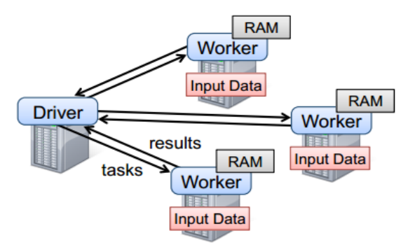

# RDD编程

## 编程模型

  - 在Spark中，RDD被表示为对象，通过对象上的方法调用来对RDD进行转换。
  - 只有遇到action，才会执行RDD的计算(即延迟计算)，这样在运行时可以通过管道的方式传输多个转换。
  - 编程模型：
  
  
  
## RDD的创建

  - 在Spark中创建RDD的创建方式可以分为三种：从集合中创建RDD；从外部存储创建RDD；从其他RDD通过转换创建。
  - 从集合中创建RDD，Spark主要提供了两种函数：parallelize和makeRDD：
    - val rdd1 = sc.parallelize(Array(1,2,3,4,5,6,7,8))
  - 由外部存储系统的数据集创建，包括本地的文件系统，还有所有Hadoop支持的数据集，比如HDFS、Cassandra、HBase等：
    - val rdd2= sc.textFile("hdfs://hadoop102:9000/RELEASE")
  
## RDD的转换

  - RDD整体上分为Value类型和Key-Value类型。
  - 转换操作从已有的RDD派生出新的RDD，并且是惰性求值，只有在行动操作中用到这些RDD时才会被计算。
  
### Value类型

  - map(func):
    - 作用：返回一个新的RDD，该RDD由每一个输入元素经过func函数转换后组成。 
    - 示例：
      - var source  = sc.parallelize(1 to 10)
      - val mapRDD = source.map(_ * 2)
  - mapPartitions(func):
    - 作用：类似于map，但独立地在RDD的每一个分区上运行，因此在类型为T的RDD上运行时，func的函数类型必须是Iterator[T] => Iterator[U]。
    - 假设有N个元素，有M个分区，那么map的函数的将被调用N次,而mapPartitions被调用M次,一个函数一次处理所有分区数据。
    - 示例：
      - val rdd = sc.makeRDD(Array(1, 2, 3, 4))
      - rdd.mapPartitions(x => x.map(_ * 2))
  - mapPartitionsWithIndex(func):
    - 作用：类似于mapPartitions，但func带有一个整数参数表示分片的索引值，因此在类型为T的RDD上运行时，func的函数类型必须是(Int, Interator[T]) => Iterator[U]。
    - 示例：
      - val rdd = sc.parallelize(Array(1,2,3,4))
      - val indexRdd = rdd.mapPartitionsWithIndex((index,items)=>(items.map((index,_))))
  - flatMap(func):
    - 作用：类似于map，返回一个序列的迭代器，而不是单一元素。
  - glom():
    - 作用：将每一个分区形成一个数组，形成新的RDD类型时RDD[Array[T]]。
    - 示例：
      - val rdd = sc.parallelize(1 to 16,4)
      - rdd.glom()
  - groupBy(func):
    - 作用：分组，按照传入函数的返回值进行分组。将相同的key对应的值放入一个迭代器。
    - 示例：
      - val rdd = sc.parallelize(1 to 4)
      - val group = rdd.groupBy(_%2)
  - filter(func):
    - 作用：过滤。返回一个新的RDD，该RDD由经过func函数计算后返回值为true的输入元素组成。
  - sample(withReplacement, fraction, seed):
    - 作用：以指定的随机种子随机抽样出数量为fraction的数据，：withReplacement表示是抽出的数据是否放回，true为有放回的抽样，false为无放回的抽样，seed用于指定随机数生成器种子。
    - 示例：
      - val rdd = sc.parallelize(1 to 10)
      - var sample1 = rdd.sample(true,0.4,2)
      - var sample2 = rdd.sample(false,0.2,3)
  - distinct([numTasks]))：
    - 作用：对源RDD进行去重后返回一个新的RDD。默认情况下，只有8个并行任务来操作，但是可以传入一个可选的numTasks参数改变它。
    - 示例：
      - val rdd = sc.parallelize(List(1,2,1,5,2,9,6,1))
      - val distinctRDD = rdd.distinct()
  - coalesce(numPartitions):
    - 作用：缩减分区数，用于大数据集过滤后，提高小数据集的执行效率。
    - 示例：
      - val rdd = sc.parallelize(1 to 16,4)
      - val coalesceRDD = rdd.coalesce(3)
  - repartition(numPartitions)：
    - 作用：根据分区数，重新通过网络随机洗牌所有数据。
    - 示例：
      - val rdd = sc.parallelize(1 to 16,4)
      - val rerdd = rdd.repartition(2)
  - coalesce和repartition的区别：
    - coalesce重新分区，可以选择是否进行shuffle过程。由参数shuffle: Boolean = false/true决定。
    - repartition实际上是调用的coalesce，默认是进行shuffle的。
  - sortBy(func,[ascending], [numTasks])：
    - 作用；使用func先对数据进行处理，按照处理后的数据比较结果排序，默认为正序。
  - pipe(command, [envVars]):
    - 作用：管道，针对每个分区，都执行一个shell脚本，返回输出的RDD。
    - 注意：脚本需要放在Worker节点可以访问到的位置。
    
### 双Value类型交互

  - union(otherDataset)：
    - 作用：对源RDD和参数RDD求并集后返回一个新的RDD。
  - subtract (otherDataset)：
    - 作用：计算差的一种函数，去除两个RDD中相同的元素，不同的RDD将保留下来。
  - intersection(otherDataset)：
    - 作用：对源RDD和参数RDD求交集后返回一个新的RDD。
  - cartesian(otherDataset)：
    - 作用：笛卡尔积（数据量大时尽量避免使用）
    
### Key-Value类型

  - partitionBy：
    - 作用：对pairRDD进行分区操作，如果原有的partionRDD和现有的partionRDD不一致即会产生shuffle过程。
    - 示例：
      - val rdd = sc.parallelize(Array((1,"aaa"),(2,"bbb"),(3,"ccc"),(4,"ddd")),4)
      - var rdd2 = rdd.partitionBy(new org.apache.spark.HashPartitioner(2))
  - groupByKey：
    - 作用：groupByKey也是对每个key进行操作，但只生成一个sequence。
  - reduceByKey(func, [numTasks])：
    - 作用：在一个(K,V)的RDD上调用，返回一个(K,V)的RDD，使用指定的reduce函数，将相同key的值聚合到一起，reduce任务的个数可以通过第二个可选的参数来设置。
    - 示例：
      - val rdd = sc.parallelize(List(("female",1),("male",5),("female",5),("male",2)))
      - val reduce = rdd.reduceByKey((x,y) => x+y)
  - reduceByKey和groupByKey的区别：
    - reduceByKey：按照key进行聚合，在shuffle之前有combine（预聚合）操作，返回结果是RDD[k,v]。
    - groupByKey：按照key进行分组，直接进行shuffle。
  - aggregateByKey：
    - 参数：(zeroValue:U,[partitioner: Partitioner]) (seqOp: (U, V) => U,combOp: (U, U) => U)
    - 参数描述：
      - zeroValue：给每一个分区中的每一个key一个初始值。
      - seqOp：函数用于在每一个分区中用初始值逐步迭代value（分区内）。
      - combOp：函数用于合并每个分区中的结果（分区间）。
    - 作用：在kv对的RDD中，，按key将value进行分组合并，合并时，将每个value和初始值作为seq函数的参数，进行计算，返回的结果作为一个新的kv对，然后再将结果按照key进行合并，最后将每个分组的value传递给combine函数进行计算（先将前两个value进行计算，将返回结果和下一个value传给combine函数，以此类推），将key与计算结果作为一个新的kv对输出。
  - foldByKey：
    - 参数：(zeroValue: V)(func: (V, V) => V): RDD[(K, V)]
    - 作用：aggregateByKey的简化操作，seqop和combop相同。
  - combineByKey[C]：
    - 参数：(createCombiner: V => C,  mergeValue: (C, V) => C,  mergeCombiners: (C, C) => C) 
    - 参数描述：
      - createCombiner: combineByKey() 会遍历分区中的所有元素，因此每个元素的键要么还没有遇到过，要么就和之前的某个元素的键相同。如果这是一个新的元素,combineByKey()会使用一个叫作createCombiner()的函数来创建那个键对应的累加器的初始值。
      - mergeValue: 如果这是一个在处理当前分区之前已经遇到的键，它会使用mergeValue()方法将该键的累加器对应的当前值与这个新的值进行合并。
      - mergeCombiners: 由于每个分区都是独立处理的， 因此对于同一个键可以有多个累加器。如果有两个或者更多的分区都有对应同一个键的累加器， 就需要使用用户提供的 mergeCombiners() 方法将各个分区的结果进行合并。
    - 作用：对相同K，把V合并成一个集合。
  - sortByKey([ascending], [numTasks])：
    - 作用：在一个(K,V)的RDD上调用，K必须实现Ordered接口，返回一个按照key进行排序的(K,V)的RDD。
  - mapValues：
    - 针对于(K,V)形式的类型只对V进行操作。
  - join(otherDataset, [numTasks])：
    - 作用：在类型为(K,V)和(K,W)的RDD上调用，返回一个相同key对应的所有元素对在一起的(K,(V,W))的RDD。
  - cogroup(otherDataset, [numTasks])：
    - 作用：在类型为(K,V)和(K,W)的RDD上调用，返回一个(K,(Iterable<V>,Iterable<W>))类型的RDD。
  
## RDD的Action操作

  - reduce(func)：
    - 作用：通过func函数聚集RDD中的所有元素，先聚合分区内数据，再聚合分区间数据。
  - collect()：
    - 作用：在驱动程序中，以数组的形式返回数据集的所有元素。
  - count()：
    - 作用：返回RDD中元素的个数。
  - first()：
    - 作用：返回RDD中的第一个元素。
  - take(n)：
    - 作用：返回一个由RDD的前n个元素组成的数组。
  - takeOrdered(n)：
    - 作用：返回该RDD排序后的前n个元素组成的数组。
  - aggregate(zeroValue: U)(seqOp: (U, T) ⇒ U, combOp: (U, U) ⇒ U)：
    - 作用：aggregate函数将每个分区里面的元素通过seqOp和初始值进行聚合，然后用combine函数将每个分区的结果和初始值(zeroValue)进行combine操作。这个函数最终返回的类型不需要和RDD中元素类型一致。
  - fold(num)(func)：
    - 作用：折叠操作，aggregate的简化操作，seqop和combop一样。
  - saveAsTextFile(path)：
    - 作用：将数据集的元素以textfile的形式保存到HDFS文件系统或者其他支持的文件系统，对于每个元素，Spark将会调用toString方法，将它转换为文件中的文本。
  - saveAsSequenceFile(path)：
    - 作用：将数据集中的元素以Hadoop sequencefile的格式保存到指定的目录下，可以是HDFS或者其他Hadoop支持的文件系统。
  - saveAsObjectFile(path)：
    - 作用：用于将RDD中的元素序列化成对象，存储到文件中。
  - countByKey()：
    - 作用：针对(K,V)类型的RDD，返回一个(K,Int)的map，表示每一个key对应的元素个数。
  - foreach(func)：
    - 作用：在数据集的每一个元素上，运行函数func进行更新。
   
## RDD依赖关系

  - Lineage（谱系图）：
    - RDD的Lineage会记录RDD的元数据信息和依赖关系，当该RDD的部分分区数据丢失时，它可以根据这些信息来重新运算和恢复丢失的数据分区。
    - RDD只支持粗粒度转换，即在大量记录上执行的单个操作。
  - RDD和它依赖的父RDD（s）的关系有两种不同的类型，即窄依赖（narrow dependency）和宽依赖（wide dependency）。
    - 窄依赖：
      - 每一个父RDD的Partition最多被子RDD的一个Partition使用，一对一。
    - 宽依赖：
      - 同一个父RDD的Partition会被多个子RDD的Partition依赖，会引起shuffle，一对多。
  - DAG(Directed Acyclic Graph)：
    - 有向无环图。
    - 原始的RDD通过一系列的转换就就形成了DAG，根据RDD之间的依赖关系的不同将DAG划分成不同的Stage。
    - 对于窄依赖，partition的转换处理在Stage中完成计算。
    - 对于宽依赖，由于有Shuffle的存在，只能在parent RDD处理完成后，才能开始接下来的计算，因此宽依赖是划分Stage的依据。
  - 任务划分：
    - RDD任务切分中间分为：Application、Job、Stage和Task。
    - Application：初始化一个SparkContext即生成一个Application。
    - Job：一个Action算子就会生成一个Job。
    - Stage：根据RDD之间的依赖关系的不同将Job划分成不同的Stage，遇到一个宽依赖则划分一个Stage。
    - Task：Stage是一个TaskSet，将Stage划分的结果发送到不同的Executor执行即为一个Task。
    - 注意：Application->Job->Stage->Task每一层都是1对n的关系。
    
## RDD缓存

  - RDD通过persist方法或cache方法可以将前面的计算结果缓存
  - 两者区别是：
    - 默认情况下persist()会把数据以序列化的形式缓存在JVM的堆空间中，但是也可以通过StorageLevel来指定存储级别。
    - cache调用了persist方法，存储级别是仅在内存存储一份。
  - 这两个方法不是被调用时立即缓存，而是触发后面的action时，该RDD将会被缓存在计算节点的内存中，并供后面重用。
  - 支持的存储级别：
    - MEMORY_ONLY
    - MEMORY_ONLY_SER
    - MEMORY_AND_DISK
    - MEMORY_AND_DISK_SER
    - DISK_ONLY
    - 在以上存储级别末尾加_2，可以把数据存2份备份
  
## RDD CheckPoint

  - Spark中对于数据的保存除了持久化操作之外，还提供了一种检查点的机制，检查点（本质是通过将RDD写入磁盘做检查点）是为了通过lineage做容错的辅助。
  - lineage过长会造成容错成本过高，不如在中间阶段做检查点容错，如果之后有节点出现问题而丢失分区，从做检查点的RDD开始重做Lineage，就会减少开销。
  - 为当前RDD设置检查点。该函数将会创建一个二进制的文件，并存储到checkpoint目录中，sc.setCheckpointDir()设置的。
  - 在checkpoint的过程中，该RDD的所有依赖于父RDD中的信息将全部被移除。
  - 对RDD进行checkpoint操作并不会马上被执行，必须执行Action操作才能触发。
    
  
