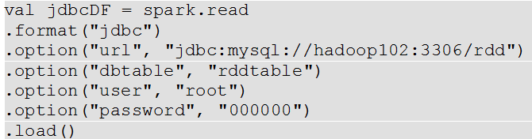
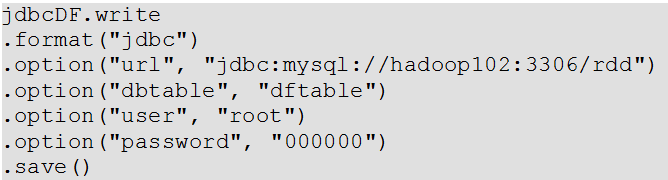

# SparkSQL数据源

## 通用加载/保存方法

  - Spark SQL的DataFrame接口支持多种数据源的操作。一个DataFrame可以进行RDDs方式的操作，也可以被注册为临时表。
  - 把DataFrame注册为临时表之后，就可以对该DataFrame执行SQL查询。
  - Spark SQL的默认数据源为Parquet格式。数据源为Parquet文件时，Spark SQL可以方便的执行所有的操作。修改配置项spark.sql.sources.default，可修改默认数据源格式。
  - 通过SparkSession提供的read.load方法用于通用加载数据，使用write和save保存数据。
    - val peopleDF = spark.read.format("json").load("examples/people.json")
    - peopleDF.write.format("parquet").save("hdfs://localhost:9000/people.parquet")
  - 文件保存选项:
  
  
  
## JDBC

  - Spark SQL可以通过JDBC从关系型数据库中读取数据的方式创建DataFrame，通过对DataFrame一系列的计算后，还可以将数据再写回关系型数据库中。
  - 注意:需要将相关的数据库驱动放到spark的类路径下。
  - JDBC示例：
  
  
  
  
  
## Hive数据库

  - Apache Hive是Hadoop上的SQL引擎，Spark SQL编译时可以包含Hive支持，也可以不包含。
  - 包含Hive支持的Spark SQL可以支持Hive表访问、UDF(用户自定义函数)以及 Hive 查询语言(HiveQL/HQL)等。
  - 若要把Spark SQL连接到一个部署好的Hive上，你必须把hive-site.xml复制到Spark的配置文件目录中($SPARK_HOME/conf)。
  - 如果你的classpath中有配好的hdfs-site.xml，默认的文件系统就是HDFS，否则就是本地文件系统。
  - 如果你使用的是内部的Hive，在Spark2.0之后，spark.sql.warehouse.dir用于指定数据仓库的地址，如果你需要是用HDFS作为路径，那么需要将core-site.xml和hdfs-site.xml 加入到Spark conf目录。
  - 代码中远程连接外部Hive时需要将hive-site.xml添加到classpath下。
  
  
    
