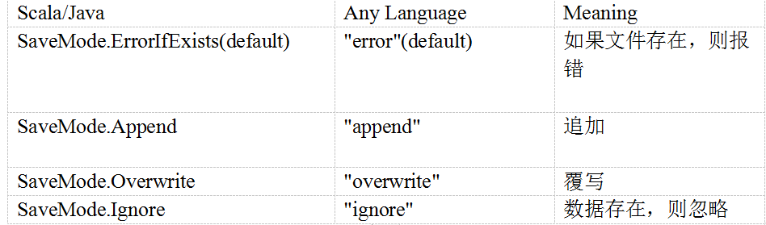

# SparkSQL数据源

## 通用加载/保存方法

  - Spark SQL的DataFrame接口支持多种数据源的操作。一个DataFrame可以进行RDDs方式的操作，也可以被注册为临时表。
  - 把DataFrame注册为临时表之后，就可以对该DataFrame执行SQL查询。
  - Spark SQL的默认数据源为Parquet格式。数据源为Parquet文件时，Spark SQL可以方便的执行所有的操作。修改配置项spark.sql.sources.default，可修改默认数据源格式。
  - 通过SparkSession提供的read和load方法用于通用加载数据，使用write和save保存数据。
    - val peopleDF = sparkSession.read.format("json").load("examples/people.json")
    - peopleDF.write.format("parquet").save("hdfs://localhost:9000/people.parquet")
  - 文件保存选项:
  
  
  
## JDBC

  - Spark SQL可以通过JDBC从关系型数据库中读取数据的方式创建DataFrame，通过对DataFrame一系列的计算后，还可以将数据再写回关系型数据库中。
  - 注意:需要将相关的数据库驱动放到spark的类路径下。
  - JDBC示例：
    - 读取数据：
      ```
      val jdbcDF = sparkSession.read
        .format("jdbc")
        .option("url", "jdbc:oracle:thin:@//127.0.0.1:1521/orcl")
        .option("dbtable", "tablename")
        .option("user", "username")
        .option("password", "password")
        .load()
      ```
    - 写数据：
      ```
      jdbcDF.write
        .format("jdbc")
        .option("url", "jdbc:oracle:thin:@//127.0.0.1:1521/orcl")
        .option("dbtable", "tablename")
        .option("user", "username")
        .option("password", "password")
        .save()
      ```
  
    
