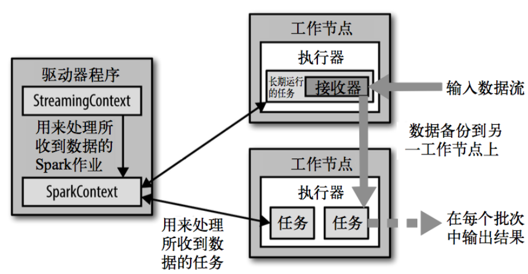

# Spark Streaming概述

  - Spark Streaming用于流式数据的处理。
  - Spark Streaming支持的数据输入源很多，例如：Kafka、Flume、Twitter、ZeroMQ和简单的TCP套接字等。
  - 数据输入后可以用Spark的高度抽象原语如：map、reduce、join、window等进行运算。
  - 结果也能保存在很多地方，如HDFS，数据库等。
  - Spark Streaming使用离散化流(discretized stream)作为抽象表示，叫作DStream。
  - DStream是随时间推移而收到的数据的序列。在内部，每个时间区间收到的数据都作为RDD存在，而DStream是由这些RDD所组成的序列(因此得名“离散化”)。
  
## Spark Streaming特点
  
  - Ease of Use
  - Fault Tolerance
  - Spark Integration
  
## SparkStreaming架构

  - SparkStreaming架构:
  
  
  
  
