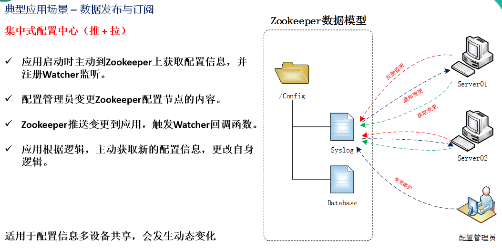
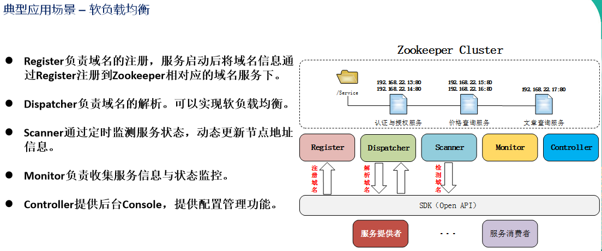

# ZooKeeper概述

  - ZooKeeper是一个开源的分布式的，为分布式应用提供协调服务的Apache项目。
  - 从设计模式角度来理解：ZooKeeper是一个基于观察者模式设计的分布式服务管理框架，它负责存储和管理大家都关心的数据, 然后接受观察者的注册，一旦这些数据的状态发生变化，ZooKeeper就将负责通知已经注册的那些观察者做出相应的反应，从而实现集群中类似Master/Slave管理模式。
  - ZooKeeper = 文件系统 + 通知机制。
  
## 应用场景

  - 分布式消息同步和协调机制
  
  
  - 服务器节点动态上下线
  - 统一配置管理
  - 软负载均衡
  
  
  - 集群管理
  
  
