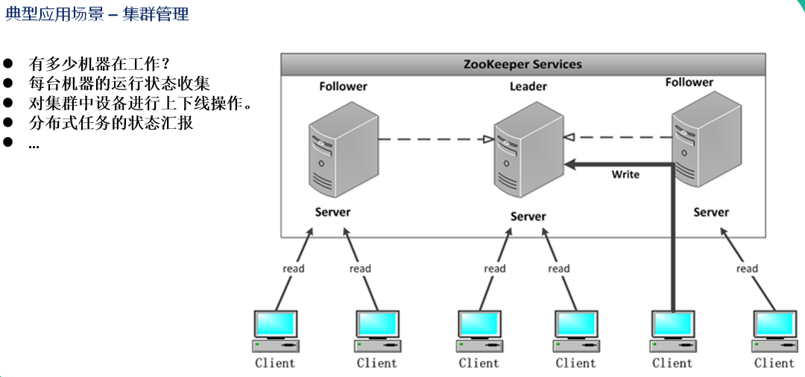

 # ZooKeeper概述

  - ZooKeeper是一个开源的，Hadoop正式子项目，针对大型分布式系统的可靠协调系统
  - 从设计模式角度来理解：ZooKeeper是一个基于观察者模式设计的分布式服务管理框架，它负责存储和管理大家都关心的数据, 然后接受观察者的注册，一旦这些数据的状态发生变化，ZooKeeper就将负责通知已经注册的那些观察者做出相应的反应，从而实现集群中类似Master/Slave管理模式。
  - ZooKeeper = 文件系统 + 通知机制。
  
## 应用场景

  - 分布式消息同步和协调机制
  
    
  
  - 服务器节点动态上下线
  - 统一配置管理
  - 软负载均衡
  
    
  
  - 集群管理
  
    

## 数据结构

  - ZK的存储模型是一颗"/"为根节点的树，每个节点称做一个ZNode节点，所有的ZNode节点通过树的目录结构按照层次关系组织在一起，构成一颗ZNode树
  - 每个Znode都可以通过其完整路径唯一标识，完整路径以"/"分隔，官方要求每个节点存放的Payload负载数据的上限为1MB
  
## 节点类型

  - Znode有两种类型：
    - 短暂（ephemeral）：客户端和服务器端断开连接后，创建的节点自己删除。
    - 持久（persistent）：客户端和服务器端断开连接后，创建的节点不删除。
  - Znode有四种形式的目录节点（默认是persistent ）：
    - 持久化目录节点（PERSISTENT）。
    - 持久化顺序编号目录节点（PERSISTENT_SEQUENTIAL）：ZooKeeper给该节点名称进行顺序编号。
    - 临时目录节点（EPHEMERAL）。
    - 临时顺序编号目录节点（EPHEMERAL_SEQUENTIAL）。
  - 创建Znode时设置顺序标识，Znode名称后会附加一个顺序值，顺序值是一个单调递增的计数器，由父节点维护。
  - 在分布式系统中，顺序号可以被用于为所有的事件进行全局排序，这样客户端可以通过顺序号推断事件的顺序。
  
## 特点

  - ZK集群需要有一个主节点，称为Leader节点，并且Leader节点是集群通过选举规则从所有节点中选出来的，这个过程称为选主。选主规则的要求是可用节点数量 > 总节点数/2。
    - 集群脑裂是由于网络断了，一个集群被分为两个集群。ZK集群，ES集群使用节点数过半机制确保集群脑裂后可以正常工作。过半机制指可用节点数量 > 总节点数/2，集群才是可用的
  - ZooKeeper有一个领导者（leader），多个跟随者（follower）组成的集群。
    - Leader负责进行投票的发起和决议，更新系统状态
    - Follower用于接收客户请求并向客户端返回结果，在选举Leader过程中参与投票
  - 全局数据一致：每个server保存一份相同的数据副本，client无论连接到哪个server，数据都是一致的。
  - 更新请求顺序进行，来自同一个client的更新请求按其发送顺序依次执行；数据更新原子性，一次数据更新要么成功，要么失败
  - 实时性：在一定时间范围内，client能读到最新数据
  - 事务ID记录节点的状态，ZK状态的每一次改变都对应着一个递增的事务ID，该ID称为Zxid，它是全局有序的
  
## 选举机制

  - 半数机制：集群中半数以上机器存活，集群可用。所以Zookeeper适合装在奇数台机器上。
  - Zookeeper虽然在配置文件中并没有指定master和slave。但工作时，是有一个节点为leader，其他则为follower，Leader是通过内部的选举机制临时产生的。
  
## 监听器原理

  - 监听器是一个接口，代码中可以实现Watcher这个接口，实现其中的process方法，方法中即我们自己的业务逻辑。
  - 监听器的注册是在获取数据的操作中实现：
    - getData(path,watch?)监听的事件是：节点数据变化事件。
    - getChildren(path,watch?)监听的事件是：节点下的子节点增减变化事件。
  - 监听器原理
  
    
    
## Curator开源客户端

  - Curator是开源的ZK客户端框架，提供了底层的细节开发工作，包括：Session会话超时重连，掉线重连，反复注册Watcher等
  - Curator核心包：
    - curator-framework: 对ZK底层API的一些封装
    - curator-client: 提供一些客户端的操作，例如重试策略等
    - curator-recipes: 封装一些高级特性，例如：Cache事件监听，选举，分布式锁，分布式计数器，分布式Barrier等

## 分布式命名服务

  - 命名服务是为系统中的资源提供标识能力。ZK的命名服务主要是利用ZK节点的树型分层结构和子节点的次序维护能力为分布式系统中的资源命名
  - 分布式API目录：
    - 在Dubbo中，使用ZK维护全局的服务接口API地址列表，实现的思路是：
      - 服务提供者在启动的时候向ZK的指定节点写入自己的API地址，相当于服务的公开，API地址节点如：/dubbo/{serviceName}/providers
      - 服务消费者启动的时候，订阅节点下的Provider服务提供者URL地址，获得所有访问提供者的API
  - 分布式ID生成器：
    - 特性：
      - 全局唯一
      - 高可用
    - 分布式ID生成器的方案：
      - Java的UUID
      - 利用分布式缓存Redis的原子操作INCR和INCRBY生成全局唯一的ID
      - Twitter的Snowflake算法，生成的ID是一个64位的长整数类型数据
      - 利用ZK的顺序节点生成全局唯一的ID
      
   
             
  
